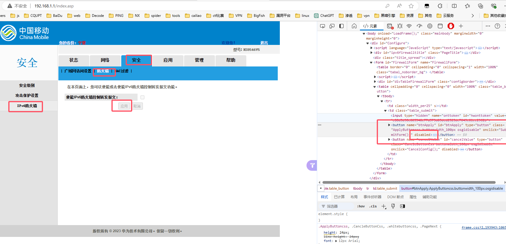

# DDNS-GO教程

#### 准备

- 首先确保有ipv6

```
测试地址：http://testipv6.cn/index.html.zh_CN
```

- 如果没有，请按照网上教程开启路由器ipv6地址

#### （一）下载DDNS-GO

```
https://github.com/jeessy2/ddns-go
```


#### （二）终端运行

```bash
# 确保已管理员身份运行
.\ddns-go.exe -s install
```


#### （三）登录设置密码

```
http://127.0.0.1:9876
```


#### （四）获取API Token

```
https://console.dnspod.cn/account/token#
```


#### （五）填写ddns-go配置

##### 1、DNS配置


##### 2、关闭IPV4


##### 3、IPV6填写域名


4、保存之后DNS如下

- 此步骤无需操作，只是用来验证上述操作是否成功。


#### （六）关闭光猫防火墙

- 进入光猫管理页面（移动192.168.1.1）`安全 → 防火墙 → 安全级别 → 防火墙等级` 禁用


- 进入光猫管理页面（移动192.168.1.1）`安全 → 防火墙 → 攻击保护设置 → DoS攻击保护` 取消勾选


- 进入光猫管理页面（移动192.168.1.1）`安全 → 防火墙 → IPv6防火墙 → 使能IPv6防火墙控制转发报文` 取消勾选

```html
在这里有个注意点
<input id="ipv6firewall" type="checkbox" realtype="CheckBox" class="CheckBox osgidisable" bindfield="x.X_HW_IPv6FWDFireWallEnable" onclick="OnFirewallClick(this);" disabled>
删除disabled就可取消勾选

<button name="btnApply" id="btnApply" type="button" class="ApplyButtoncss buttonwidth_100px osgidisable" onclick="SubmitForm();" disabled=""><script>document.write(route_language['bbsp_app']);</script>应用</button>
删除disabled就可点击应用
```




#### （七）关闭路由器防火墙

- 登录路由器后台关闭防火墙


#### （八）本机防火墙

- 在这里有两种方式

##### 方法一：关闭防火墙

- 全部关闭即可


##### 方法二：防火墙添加入站规则

- 将一下端口添加到防火墙入站规则里即可


```
# tcp
47984, 47989, 47990, 48010

# udp
47998-48000
```


#### （九）成功

- 成功将域名解析到ipv6上。 
