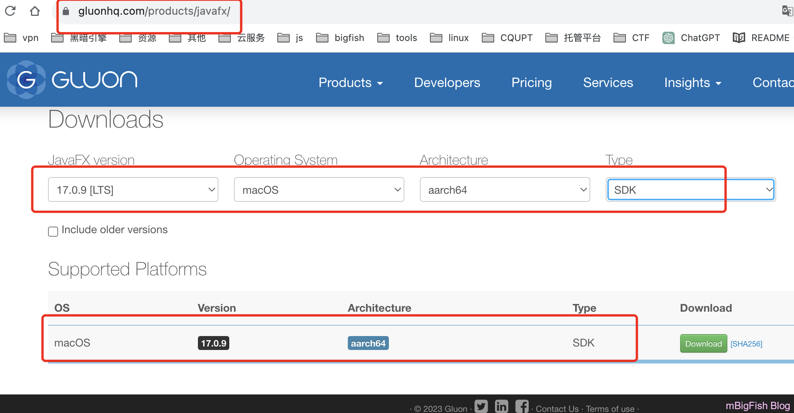

# MacBookAirM1安装冰蝎v4.1

## 前言：

* **在使用 MacBook 安装一些渗透测试工具时，对于 webshell 管理工具安装很是麻烦，对于 菜刀 蚁剑，似乎都没有适合 mac 的版本，好像也只有冰蝎才适用于 MacBook，但是在安装时，因为冰蝎的更新，取消了内置 javafx 框架版本，导致 M1 不兼容此版本，于是在网上搜索解决办法，但是都没有具体的解决方法，于是总结网上的教程以及 GitHub 上的反馈，写出此教程。**
* **在运行时报以下错误，便是缺少 javafx 内置库，按此教程操作即可。**

```
java -jar Behinder.jar
12月 1, 2023 12:59:33 下午 com.sun.javafx.application.PlatformImpl startup
警告: Unsupported JavaFX configuration: classes were loaded from 'unnamed module @22de69b2'
Loading library prism_es2 from resource failed: java.lang.UnsatisfiedLinkError: Can't load library: /Users/xxxxxx/.openjfx/cache/19+11/aarch64/libprism_es2.dylib
java.lang.UnsatisfiedLinkError: Can't load library: /Users/xxxxx/.openjfx/cache/19+11/aarch64/libprism_es2.dylib
    at java.base/java.lang.ClassLoader.loadLibrary(ClassLoader.java:2398)
    at java.base/java.lang.Runtime.load0(Runtime.java:785)
    at java.base/java.lang.System.load(System.java:1979)
    at com.sun.glass.utils.NativeLibLoader.installLibraryFromResource(NativeLibLoader.java:217)
    at com.sun.glass.utils.NativeLibLoader.loadLibraryFromResource(NativeLibLoader.java:197)
    at com.sun.glass.utils.NativeLibLoader.loadLibraryInternal(NativeLibLoader.java:138)
    at com.sun.glass.utils.NativeLibLoader.loadLibrary(NativeLibLoader.java:54)
    at com.sun.prism.es2.ES2Pipeline.lambda$static$0(ES2Pipeline.java:63)
    at java.base/java.security.AccessController.doPrivileged(AccessController.java:318)
    at com.sun.prism.es2.ES2Pipeline.<clinit>(ES2Pipeline.java:52)
    at java.base/java.lang.Class.forName0(Native Method)
    at java.base/java.lang.Class.forName(Class.java:383)
    at java.base/java.lang.Class.forName(Class.java:376)
    at com.sun.prism.GraphicsPipeline.createPipeline(GraphicsPipeline.java:218)
    at com.sun.javafx.tk.quantum.QuantumRenderer$PipelineRunnable.init(QuantumRenderer.java:92)
    at com.sun.javafx.tk.quantum.QuantumRenderer$PipelineRunnable.run(QuantumRenderer.java:125)
    at java.base/java.lang.Thread.run(Thread.java:833)
Loading library prism_sw from resource failed: java.lang.UnsatisfiedLinkError: Can't load library: /Users/xxxxx/.openjfx/cache/19+11/aarch64/libprism_sw.dylib
java.lang.UnsatisfiedLinkError: Can't load library: /Users/xxxx/.openjfx/cache/19+11/aarch64/libprism_sw.dylib
    at java.base/java.lang.ClassLoader.loadLibrary(ClassLoader.java:2398)
    at java.base/java.lang.Runtime.load0(Runtime.java:785)
    at java.base/java.lang.System.load(System.java:1979)
    at com.sun.glass.utils.NativeLibLoader.installLibraryFromResource(NativeLibLoader.java:217)
    at com.sun.glass.utils.NativeLibLoader.loadLibraryFromResource(NativeLibLoader.java:197)
    at com.sun.glass.utils.NativeLibLoader.loadLibraryInternal(NativeLibLoader.java:138)
    at com.sun.glass.utils.NativeLibLoader.loadLibrary(NativeLibLoader.java:54)
    at com.sun.prism.sw.SWPipeline.lambda$static$0(SWPipeline.java:43)
    at java.base/java.security.AccessController.doPrivileged(AccessController.java:318)
    at com.sun.prism.sw.SWPipeline.<clinit>(SWPipeline.java:42)
    at java.base/java.lang.Class.forName0(Native Method)
    at java.base/java.lang.Class.forName(Class.java:383)
    at java.base/java.lang.Class.forName(Class.java:376)
    at com.sun.prism.GraphicsPipeline.createPipeline(GraphicsPipeline.java:218)
    at com.sun.javafx.tk.quantum.QuantumRenderer$PipelineRunnable.init(QuantumRenderer.java:92)
    at com.sun.javafx.tk.quantum.QuantumRenderer$PipelineRunnable.run(QuantumRenderer.java:125)
    at java.base/java.lang.Thread.run(Thread.java:833)
Graphics Device initialization failed for :  es2, sw
Error initializing QuantumRenderer: no suitable pipeline found
java.lang.RuntimeException: java.lang.RuntimeException: Error initializing QuantumRenderer: no suitable pipeline found
    at com.sun.javafx.tk.quantum.QuantumRenderer.getInstance(QuantumRenderer.java:283)
    at com.sun.javafx.tk.quantum.QuantumToolkit.init(QuantumToolkit.java:253)
    at com.sun.javafx.tk.Toolkit.getToolkit(Toolkit.java:268)
    at com.sun.javafx.application.PlatformImpl.startup(PlatformImpl.java:291)
    at com.sun.javafx.application.PlatformImpl.startup(PlatformImpl.java:163)
    at com.sun.javafx.application.LauncherImpl.startToolkit(LauncherImpl.java:659)
    at com.sun.javafx.application.LauncherImpl.launchApplication1(LauncherImpl.java:679)
    at com.sun.javafx.application.LauncherImpl.lambda$launchApplication$2(LauncherImpl.java:196)
    at java.base/java.lang.Thread.run(Thread.java:833)
Caused by: java.lang.RuntimeException: Error initializing QuantumRenderer: no suitable pipeline found
    at com.sun.javafx.tk.quantum.QuantumRenderer$PipelineRunnable.init(QuantumRenderer.java:95)
    at com.sun.javafx.tk.quantum.QuantumRenderer$PipelineRunnable.run(QuantumRenderer.java:125)
    ... 1 more
Graphics Device initialization failed for :  es2, sw
Error initializing QuantumRenderer: no suitable pipeline found
java.lang.RuntimeException: java.lang.RuntimeException: Error initializing QuantumRenderer: no suitable pipeline found
    at com.sun.javafx.tk.quantum.QuantumRenderer.getInstance(QuantumRenderer.java:283)
    at com.sun.javafx.tk.quantum.QuantumToolkit.init(QuantumToolkit.java:253)
    at com.sun.javafx.tk.Toolkit.getToolkit(Toolkit.java:268)
    at javafx.stage.Screen.<clinit>(Screen.java:74)
    at javafx.stage.Window.<init>(Window.java:1504)
    at javafx.stage.Stage.<init>(Stage.java:256)
    at javafx.stage.Stage.<init>(Stage.java:244)
    at javafx.scene.control.HeavyweightDialog$1.<init>(HeavyweightDialog.java:52)
    at javafx.scene.control.HeavyweightDialog.<init>(HeavyweightDialog.java:52)
    at javafx.scene.control.Dialog.<init>(Dialog.java:252)
    at javafx.scene.control.Alert.<init>(Alert.java:247)
    at javafx.scene.control.Alert.<init>(Alert.java:222)
    at net.rebeyond.behinder.utils.Utils.getAlert(Utils.java:85)
    at net.rebeyond.behinder.utils.Utils.showErrorMessage(Utils.java:1341)
    at net.rebeyond.behinder.ui.Main.main(Main.java:57)
    at net.rebeyond.behinder.ui.Launcher.main(Launcher.java:7)
Caused by: java.lang.RuntimeException: Error initializing QuantumRenderer: no suitable pipeline found
    at com.sun.javafx.tk.quantum.QuantumRenderer$PipelineRunnable.init(QuantumRenderer.java:95)
    at com.sun.javafx.tk.quantum.QuantumRenderer$PipelineRunnable.run(QuantumRenderer.java:125)
    at java.base/java.lang.Thread.run(Thread.java:833)
java.lang.ExceptionInInitializerError
    at javafx.stage.Window.<init>(Window.java:1504)
    at javafx.stage.Stage.<init>(Stage.java:256)
    at javafx.stage.Stage.<init>(Stage.java:244)
    at javafx.scene.control.HeavyweightDialog$1.<init>(HeavyweightDialog.java:52)
    at javafx.scene.control.HeavyweightDialog.<init>(HeavyweightDialog.java:52)
    at javafx.scene.control.Dialog.<init>(Dialog.java:252)
    at javafx.scene.control.Alert.<init>(Alert.java:247)
    at javafx.scene.control.Alert.<init>(Alert.java:222)
    at net.rebeyond.behinder.utils.Utils.getAlert(Utils.java:85)
    at net.rebeyond.behinder.utils.Utils.showErrorMessage(Utils.java:1341)
    at net.rebeyond.behinder.ui.Main.main(Main.java:57)
    at net.rebeyond.behinder.ui.Launcher.main(Launcher.java:7)
Caused by: java.lang.RuntimeException: No toolkit found
    at com.sun.javafx.tk.Toolkit.getToolkit(Toolkit.java:280)
    at javafx.stage.Screen.<clinit>(Screen.java:74)
    ... 12 more
```

## 一、下载所需文件

* **冰蝎：**[https://github.com/rebeyond/Behinder/releases/tag/Behinder\_v4.1%E3%80%90t00ls%E4%B8%93%E7%89%88%E3%80%91](https://github.com/rebeyond/Behinder/releases/tag/Behinder_v4.1%E3%80%90t00ls%E4%B8%93%E7%89%88%E3%80%91)
* **javafx：**[https://gluonhq.com/products/javafx/](https://gluonhq.com/products/javafx/)
  
* **java 下载：**[Java Downloads | Oracle 中国](https://www.oracle.com/cn/java/technologies/downloads/#jdk17-mac)
  

## 二、安装配置

### 1、安装 java

**安装后查看版本**

```
    java -version
```


### 2、将下载好的冰蝎和 javafx 移动至文件夹（随意）


### 3、在冰蝎文件夹打开终端


### 4、运行

```
#运行命令
java --module-path /Users/mawu/tools/javafx-sdk-17.0.9/lib --add-modules=javafx.base,javafx.controls,javafx.fxml,javafx.graphics,javafx.media,javafx.swing,javafx.web -jar Behinder.jar

#对上述命令解释
java --module-path /javafx路径/lib -add-modules=avafx.base,javafx.controls,javafx.fxml,javafx.graphics,javafx.media,javafx.swing,javafx.web -jar 冰蝎名字.jar
```


## 三、创建快捷图标

### 1、打开 自动操作 应用程序


### 2、选择 新建文稿


### 3、选择 应用程序


### 4、选择 运行 shell 脚本


### 5、输入 命令（打开冰蝎文件 + 上面运行冰蝎的命令）

```
cd /Users/mawu/tools/Behinder_v4.1 && java --module-path /Users/mawu/tools/javafx-sdk-17.0.9/lib --add-modules=javafx.base,javafx.controls,javafx.fxml,javafx.graphics,javafx.media,javafx.swing,javafx.web -jar Behinder.jar
```


### 6、点击 运行


### 7、ctrl + s 保存


### 8、更换图标方式

1. **打开应用程序 右键 点击 显示简介**
   
2. **拖拽图标**
   
3. **成功**
   
