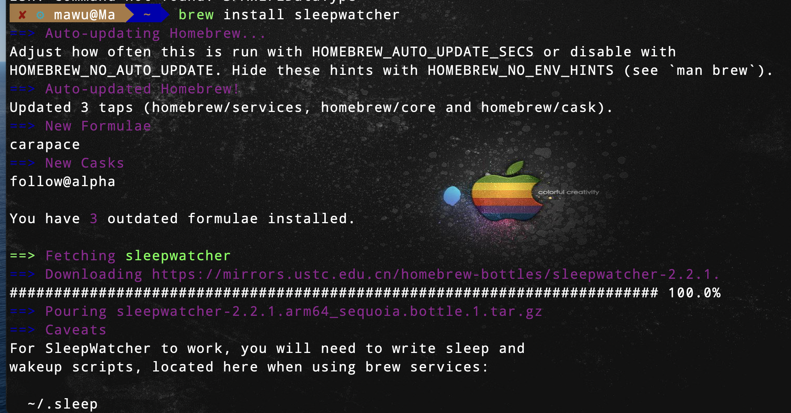
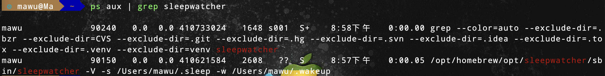
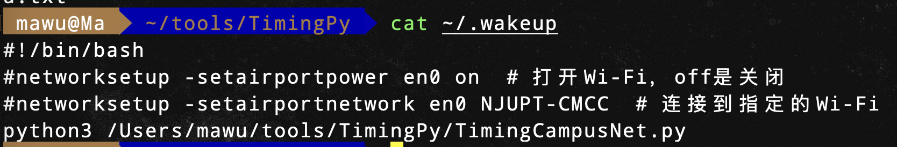
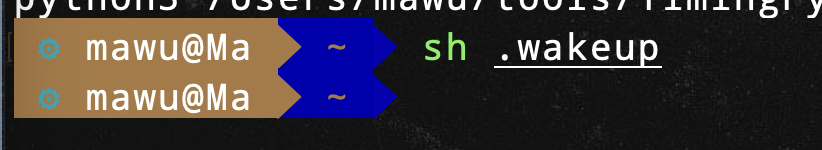

# MacBook自动连接校园网（重邮）

- 在使用MacBook过程中，因为去图书馆和宿舍之间，每次都要重新登录，所以用python写了个脚本自动登录校园网的功能。

### 一、安装sleepwater

```bash
brew install sleepwatcher
```



### 二、设置软件自启动

```bash
brew service start sleepwatcher
```


### 三、查看进程是否启动

```bash
ps aux | grep sleepwatcher
```



### 四、创建目录

```bash
在个人 home 目录 ~ 下创建文件 .wakeup 并赋予权限 777
touch ~/.wakeup
chmod 777 ~/.wakeup
```


### 五、创建脚本文件

```bash
# 编辑脚本文件
vim ~/.wakeup
```

- `.wakeup`文件内容

```bash
#!/bin/bash
#networksetup -setairportpower en0 on  # 打开Wi-Fi，off是关闭
#networksetup -setairportnetwork en0 NJUPT-CMCC  # 连接到指定的Wi-Fi
python3 /Users/mawu/tools/TimingPy/TimingCampusNet.py 
# python目录可以自定义设置
```



- `TimingCampusNet.py`文件
- 请修改账号和密码

```python
import json
import os
import random
import re
import time

import requests


class CampusNetwork():
    def __init__(self):
        self.url = 'http://192.168.200.2:801/'
        self.ac = ''
        # 请按照格式输入账号
        self.user_account = ',0,1673111@telecom'
        # 请输入密码
        self.user_password = '123456789'

        self.callback = 'dr1003'
        self.v = random.randint(1000, 9999)
        self.jsVersion = '3,3.3'
        self.my_result, self.my_ipv4 = self.check_status()
        self.headers = {
            "User-Agent": "Mozilla/5.0 (Windows NT 10.0; Win64; x64) AppleWebKit/537.36 (KHTML, like Gecko) Chrome/114.0.0.0 Safari/537.36",
            "Accept": "text/html,application/xhtml+xml,application/xml;q=0.9,image/avif,image/webp,image/apng,*/*;q=0.8",
            "Accept-Encoding": "gzip, deflate, br",
            "Accept-Language": "en-US,en;q=0.5",
            "Connection": "keep-alive",
            "Referer": self.url,  # 可根据实际请求页面修改
            # "Content-Type": "application/x-www-form-urlencoded",  # 根据请求内容类型修改
            # "Authorization": "Bearer <token>",  # 如果需要认证，可以添加认证信息
            # "Cookie": "PHPSESSID=oeu4gf4t3es6vdahqlc3sgloqv"  # 如果需要会话，添加 Cookie 信息
        }

    # 登录
    def login(self):
        # 请求参数
        params = {
            'c': 'Portal',
            'a': 'login',
            'callback': 'dr1004',
            'login_method': '1',
            'user_account': self.user_account,
            'user_password': self.user_password,
            'wlan_user_ip': self.my_ipv4,
            'wlan_user_ipv6': '',
            'wlan_user_mac': '000000000000',
            'wlan_ac_ip': '',
            'wlan_ac_name': '',
            'jsVersion': self.jsVersion,
            'v': self.v
        }
        url = self.url + 'eportal/'
        resp = requests.get(url, params=params)
        print(resp.text)

    # 获取本机wifi信息
    def check_status(self):
        url = 'http://192.168.200.2/drcom/chkstatus'
        params = {
            "callback": self.callback,
            "v": self.v
        }
        resp = requests.get(url, params=params).text
        content = json.loads(re.search(r'dr\d+\((\{.*?\})\)', resp).group(1))
        my_result = content["result"]
        my_v46ip = content["v46ip"]
        return my_result, my_v46ip

    def timing_campus_net(self):
        if not self.my_result:
            self.login()

def check_wifi():
    response = os.system(f"ping -c 1 -W 1 192.168.200.2 > /dev/null 2>&1")
    return response == 0

if __name__ == '__main__':
    for _ in range(15):
        flag = check_wifi()
        if flag:
            a = CampusNetwork()
            a.timing_campus_net()
            break
        time.sleep(1)
```

### 六、测试py脚本

```json
# 先退出校园网登录，然后运行py脚本，如果输出如下，则脚本没有问题
# 执行命令 python3 TimingCampusNet.py

dr1004({"result":"1","msg":"\u8ba4\u8bc1\u6210\u529f"})
```


### 七、测试sh脚本

```
# 执行命令 sh .wakeup

如果无输出则没有题
```


