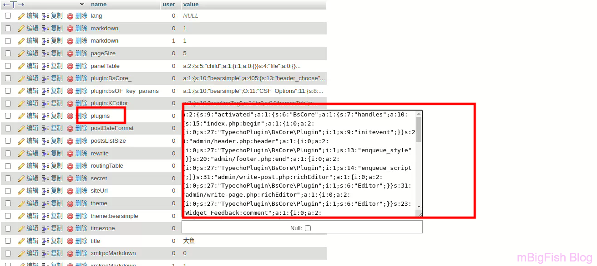

## Typecho不用进入后台如何关闭已启用的插件

## 一：前言

* **前一段时间，我给 typecho 想换个后台主题，于是搜索安装了一个插件，但是在它安装后，起用这个这个插件的时候发现网站后台无法登陆了。**
* **所以想要解决这个问题，就需要关闭这个插件。**

## 二：解决方法

* **我网上看了半天 typecho 的数据库终于发现了控制 typecho 的插件启用的表。**

```
typecho_options
```

* **进入表，修改表中的列 ****plugins** 的值为

```
a:0:{}
```


