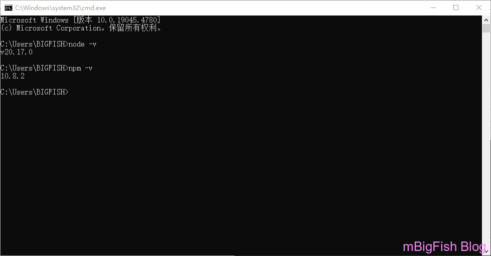
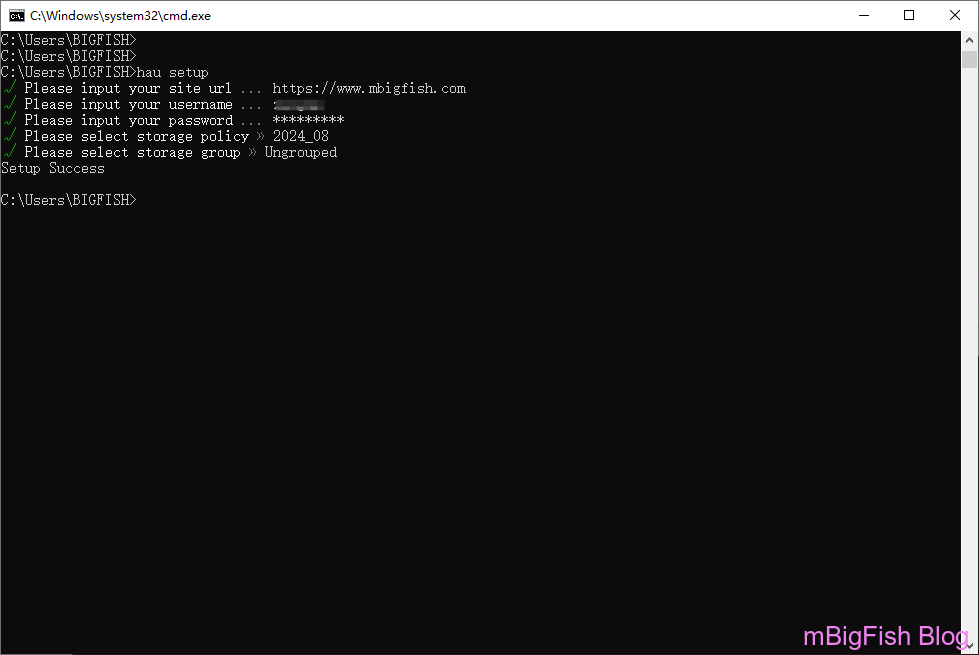
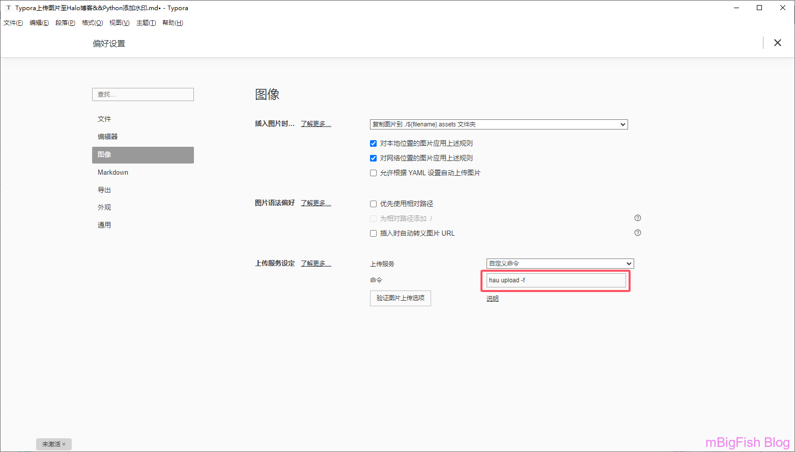
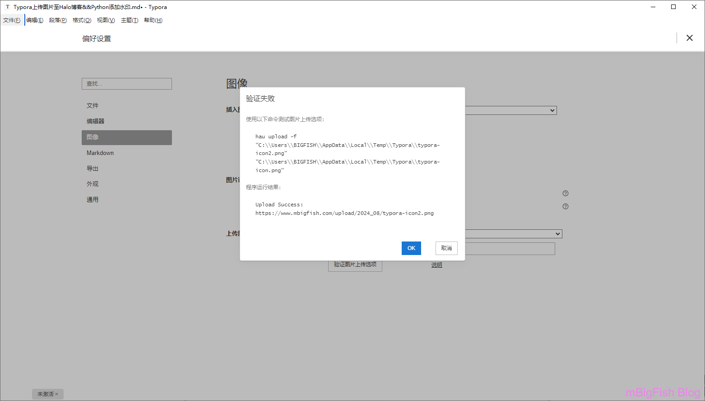
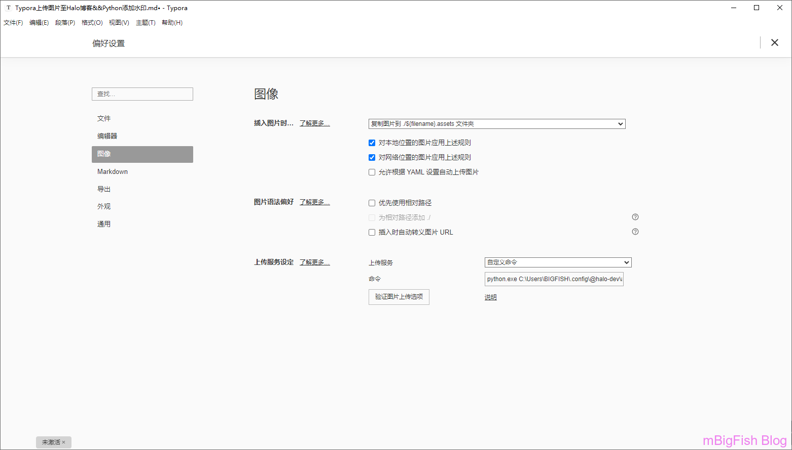
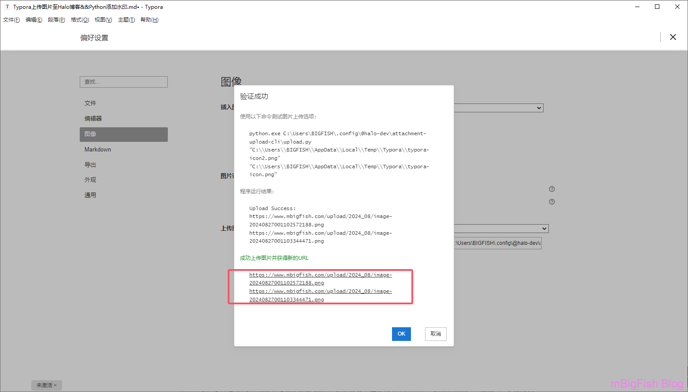
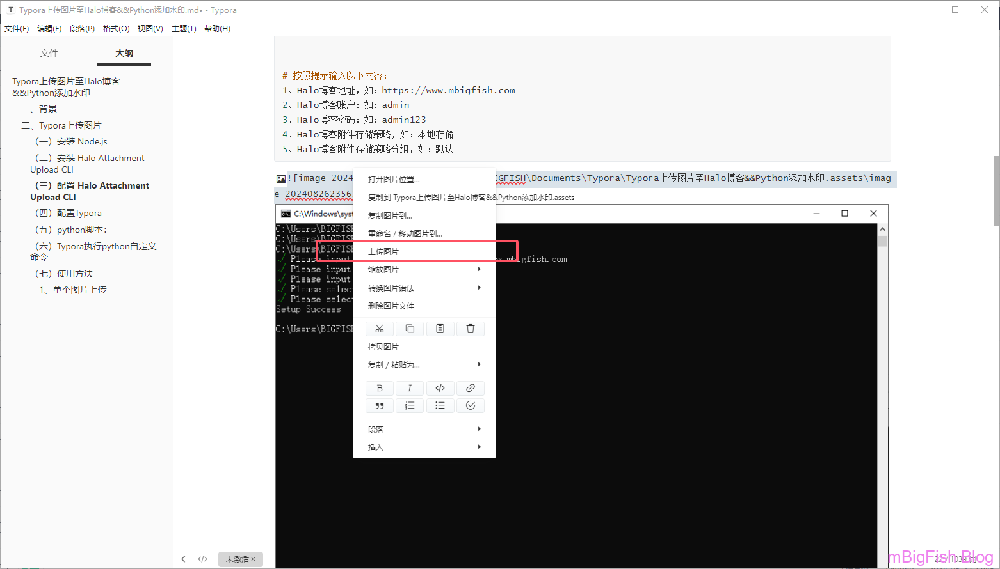
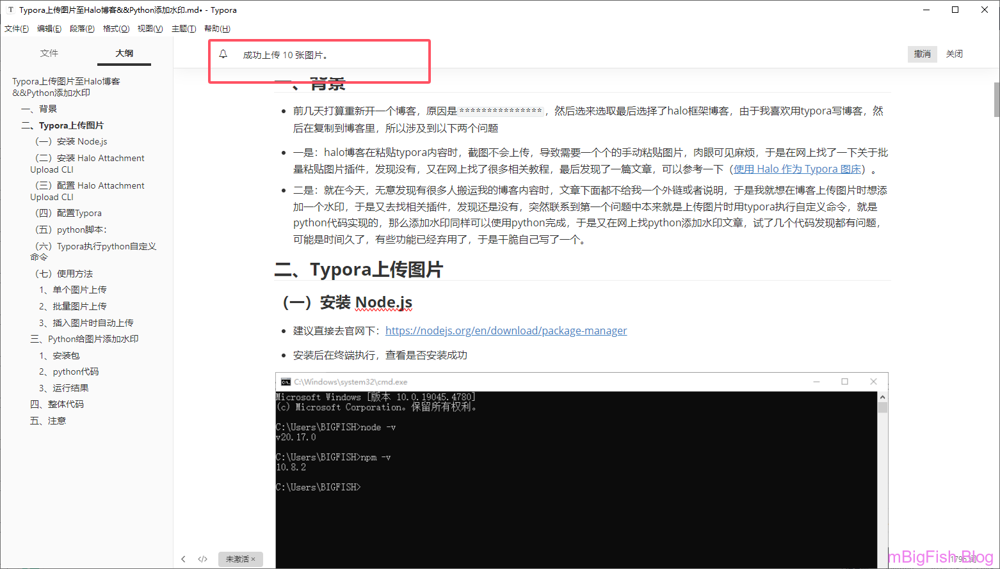
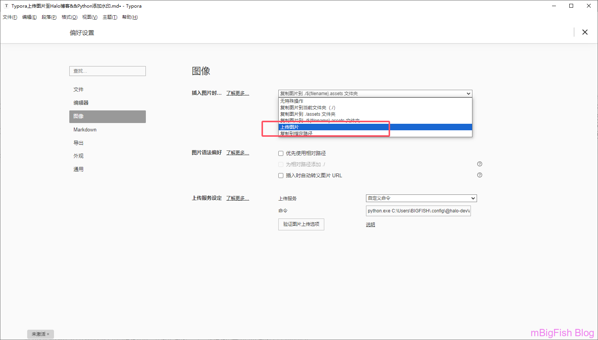

# Typora上传图片至Halo博客&&Python添加水印

## 一、背景

* **前几天打算重新开一个博客，原因是** `***************`，然后选来选取最后选择了halo框架博客，由于我喜欢用typora写博客，然后在复制到博客里，所以涉及到以下两个问题
* **一是：halo博客在粘贴typora内容时，截图不会上传，导致需要一个个的手动粘贴图片，肉眼可见麻烦，于是在网上找了一下关于批量粘贴图片插件，发现没有，又在网上找了很多相关教程，最后发现了一篇文章，可以参考一下（**[使用 Halo 作为 Typora 图床](https://blog.t1m2h0u.com/archives/shi-yong-halo-zuo-wei-typora-tu-chuang)）。
* **二是：就在今天，无意发现有很多人搬运我的博客内容时，文章下面都不给我一个外链或者说明，于是我就想在博客上传图片时想添加一个水印，于是又去找相关插件，发现还是没有，突然联系到第一个问题中本来就是上传图片时用typora执行自定义命令，就是python代码实现的，那么添加水印同样可以使用python完成，于是又在网上找python添加水印文章，试了几个代码发现都有问题，可能是时间久了，有些功能已经弃用了，于是干脆自己写了一个。**

## 二、Typora上传图片

### （一）安装 Node.js

* **建议直接去官网下：**[https://nodejs.org/en/download/package-manager](https://nodejs.org/en/download/package-manager)
* **安装后在终端执行，查看是否安装成功**



### （二）安装 Halo Attachment Upload CLI

* **终端执行下面命令**

```
npm install @halo-dev/attachment-upload-cli -g
```

* **安装成功后，验证一下是否成功**

```
hau --help
```

### （三）配置 Halo Attachment Upload CLI

```
hau setup


# 按照提示输入以下内容：
1、Halo博客地址，如：https://www.mbigfish.com
2、Halo博客账户：如：admin
3、Halo博客密码：如：admin123
4、Halo博客附件存储策略，如：本地存储
5、Halo博客附件存储策略分组，如：默认
```



### （四）配置Typora

* **打开 Typora，进入\***\*文件 -> 偏好设置 -> 图像**，将上传服务改为**自定义命令\*\*，输入 `hau upload -f` 即可。



* **以下结果，则为配置成功。**



* **注意：这里其实这样配置就已经完成了，但是因为这个配置，每次只能成功上传一张图片，因此才用到了一下的py脚本执行。**


### （五）python脚本：

```
import datetime
import os
import requests
import shutil
import sys
import urllib.parse

TEMP_PATH = "C:\\Users\\t1m2h0u\\AppData\\Local\\Temp\\Typora\\"

print("Upload Success:")

for old_image_url in sys.argv[1:]:
    old_image_urlparse = urllib.parse.urlparse(old_image_url)
    new_image_name = f"image-{datetime.datetime.now().strftime("%Y%m%d%H%M%S%f")}"
    new_image_suffix = os.path.splitext(old_image_urlparse.path)[-1]
    new_image_url = f"{TEMP_PATH}{new_image_name}{new_image_suffix}"
    if old_image_urlparse.scheme in ["http", "https"]:
        with open(new_image_url, "wb") as image:
            image.write(requests.get(old_image_url).content)
    else:
        shutil.copy(old_image_url, new_image_url)
    print(os.popen(f"hau upload -f {new_image_url}").readlines()[1].strip("\n"))
```

* **可以将这个python脚本放在这个目录**

```
C:\Users\BIGFISH\.config\@halo-dev\attachment-upload-cli\
```

```
C:\Users\BIGFISH\.config\@halo-dev\attachment-upload-cli\upload.py
```

### （六）Typora执行python自定义命令

* **添加命令：python.exe + python脚本路径**

```
python.exe C:\Users\BIGFISH\.config\@halo-dev\attachment-upload-cli\upload.py
```



* **执行命令情况，发现两个图片均上传成功，到此配置成功**



### （七）使用方法

#### 1、单个图片上传

* **可以点击图片，然后选择上传图片**



#### 2、批量图片上传

* **打开 Typora，进入 格式 -> 图像 -> 上传所以本地图片（因为不好截图，就没有截图）**



#### 3、插入图片时自动上传

* **还是在偏好里设置，将插入图片时，改为 上传图片即可**



### 三、Python给图片添加水印

#### 1、安装包

```
pip install pillow
```

#### 2、python代码

```
from PIL import Image, ImageDraw, ImageFont

def add_watermark(input_image_path, output_image_path, watermark_text):
    # 打开原始图片
    original = Image.open(input_image_path)
    
    # 创建一个绘图对象
    draw = ImageDraw.Draw(original)
    
    # 使用你想要的字体和大小
    font = ImageFont.truetype("arial.ttf", 36)
    
    # 获取图片的宽度和高度
    width, height = original.size
    
    # 获取文本的边界框
    text_bbox = draw.textbbox((0, 0), watermark_text, font=font)
    text_width = text_bbox[2] - text_bbox[0]
    text_height = text_bbox[3] - text_bbox[1]
    
    # 设置水印的位置（右下角）
    x = width - text_width - 10  # 10个像素的边距
    y = height - text_height - 10  # 10个像素的边距
    
    # 添加水印
    draw.text((x, y), watermark_text, font=font, fill=(255, 255, 255, 128))  # 白色半透明水印
    
    # 保存带水印的图片
    original.save(output_image_path)

# 调用函数添加水印
input_image_path = "input_image.png"
output_image_path = "output_image_with_watermark.png"
watermark_text = "Big Fish Blog"

add_watermark(input_image_path, output_image_path, watermark_text)
```

#### 3、运行结果


### 四、整体代码

* **一下代码是 包括 上传 + 水印 的代码，按照二配置即可！**
* windows版

```python
import datetime
import os
import requests
import shutil
import sys
import urllib.parse
from PIL import Image, ImageDraw, ImageFont

TEMP_PATH = "C:\\Users\\BIGFISH\\AppData\\Local\\Temp\\Typora\\"

print("Upload Success:")

def add_watermark(input_image_path, output_image_path):
    watermark_text = "mbigfish.com"
    # 打开原始图片
    original = Image.open(input_image_path)

    # 创建一个绘图对象
    draw = ImageDraw.Draw(original)

    # 使用你想要的字体和大小
    font = ImageFont.truetype("arial.ttf", 36)

    # 获取图片的宽度和高度
    width, height = original.size

    # 获取文本的边界框
    text_bbox = draw.textbbox((0, 0), watermark_text, font=font)
    text_width = text_bbox[2] - text_bbox[0]
    text_height = text_bbox[3] - text_bbox[1]

    # 设置水印的位置（右下角）
    x = width - text_width - 10  # 10个像素的边距
    y = height - text_height - 10  # 10个像素的边距

    # 添加水印
    draw.text((x, y), watermark_text, font=font, fill=(238, 130, 238, 120))  # 粉色半透明水印

    # 保存带水印的图片
    original.save(output_image_path)


for old_image_url in sys.argv[1:]:
    old_image_urlparse = urllib.parse.urlparse(old_image_url)
    time_name = datetime.datetime.now().strftime('%Y%m%d%H%M%S%f')
    new_image_name = f"image-{time_name}"
    new_image_suffix = os.path.splitext(old_image_urlparse.path)[-1]
    new_image_url = f"{TEMP_PATH}{new_image_name}{new_image_suffix}"

    watermark_image_url = f"watermark-{time_name}{new_image_suffix}"
    add_watermark(old_image_url, watermark_image_url)
    if old_image_urlparse.scheme in ["http", "https"]:
        with open(new_image_url, "wb") as image:
            image.write(requests.get(watermark_image_url).content)
    else:
        shutil.copy(watermark_image_url, new_image_url)
    os.remove(watermark_image_url)
    print(os.popen(f"hau upload -f {new_image_url}").readlines()[1].strip("\n"))


# "C:\\Users\\BIGFISH\\AppData\\Local\\Temp\\Typora\\typora-icon2.png" 
# "C:\\Users\\BIGFISH\\AppData\\Local\\Temp\\Typora\\typora-icon.png"
```

* mac版

```
import datetime
import os
import requests
import shutil
import sys
import urllib.parse
from PIL import Image, ImageDraw, ImageFont

TEMP_PATH = '/tmp/'

print("Upload Success:")

def add_watermark(input_image_path, output_image_path):
    watermark_image_path = '/Users/mawu/.config/@halo-dev/attachment-upload-cli/log.png'
    # 打开原始图片和水印图片
    original = Image.open(input_image_path)
    watermark = Image.open(watermark_image_path)
    # 获取原始图片的尺寸
    original_width, original_height = original.size
    # 水印图片尺寸
    watermark_width = int(150)
    watermark_height = int((watermark.size[1] / watermark.size[0]) * watermark_width)
    watermark = watermark.resize((watermark_width, watermark_height), Image.LANCZOS)
    # 计算水印图片在右下角的位置
    position = (original_width - watermark_width - 10, original_height - watermark_height - 10)  # 10个像素的边距

    # 将水印图片粘贴到原始图片的右下角
    original.paste(watermark, position, watermark)

    # 保存带有水印的图片
    original.save(output_image_path)


# 上传图片失败。错误信息:
# Upload Success: /Users/mawu/Documents/typora/其他/cqupt_net.assets/image-20241026125345741.png
# 遍历命令行参数中的图片 URL 列表（从 sys.argv[1] 开始）

for old_image_url in sys.argv[1:]:
    # 解析图片的 URL，获取 URL 的各个部分
    old_image_urlparse = urllib.parse.urlparse(old_image_url)
    # 生成时间戳，确保文件名唯一
    time_name = datetime.datetime.now().strftime('%Y%m%d%H%M%S%f')
    # 设置新的图片名称，格式为 "image-<时间戳>"
    new_image_name = f"image-{time_name}"
    # 获取图片的扩展名（例如 .jpg, .png）
    new_image_suffix = os.path.splitext(old_image_urlparse.path)[-1]

    # 生成新的图片路径，用于保存处理后的图片
    new_image_url = f"{TEMP_PATH}{new_image_name}{new_image_suffix}"

    # 生成水印图片的文件路径，命名为 "watermark-<时间戳><扩展名>"
    # watermark_image_url = f"watermark-{time_name}{new_image_suffix}"

    # 调用 add_watermark 函数对图片添加水印
    add_watermark(old_image_url, new_image_url)

    # 判断图片是远程 URL 还是本地文件路径
    # if old_image_urlparse.scheme in ["http", "https"]:
    #     # 如果是远程 URL，通过 requests 下载带水印的图片
    #     with open(new_image_url, "wb") as image:
    #         # 获取水印图片的内容并写入新图片路径
    #         image.write(requests.get(watermark_image_url).content)
    # else:
    #     # 如果是本地文件路径，直接复制水印图片到新图片路径
    #     shutil.copy(watermark_image_url, new_image_url)

    # 上传处理后的图片，并获取上传后的返回信息
    upload_output = os.popen(f"hau upload -f {new_image_url}").readlines()
    # 删除临时的新图片
    os.remove(new_image_url)
    # 打印上传结果的第二行信息（假设是上传后的 URL 或信息）
    print(upload_output[1].strip("\n"))
```

### 五、注意

* **如果报错，一定要记得本地python环境安装好上述用到的pip包**
