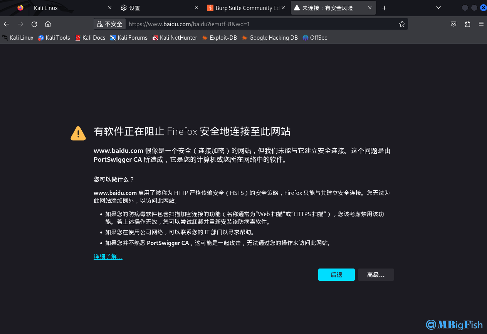
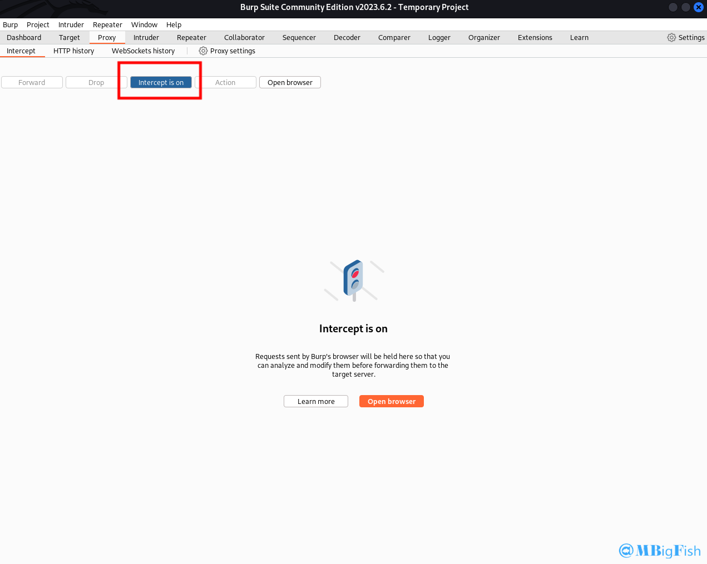
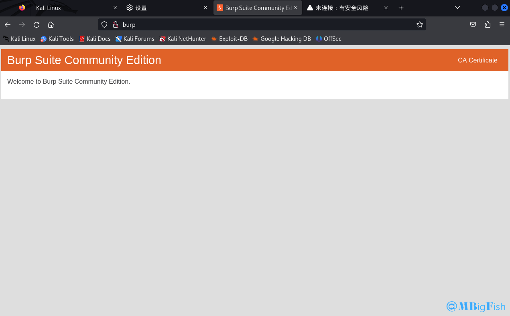
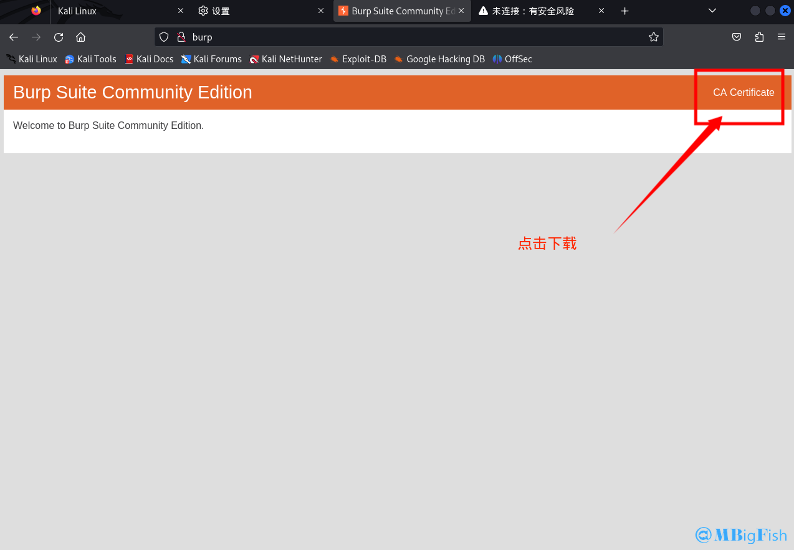
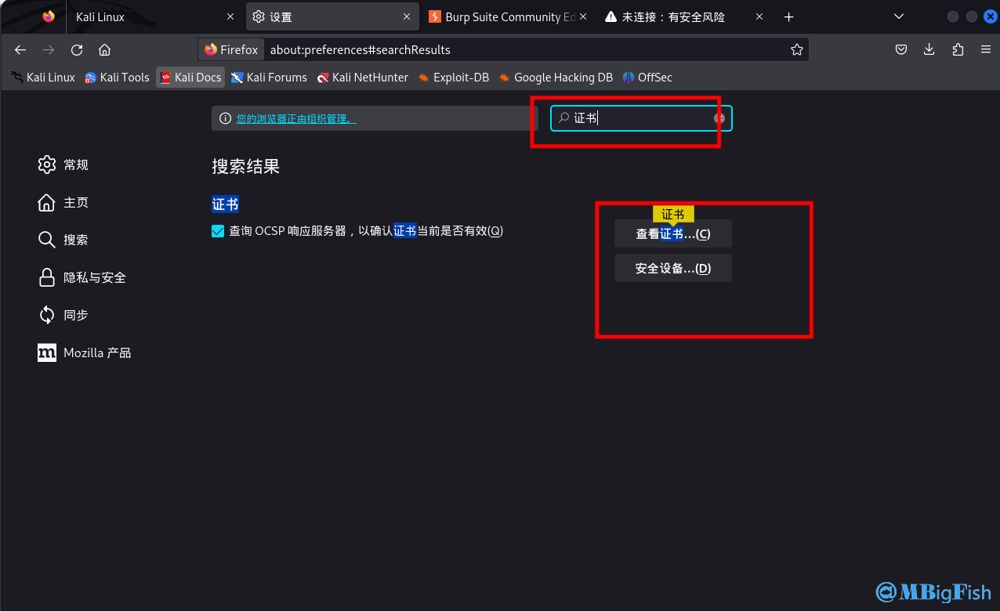
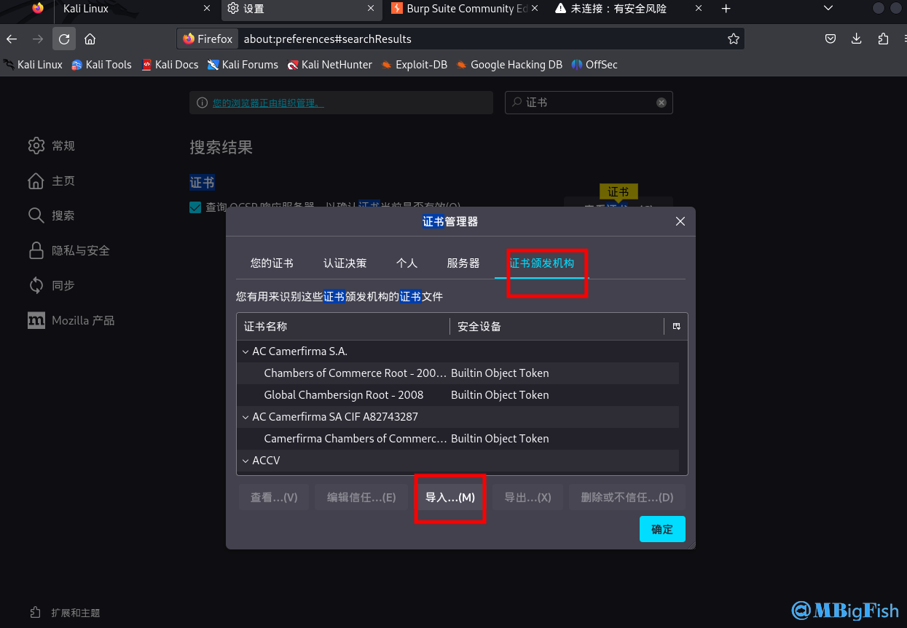
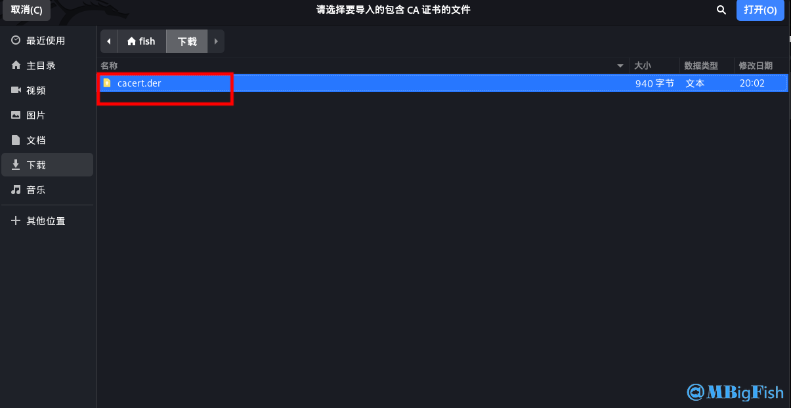
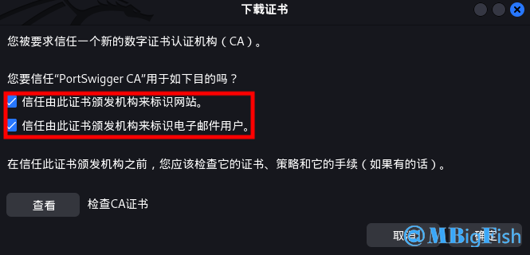
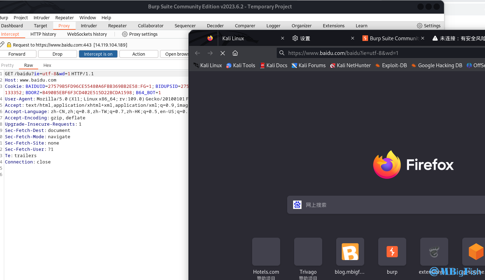

# burpsuit安装证书

## 一、原因

* **HTTPS 协议是为了数据传输安全的需要，在 HTTP 原有的基础上，加入了安全**[套接字](https://so.csdn.net/so/search?q=%E5%A5%97%E6%8E%A5%E5%AD%97&spm=1001.2101.3001.7020)层 SSL 协议，通过 CA 证书来验证服务器的身份，并对通信消息进行加密。基于 HTTPS 协议这些特性，我们在使用 Burp Proxy 代理时，需要增加更多的设置，才能拦截 HTTPS 的消息。
* **如果没有安装 CA 证书就拦截 htpps 协议的网址，就会出现下面的情况**

## 二、安装方法

#### 1、先把代理开启与代理插件开启

#### 2、访问 [http://burp](http://burp/)

#### 3、下载证书到本地

#### 4、在你使用的浏览器中打开设置，找到管理证书

#### 5、点击证书颁发机构，然后导入证书

#### 6、选择刚才下载的导入

#### 7、勾选上这两个

#### 8、如果提示安全警告，点击【是】，提示导入完成。

#### 9、导入后如果未成功，重启浏览器即可。

#### 10、测试发现成功！

