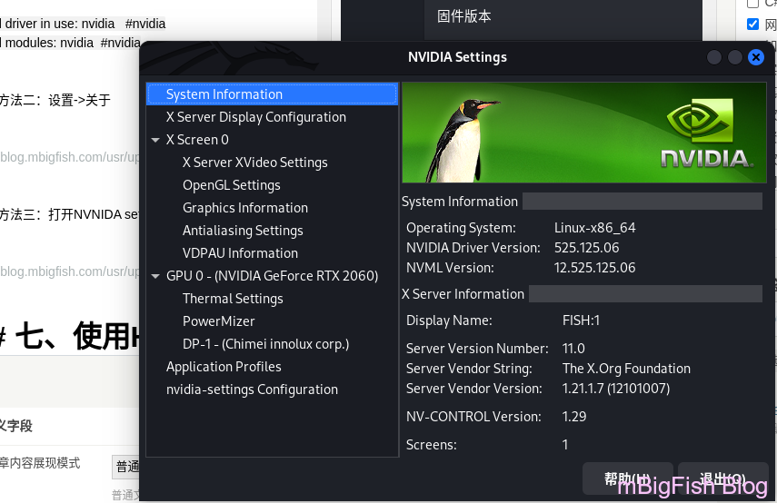

# kali linux 上安装 NVIDIA 驱动程序

### 一、更新系统

```
sudo apt update
sudo apt -y full-upgrade
sudo apt -y autoremove
reboot
```

### 二、查看已安装的显卡，并验证是否用 Nouveau 开源驱动程序

```
lspci | grep -i vga

#显示结果
01:00.0 VGA compatible controller: NVIDIA Corporation TU106M [GeForce RTX 2060 Mobile] (rev a1)
```

### 三、获取安装有关 iuan 驱动程序的信息，01:00.0 是上面显示显卡的数字

```
lspci -s 01:00.0 -v

#显示结果
    #省略部分
    ......
    Kernel driver in use: nouveau  #nouveau
    Kernel modules: nouveau   #nouveau
```

### 四、使用 APT 包管理器将驱动程序和 CUDA Toolkit 安装以下命令

```
sudo apt install nvidia-driver nvidia-cuda-toolkit
```

### 五、重启计算机生效

```
reboot
```

### 六、验证系统是否正在使用 NVIDIA 驱动而不是 Nouvear

* #### 方法一：终端执行命令

```
lspci -s 01:00.0 -v #数字是上面得到结果

#显示结果
    #省略部分
    .......
    Kernel driver in use: nvidia   #nvidia
    Kernel modules: nvidia    #nvidia
```

* #### 方法二：设置 -> 关于
* #### 方法三：打开 NVNIDA settings



### 七、使用 HashCAT 执行基准测试

```
sudo apt install hashcat
hashcat -b | uniq
```
