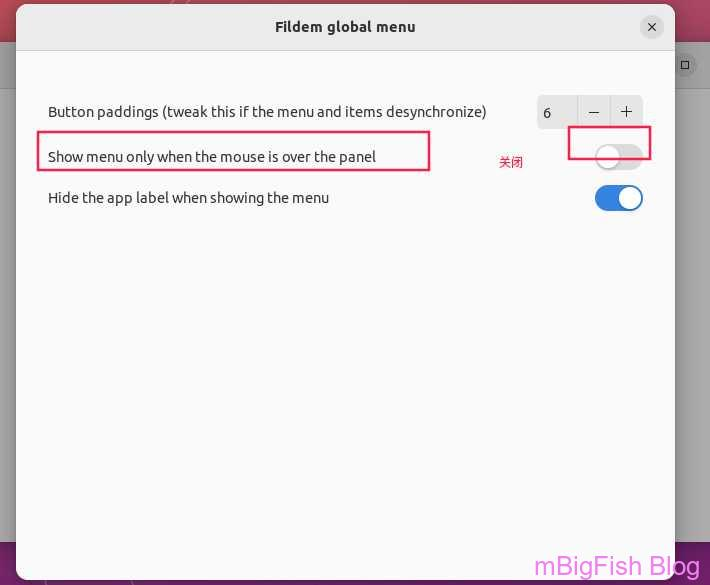

# kali全局菜单安装(Fildem安装）

## 一、安装

```
sudo apt install libbamf3-dev bamfdaemon libkeybinder-3.0-dev git python3-pip
python3 -m pip install --user fuzzysearch
sudo apt install appmenu-gtk-module-common appmenu-gtk2-module appmenu-gtk3-module

cd /opt
git clone https://github.com/gonzaarcr/Fildem

cd Fildem

mv fildemGMenu@gonza.com ~/.local/share/gnome-shell/extensions

sudo python3 setup.py install --optimize=1
```

## 二、配置

```
第一步：
vim ~/.gtkrc-2.0

#增加
    gtk-modules="appmenu-gtk-module"
----------------------------------------------------------------------------
第二步：
vim ~/.config/gtk-3.0/settings.ini

#在[Settings]中增加
    gtk-modules="appmenu-gtk-module"
```

## 三、启用

* **在拓展中启用 filedem 且如下设置**



## 四、添加自启动

```
gedit ~/.config/autostart/fildem.desktop

## 添加内容

[Desktop Entry]
Type=Application
Exec=fildem
Hidden=false
NoDisplay=false
X-GNOME-Autostart-enabled=true
Name[en_US]=Fildem
Name=Fildem
Comment[en_US]=Fildem Global Menu and HUD
Comment=Fildem Global Menu and HUD
```

## 五、重启系统
