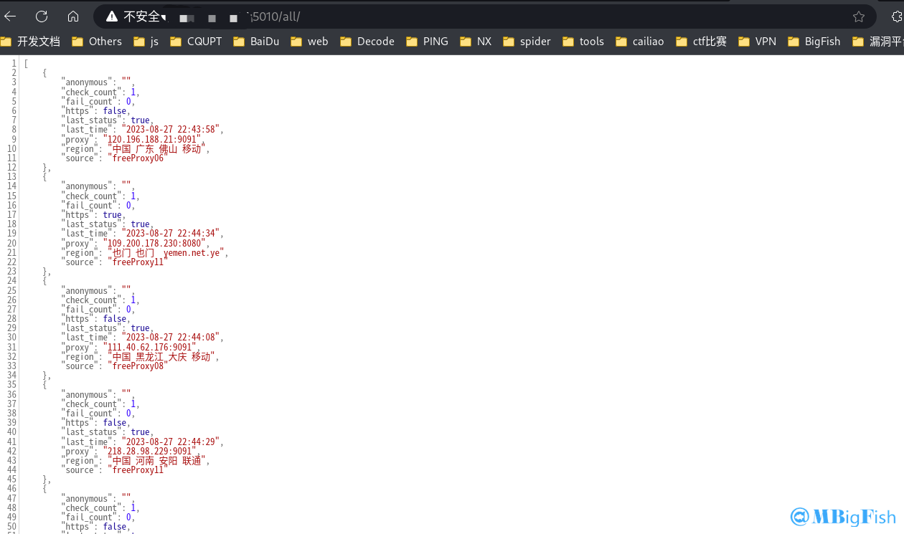

# proxy\_pool安装教程（代理池搭建）

## 一、安装 docker

```
# 官方一键安装脚本
curl -fsSL https://get.docker.com | bash -s docker --mirror Aliyun

#国内 daocloud一键安装命令
curl -sSL https://get.daocloud.io/docker | sh
```

## 二、安装 docker-compose

```
# 这个是官方地址，可能比较慢，推荐使用下面的国内镜像地址
sudo curl -L "https://github.com/docker/compose/releases/download/1.29.1/docker-compose-$(uname -s)-$(uname -m)" -o /usr/local/bin/docker-compose

# 国内镜像地址
curl -L https://get.daocloud.io/docker/compose/releases/download/1.29.1/docker-compose-`uname -s`-`uname -m` > /usr/local/bin/docker-compose

# 下载完之后可以看下 /usr/local/bin 这个目录有没有 docker-compose 这个文件
```

## 三、安装 proxy\_pool

* **项目地址：**[https://github.com/jhao104/proxy\_pool](https://github.com/jhao104/proxy_pool)

#### 1.下载文件

```
 git clone https://github.com/jhao104/proxy_pool.git
```

#### 2.打开下载的文件夹

```
cd proxy_pool/
```

#### 3.运行

```
docker-compose up -d
```



#### 4.如果遇到以下报错时

```
# docker-compose version
-bash: /usr/local/bin/docker-compose: Permission denied
```

* **解决方法**

```
chmod +x /usr/local/bin/docker-compose
```

## 四、使用

* 启动 web 服务后，默认配置下会开启 [http://127.0.0.1:5010](http://127.0.0.1:5010/) 的 api 接口服务：

| **应用程序编程接口** | **方法** | **描述**               | **参数**                                           |
| -------------------------- | -------------- | ---------------------------- | -------------------------------------------------------- |
| **/**                | **GET**  | **api 介绍**           | **None**                                           |
| **/get**             | **GET**  | **随机获取一个代理**   | **可选参数：**`?type=https`过滤支持 https 的代理 |
| **/pop**             | **GET**  | **获取并删除一个代理** | **可选参数：**`?type=https`过滤支持 https 的代理 |
| **/all**             | **GET**  | **获取所有代理**       | **可选参数：**`?type=https`过滤支持 https 的代理 |
| **/count**           | **GET**  | **查看代理数量**       | **None**                                           |
| **/delete**          | **GET**  | **删除代理**           | `?proxy=host:ip`                                       |
