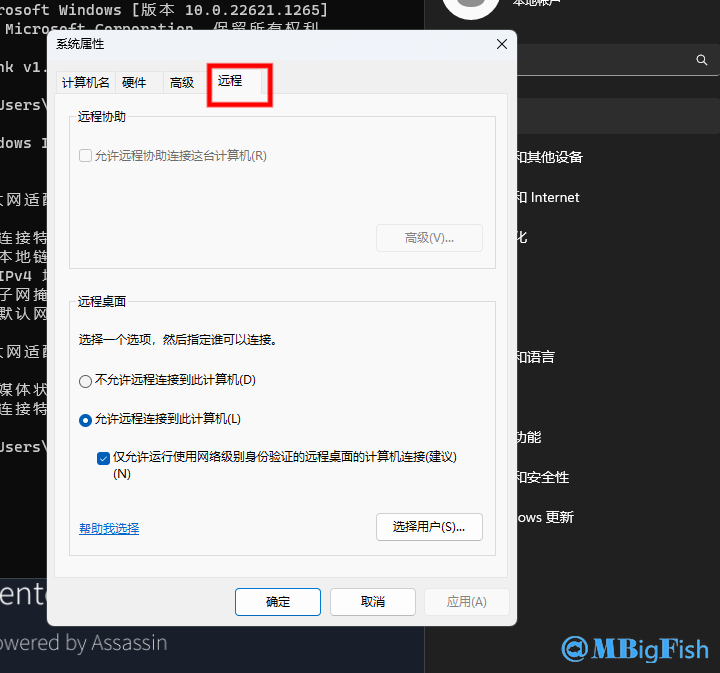

# rdesktop连接Windows远程桌面因CredSSP报错解决办法

## 一、问题

* **今天在使用 kali 工具 rdesktop 连接 windows 远程桌面时，遇到以下报错问题**

```
Core(warning): Certificate received from server is NOT trusted by this system, an exception has been added by the user to trust this specific certificate.
Failed to initialize NLA, do you have correct Kerberos TGT initialized ?
Failed to connect, CredSSP required by server (check if server has disabled old TLS versions, if yes use -V option).
```


* **通过网上查找资料，发现只需关闭仅允许运行使用网络界别身份验证的远程桌面的计算机连接 (建议)**

## 二、解决

**1、打开 windows 高级设置**


**2、选择远程**



**3、取消勾选 仅允许运行使用网络界别身份验证的远程桌面的计算机连接 (建议)**


**4、即可成功连接**


## 三、替代

**有些有时我们无法进入 windows 进行上述配置，这个时候就可以使用另一款工具**

### 1.安装 remmina

```
sudo apt install remmina
```

### 2、创建连接


### 3、成功连接


