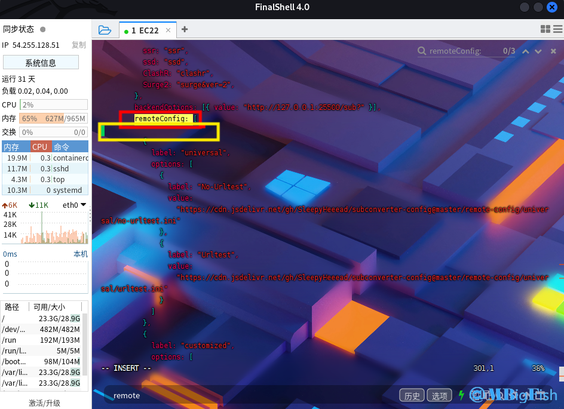
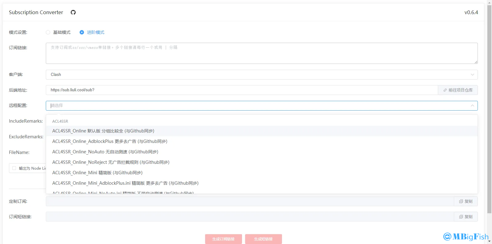
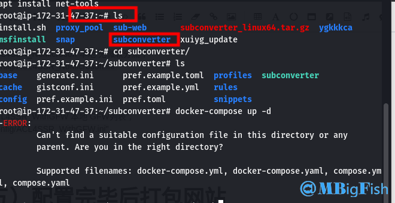
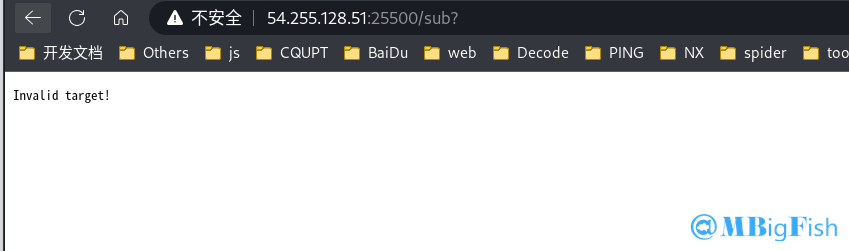

# sub-web订阅转换面板的搭建教程

## 一、Sub-Web 前端搭建

**项目地址：**[https://github.com/CareyWang/sub-web](https://github.com/CareyWang/sub-web)

### （一）安装 docker

```
# 官方一键安装脚本
curl -fsSL https://get.docker.com | bash -s docker --mirror Aliyun

#国内 daocloud 一键安装命令
curl -sSL https://get.daocloud.io/docker | sh
```

### （二）下载源码

```
git clone https://github.com/CareyWang/sub-web.git
```

### （三）搭建前端

#### 1.打开文件

```
cd sub-we
```

#### 2.运行 docker

```
docker run -d -p 58080:80 --restart always --name subweb careywong/subweb:latest
```

### （四）修改后端地址并增加远程规则

**1.找到 VPS /root/sub-web/src/views/Subconverter.vue 文件**

**2.找到 backendOptions 将你解析好的后端地址输入进去。域名为你刚才准备的后端域名，要将 http 改成 https，并且增加 /sub? 的后缀。**

**3.找到 **`remoteConfig: [`   后  回车将下面的规则复制进去



```
{
    label: "ACL4SSR",
    options: [
        {
            label: "ACL4SSR_Online 默认版 分组比较全 (与Github同步)",
            value: "https://raw.githubusercontent.com/ACL4SSR/ACL4SSR/master/Clash/config/ACL4SSR_Online.ini"
        },

        {
            label: "ACL4SSR_Online_AdblockPlus 更多去广告 (与Github同步)",
            value: "https://raw.githubusercontent.com/ACL4SSR/ACL4SSR/master/Clash/config/ACL4SSR_Online_AdblockPlus.ini"
        },

        {
            label: "ACL4SSR_Online_NoAuto 无自动测速 (与Github同步)",
            value:"https://raw.githubusercontent.com/ACL4SSR/ACL4SSR/master/Clash/config/ACL4SSR_Online_NoAuto.ini"
        },

        {
            label: "ACL4SSR_Online_NoReject 无广告拦截规则 (与Github同步)",
            value:"https://raw.githubusercontent.com/ACL4SSR/ACL4SSR/master/Clash/config/ACL4SSR_Online_NoReject.ini"
        },

        {
            label: "ACL4SSR_Online_Mini 精简版 (与Github同步)",
            value:"https://raw.githubusercontent.com/ACL4SSR/ACL4SSR/master/Clash/config/ACL4SSR_Online_Mini.ini"
      },

      {
            label: "ACL4SSR_Online_Mini_AdblockPlus.ini 精简版 更多去广告 (与Github同步)",
            value:"https://raw.githubusercontent.com/ACL4SSR/ACL4SSR/master/Clash/config/ACL4SSR_Online_Mini_AdblockPlus.ini"
      },

      {
            label: "ACL4SSR_Online_Mini_NoAuto.ini 精简版 不带自动测速 (与Github同步)",
            value:"https://raw.githubusercontent.com/ACL4SSR/ACL4SSR/master/Clash/config/ACL4SSR_Online_Mini_NoAuto.ini"
      },

      {
            label: "ACL4SSR_Online_Mini_Fallback.ini 精简版 带故障转移 (与Github同步)",
            value:"https://raw.githubusercontent.com/ACL4SSR/ACL4SSR/master/Clash/config/ACL4SSR_Online_Mini_Fallback.ini"
      },

      {
            label: "ACL4SSR_Online_Mini_MultiMode.ini 精简版 自动测速、故障转移、负载均衡 (与Github同步)",
            value:"https://raw.githubusercontent.com/ACL4SSR/ACL4SSR/master/Clash/config/ACL4SSR_Online_Mini_MultiMode.ini"
      },

      {
          label: "ACL4SSR_Online_Full 全分组 重度用户使用 (与Github同步)",
          value:"https://raw.githubusercontent.com/ACL4SSR/ACL4SSR/master/Clash/config/ACL4SSR_Online_Full.ini"
      },

      {
          label: "ACL4SSR_Online_Full_NoAuto.ini 全分组 无自动测速 重度用户使用 (与Github同步)",
          value:"https://raw.githubusercontent.com/ACL4SSR/ACL4SSR/master/Clash/config/ACL4SSR_Online_Full_NoAuto.ini"
      },

      {
          label: "ACL4SSR_Online_Full_AdblockPlus 全分组 重度用户使用 更多去广告 (与Github同步)",
          value:"https://raw.githubusercontent.com/ACL4SSR/ACL4SSR/master/Clash/config/ACL4SSR_Online_Full_AdblockPlus.ini"
      },

      {
          label: "ACL4SSR_Online_Full_Netflix 全分组 重度用户使用 奈飞全量 (与Github同步)",
          value:"https://raw.githubusercontent.com/ACL4SSR/ACL4SSR/master/Clash/config/ACL4SSR_Online_Full_Netflix.ini"
      },

      {
          label: "ACL4SSR 本地 默认版 分组比较全",
          value: "config/ACL4SSR.ini"
      },

      {
          label: "ACL4SSR_Mini 本地 精简版",
          value: "config/ACL4SSR_Mini.ini"
      },

      {
          label: "ACL4SSR_Mini_NoAuto.ini 本地 精简版+无自动测速",
          value: "config/ACL4SSR_Mini_NoAuto.ini"
      },

      {
          label: "ACL4SSR_Mini_Fallback.ini 本地 精简版+fallback",
          value: "config/ACL4SSR_Mini_Fallback.ini"
      },

      {
          label: "ACL4SSR_BackCN 本地 回国",
          value: "config/ACL4SSR_BackCN.ini"
      },

      {
          label: "ACL4SSR_NoApple 本地 无苹果分流",
          value: "config/ACL4SSR_NoApple.ini"
      },

      {
            label: "ACL4SSR_NoAuto 本地 无自动测速 ",
            value: "config/ACL4SSR_NoAuto.ini"
      },

      {
            label: "ACL4SSR_NoAuto_NoApple 本地 无自动测速&无苹果分流",
            value: "config/ACL4SSR_NoAuto_NoApple.ini"
      },

      {
            label: "ACL4SSR_NoMicrosoft 本地 无微软分流",
            value: "config/ACL4SSR_NoMicrosoft.ini"
      },

      {
            label: "ACL4SSR_WithGFW 本地 GFW列表",
            value: "config/ACL4SSR_WithGFW.ini"
      }
    ]
  },
```

### （五）配置完毕后打包网站

* **配置完毕以后，程序会自动更新，再次刷新前端网页，会出现刚才添加的相关规则，如图所示：**



* **如图所示，经过上面的修改默认后端地址和原程配置的规则就修改好了。**
* **至此，我们的前端调试完毕，我们现在需要打包，生成一个发布目录并将他发布了。**
* **首先停止调试程序，CTRL+C ，退出当前调试，然后执行下面的命令进行打包：**
* **参考链接：**[https://www.mxlong.com/13.html](https://www.mxlong.com/13.html)

## 二、SubConverter 后端搭建

### （一）下载并解压 subconverter 二进制文件

```
cd /root
wget https://github.com/tindy2013/subconverter/releases/download/v0.7.2/subconverter_linux64.tar.gz
tar -zxvf subconverter_linux64.tar.gz
```

* **完成以后，在 /root 文件夹下会多出一个 subconverter 的文件夹，这个就是我们的后端程序**



### （二）修改配置文件参数

* **找到 VPS 文件 /root/subconverter/pref.ini ，找到如下参数进行修改**

```
api_access_token=123123dfsdsdfsdfsdf            #随意设置自己知道就行
managed_config_prefix=https://sub.yourdomin.com  #设置成我们刚刚解析的域名
listen=127.0.0.1                                #这里改成 127.0.0.1 进行反代
```

### （三）创建服务进程并启动

* **接下来我们需要创建一个服务，让 VPS 每次重启或是开机自动运行后端程序**
* **找到 VPS 目录 /etc/systemd/system，创建一个名为 sub.service 的文件**
* **打开文件，贴入以下内容，保存。**

```
[Unit]
Description=A API For Subscription Convert
After=network.target

[Service]
Type=simple
ExecStart=/root/subconverter/subconverter
WorkingDirectory=/root/subconverter
Restart=always
RestartSec=10

[Install]
WantedBy=multi-user.target
```

### （四）检查运行状态以及设置开机自启

```
systemctl daemon-reload
systemctl start sub
systemctl enable sub
systemctl status sub
```

* **到这里，后端也就搭建完毕了，我们现在可以在浏览器里面访问我们的后端了，访问后端域名出现下图即为后端搭建成功！**


