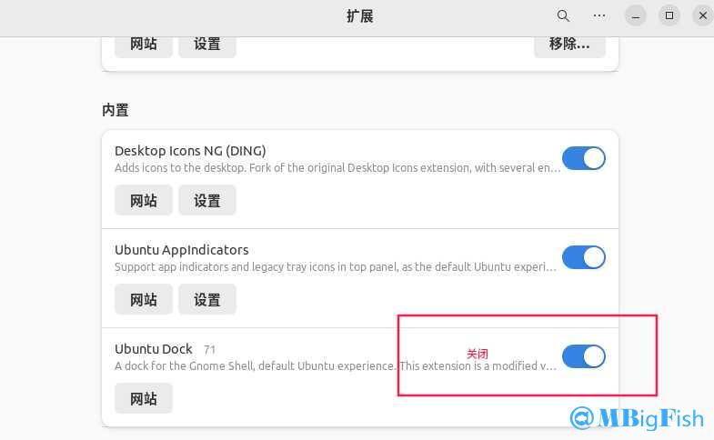
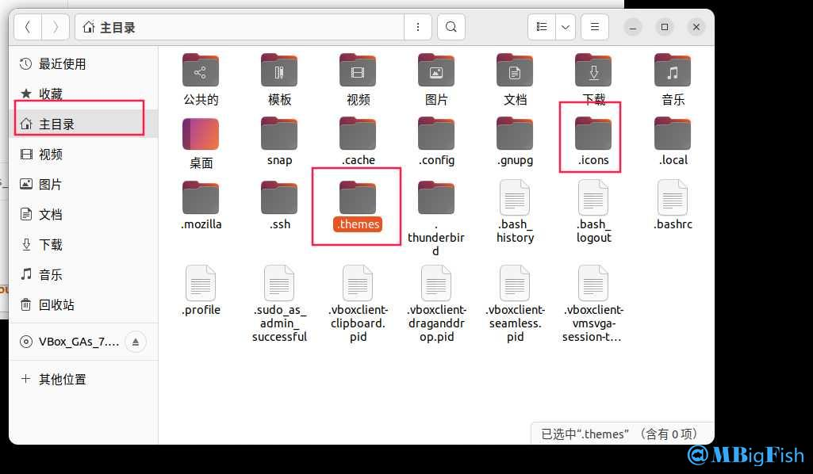
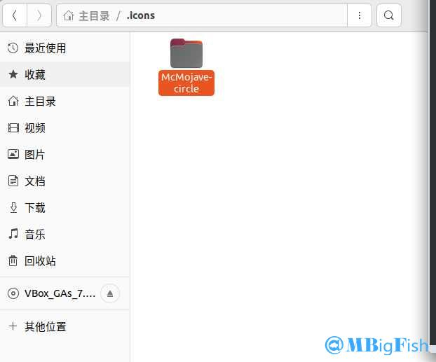
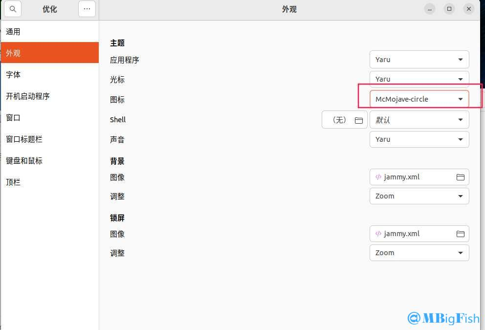
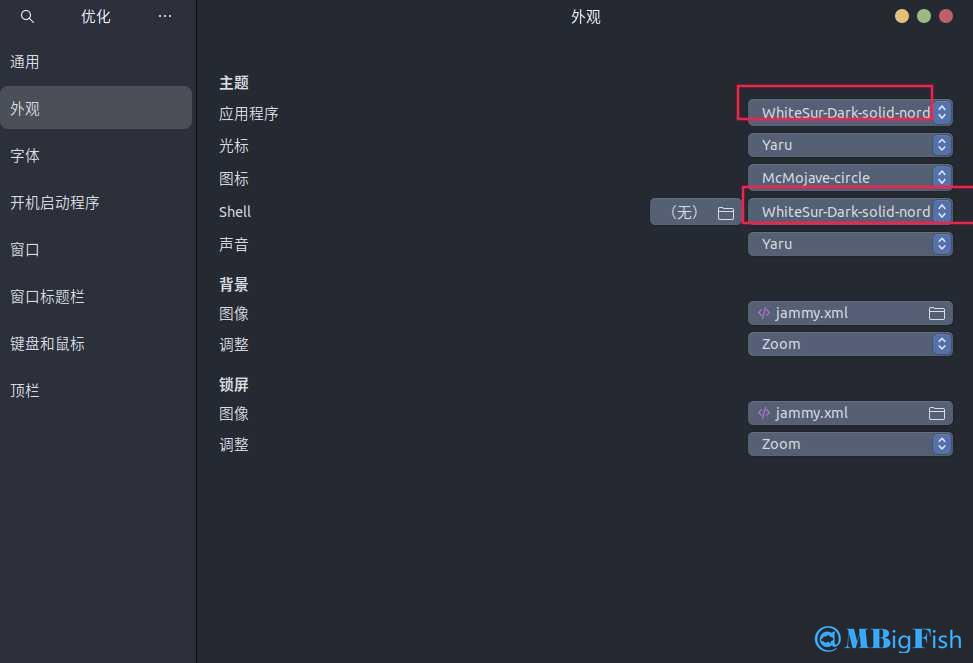
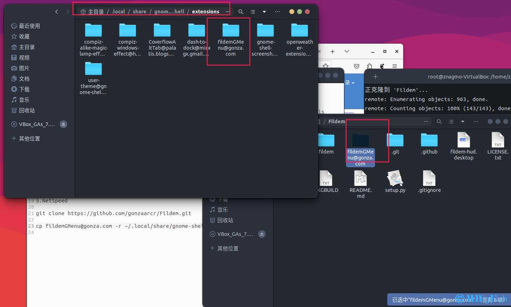
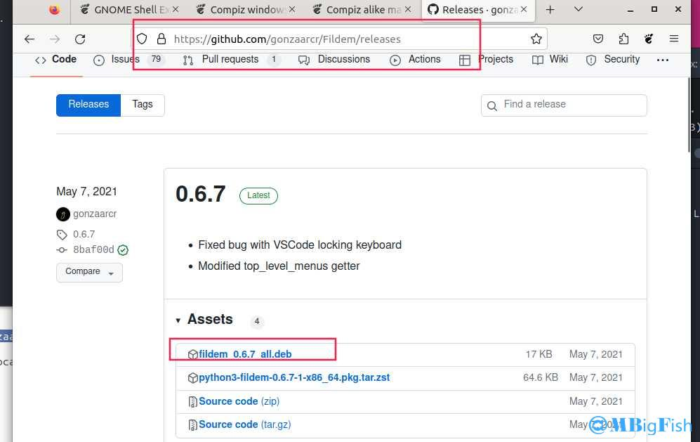
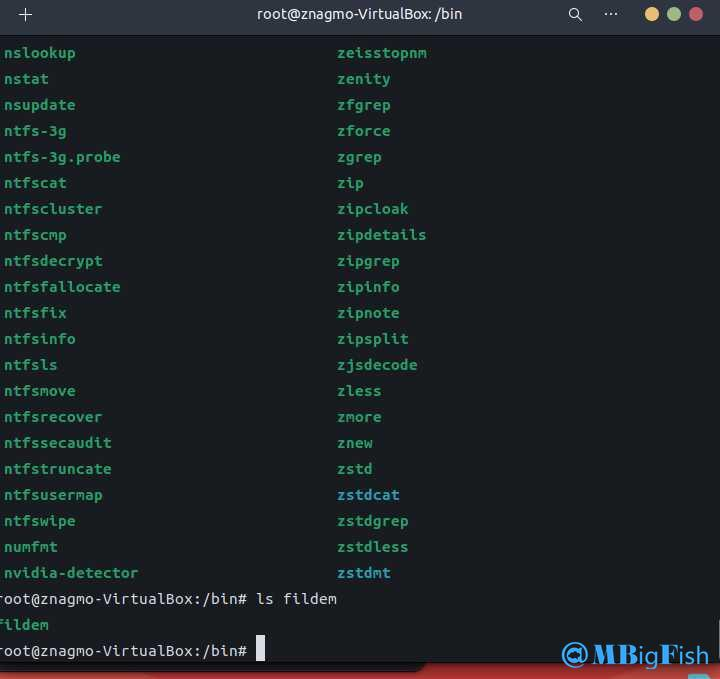
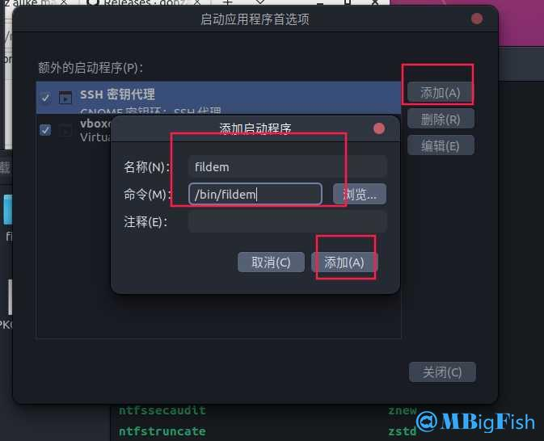
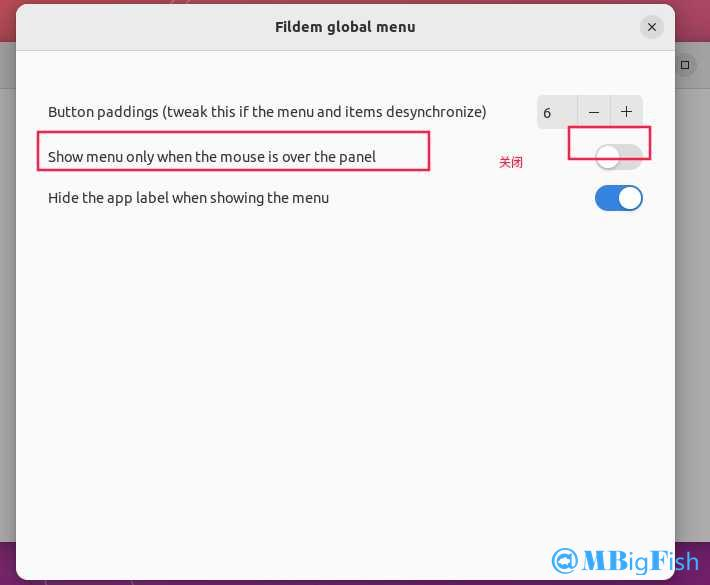

# ubuntu美化

## 一：更新源

```
sudo apt-get update

sudo apt-get upgrade
```

## 二：下载

```
1、执行：sudo apt install gnome-tweaks chrome-gnome-shell

2、执行：apt install gtk2-engines-murrine gtk2-engines-pixbuf

3、执行：install sassc optipng inkscape libcanberra-gtk-module libglib2.0-dev libxml2-utils

4、执行（拓展）：sudo apt install gnome-shell-extensions
```

## 三：安装扩展

**下载地址：**[https://extensions.gnome.org/#](https://extensions.gnome.org/#)

```
1. User Themes
2. Coverflow Alt-Tab（切换任务）
3. Screenshot Tool（截图根据）
4. OpenWeather（天气）
5. NetSpeed（测速）
6. dash to dock (dock 栏)
7. Compiz alike magic lamp effect（魔灯）
8. Compiz windows effect（窗口抖动）
9. blur-my-shell（背景）
10. caffeine（禁用屏幕保护）
11. Clipboard Indicator（剪贴板）
12. inactivity（隐藏顶部活动）
13. input Method Panel（美化输入）
14. Applications Menu（顶部菜单栏）
15. auto-move-windows（在创建窗口时将应用程序移动到特定的工作区）
16. desktop-icons-ng-ding（桌面图标）
17. native-window-placement（以更紧凑的方式在概览中排列窗口）
18. Places Status Indicator（顶栏文件夹）
19. removable-drive-menu（可移动驱动器菜单）
20. screenshot-window-sizer（屏幕截图窗口大小调整器）
21. tiling-assistant（平铺切换任务）
22. Ubuntu AppIndicators（Ubuntu 应用指示器底栏应用框）
23. Window List（将窗口列表添加到顶部面板）
24. windowNavigator（允许在覆盖模式下使用键盘选择窗口和工作区）
25. Workspace Indicator（工作区指示器）
26. 关闭 ubuntu dock
```



## 四：下载主题包等

* **下载：**[https://wwi.lanzoup.com/iOH3Q06v525a](https://wwi.lanzoup.com/iOH3Q06v525a)

## 五：安装主题

### （一）创建文件夹

**在用户根目录创建两个文件夹**

1. **.themes**
2. **.icons**



### （二）安装图标

**1.将 McMojave-circle 移动到 .icons 文件下**



**2.在优化中选择该图标**



### （三）安装主题

**1.将 WhiteSur-Dark 移动到 .themes 文件夹下**

**2.将 WhiteSur-Dark-solid-nord 移动到 .themes 文件夹下**

**3.优化中 应用程序 选择 WhiteSur-Dark-solid-nord**

**4.优化中 shell 选择 WhiteSur-Dark-solid-nord**



**5.在优化中选择该主题**

## 六：全局菜单

### （一）下载

```
git clone https://github.com/gonzaarcr/Fildem.git
```

### （二）创建文件夹

```
/.local/share/gnome-shell/extensions/
```

### （三）打开下载的 Fildem 文件

### （四）复制

```
将 fildemGMenu@gonza.com 复制到 /.local/share/gnome-shell/extensions/
```

**1.命令：cp **[fildemGMenu@gonza.com](mailto:fildemGMenu@gonza.com) -r \~/.local/share/gnome-shell/extensions/

**2.直接复制也可以**

### （五）去 GitHub 下载 releases

#### 1.下载地址

* [https://github.com/gonzaarcr/Fildem](https://github.com/gonzaarcr/Fildem)



#### 2.安装：sudo dpkg -i 包名

* **如果缺少依赖，先执行：apt install -f**

#### 3.设置开机自启

##### （1）在 bin 文件下找到 fildem

* **命令：ls fildem**



##### （2）打开启动应用程序

* **添加**



##### （3）在拓展中启用 fildem global menu

* **如果找不到，重启即可！**

##### （4）然后打开 fildem global menu 设置，关闭第一个



##### （5）然后注销或重启即可成功

##### （6）将 shell 修改为 whitesur-dark 即可顶栏

## 七：参考

1. **主题包：**[https://www.gnome-look.org/p/1403328/](https://www.gnome-look.org/p/1403328/)
2. **icnos 图标：**[https://www.pling.com/p/1405756/](https://www.pling.com/p/1405756/)
3. **鼠标图标：**[https://www.pling.com/p/1355701/](https://www.pling.com/p/1355701/)
4. **壁纸图标：**[https://www.pling.com/p/1398833/](https://www.pling.com/p/1398833/)
5. [https://zhuanlan.zhihu.com/p/176977192](https://zhuanlan.zhihu.com/p/176977192)
6. **b 站**
