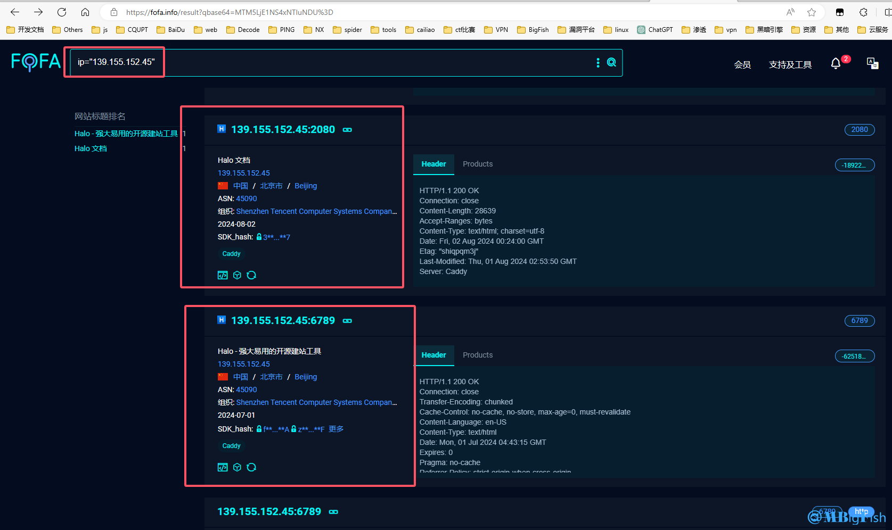

# 渗透思路 - 信息收集

**本篇渗透思路由本人对网上信息归纳总结，形成自己的独特渗透思路，原创内容！！！**

**时间：2024-09-01**

**作者：mBigFish**

## 一、信息收集

* **渗透的本质是信息收集，信息收集也叫做资产收集。**
* **信息收集是渗透测试的前期主要工作，是非常重要的环节，收集足够多的信息才能方便接下来的测试，信息收集主要是收集网站的域名信息、子域名信息、目标网站信息、目标网站真实IP、敏感/目录文件、开放端口和中间件信息等等。通过各种渠道和手段尽可能收集到多的关于这个站点的信息，有助于我们更多的去找到渗透点，突破口。**
* **下面，我将信息收集分为两部分**
  * **第一部分：对靶标进行资产拓展，获取到更多的资产，从而增大渗透面。**
  * **第二部分：对获取到的每一个站点，进行站点相关信息的获取。**

### （一）资产收集

#### 1.whois

```
- 注册人 电话 邮箱 地址
- http://whois.chinaz.com
- kali自带的whois工具
```

#### 2.子域名

##### （1）域名的级别分类

* **根域名（也称顶级域名），如** `baidu.com`
* **二级域名，如** `www.baidu.com`
* **三级域名，如** `test.www.baidu.com`

##### （2）域名的解析类型

```
1、A（Address）记录：
    是用来指定主机名（或域名）对应的IP地址记录。用户可以将该域名下的网站服务器指向到自己的web server上。同时也可以设置您域名的二级域名。
  
2、别名(CNAME)记录：
    也被称为规范名字。这种记录允许您将多个名字映射到同一台计算机。通常用于同时提供WWW和MAIL服务的计算机。例如，有一台计算机名为“host.mydomain.com”（A记录）。它同时提供WWW和MAIL服务，为了便于用户访问服务。可以为该计算机设置两个别名（CNAME）：WWW和MAIL。这两个别名的全称就是“www.mydomain.com”和“mail.mydomain.com”。实际上他们都指向“host.mydomain.com”。
    同样的方法可以用于当您拥有多个域名需要指向同一服务器IP，此时您就可以将一个域名做A记录指向服务器IP然后将其他的域名做别名到之前做A记录的域名上，那么当您的服务器IP地址变更时您就可以不必麻烦的一个一个域名更改指向了 只需要更改做A记录的那个域名其他做别名的那些域名的指向也将自动更改到新的IP地址上了。
    
3、MX（Mail Exchanger）记录:
    是邮件交换记录，它指向一个邮件服务器，用于电子邮件系统发邮件时根据 收信人的地址后缀来定位邮件服务器。例如，当Internet上的某用户要发一封信给 user@mydomain.com 时，该用户的邮件系统通过DNS查找mydomain.com这个域名的MX记录，如果MX记录存在， 用户计算机就将邮件发送到MX记录所指定的邮件服务器上。

4、TXT记录:
    TXT记录一般指为某个主机名或域名设置的说明，如：
        1）admin IN TXT "jack, mobile:13800138000"；
        2）mail IN TXT "邮件主机, 存放在xxx ,管理人：AAA"，Jim IN TXT "contact: abc@mailserver.com"
    也就是您可以设置 TXT ，以便使别人联系到您。
  
5、NS记录：
    ns记录全称为Name Server 是一种域名服务器记录，用来明确当前你的域名是由哪个DNS服务器来进行解析的。
  
查询网站：（key：域名解析记录在线查询）
    https://tool.chinaz.com/nslookup
    https://securitytrails.com/
    https://33tool.com/nslookup/
```

##### （3）收集子域名

* **在线收集**

```
DNS侦测：https://dnsdumpster.com/
IP138查询子域名：https://site.ip138.com/baidu.com/domain.htm
```

* **工具收集**

```
oneforall：https://github.com/shmilylty/OneForAll
```

* **搜索引擎**

```
fofa
    title=“公司名称”
百度 
    intitle=公司名称
Google
    intitle=公司名称
站长之家直接搜索名称或者网站域名即可查看相关信息
    http://tool.chinaz.com
钟馗之眼 
    site=域名
```

* **证书透明公开日志枚举**

```
https://crt.sh/
https://censys.com/
https://myssl.com/
```


#### 3.C段&旁站

```
# 旁站 
    同服务器下的不同web服务，从其他的web界面拿到服务器权限
    站长之家：   https://tool.chinaz.com/same
    查旁站：    https://chapangzhan.com/  
    
# C段 
    对同网段下的不同服务区IP下的WEB应用进行攻击，再使用这个服务器来当跳板进行攻击，可以使用masscan来进行扫描
    WebScan：   https://www.webscan.cc/
    fofa：      ip="8.210.121.0/24"
    shodan：    net:"8.210.121.0/24"
    C段端口服务探测：
        Cwebscanner：    https://github.com/se55i0n/Cwebscanner
        Lscan：          https://github.com/sh1yan/Lscan
```

#### 4.备案信息

```
天眼查 https://www.tianyancha.com/

ICP备案查询网http://www.beianbeian.com/

爱站备案查询https://icp.aizhan.com/

域名助手备案信息查询 http://cha.fute.com/index
```

#### 5.端口

##### （1）常见端口及其脆弱点

```
端口：21 服务：FTP/TFTP/VSFTPD 总结：爆破/嗅探/溢出/后门
端口：22 服务：ssh远程连接      总结：爆破/openssh漏洞
端口：23 服务：Telnet远程连接   总结：爆破/嗅探/弱口令
端口：25 服务：SMTP邮件服务     总结：邮件伪造
端口：53 服务：DNS域名解析系统   总结：域传送/劫持/缓存投毒/欺骗
端口：67/68 服务：dhcp服务      总结：劫持/欺骗
端口：110 服务：pop3              总结：爆破/嗅探
端口：139 服务：Samba服务         总结：爆破/未授权访问/远程命令执行
端口：143 服务：Imap协议         总结：爆破161SNMP协议爆破/搜集目标内网信息
端口：389 服务：Ldap目录访问协议 总结：注入/未授权访问/弱口令
端口：445 服务：smb              总结：ms17-010/端口溢出
端口：512/513/514 服务：Linux Rexec服务 总结：爆破/Rlogin登陆
端口：873 服务：Rsync服务                 总结：文件上传/未授权访问
端口：1080 服务：socket                  总结：爆破
端口：1352 服务：Lotus domino邮件服务   总结：爆破/信息泄漏
端口：1433 服务：mssql                  总结：爆破/注入/SA弱口令
端口：1521 服务：oracle       总结：爆破/注入/TNS爆破/反弹shell2049Nfs服务配置不当
端口：2181 服务：zookeeper服务            总结：未授权访问
端口：2375 服务：docker remote api    总结：未授权访问
端口：3306 服务：mysql                 总结：爆破/注入
端口：3389 服务：Rdp远程桌面链接        总结：爆破/shift后门
端口：4848 服务：GlassFish控制台       总结：爆破/认证绕过
端口：5000 服务：sybase/DB2数据库      总结：爆破/注入/提权
端口：5432 服务：postgresql             总结：爆破/注入/缓冲区溢出
端口：5632 服务：pcanywhere服务        总结：抓密码/代码执行
端口：5900 服务：vnc                     总结：爆破/认证绕过
端口：6379 服务：Redis数据库           总结：未授权访问/爆破
端口：7001/7002 服务：weblogic         总结：java反序列化/控制台弱口令
端口：80/443 服务：http/https         总结：web应用漏洞/心脏滴血
端口：8069 服务：zabbix服务            总结：远程命令执行/注入
端口：8161 服务：activemq             总结：弱口令/写文件
端口：8080/8089 服务：Jboss/Tomcat/Resin 总结：爆破/PUT文件上传/反序列化
端口：8083/8086 服务：influxDB         总结：未授权访问
端口：9000 服务：fastcgi                 总结：远程命令执行
端口：9090 服务：Websphere             总结：控制台爆破/java反序列化/弱口令
端口：9200/9300 服务：elasticsearch   总结：远程代码执行
端口：11211 服务：memcached             总结：未授权访问
端口：27017/27018 服务：mongodb         总结：未授权访问/爆破
```

##### （2）端口范围

```
0 - 65535
```

##### （3）常见端口扫描方式

* **全扫描**
  * **扫描主机尝试使用三次握手与目标主机的某个端口建立正规的连接，若成功建立连接，则端口处于开放状态，反之处于关闭状态。全扫描实现简单，且以较低的权限就可以进行该操作。但是在流量日志中会有大量明显的记录。**
* **半扫描**
  * **在半扫描中，仅发送SYN数据段，如果应答为RST，则端口处于关闭状态，若应答为SYN/ACK，则端口处于监听状态。不过这种方式需要较高的权限，而且部分防火墙已经开始对这种扫描方式做处理。**
* **FIN扫描**
  * **FIN扫描是向目标发送一个FIN数据包，如果是开放的端口，会返回RST数据包，关闭的端口则不会返回数据包，可以通过这种方式来判断端口是否打开。**
  * **这种方式并不在TCP三次握手的状态中，所以不会被记录，相对SYN扫描要更隐蔽一些。**

##### （4）常见端口扫描工具

* **masscan扫描**

```
msscan -p 1 - 65535 ip --rate=1000
```

* **nmap扫描**

```
nmap -sV 192.168.0.1
nmap -sT 192.168.0.1
nmap -Pn -A -sC 192.168.0.1
nmap -sU -sT -p0-65535 192.168.0.1
nmap -Pn -sV www.baidu.com

# 端口状态
open		端口开放
closed		端口关闭
filtered	端口过滤状态 存在防火墙 数据包无法到达

# 多个IP扫描
nmap -iL ip.txt

# 操作系统
nmap -O 192.168.0.1
```

* **在线端口扫描**

`http://coolaf.com/tool/port`

#### 6.CDN信息

##### （1）判断

* **超级ping**


* **nslookup命令**
  * **如果返回域名解析对应多个 IP 地址多半是使用了 CDN**


##### （2）寻找真实IP

###### A、查询子域名

* **因为CDN收费较高，对于部分站长，他们只会套用一些业务比较多的站点，或者是对响应速度要求比较高的站点，如视频网站对速度要求较高，对于其他剩下的子站，可能就会不套用CDN，因此通过子域名可能会获取到真实IP（前提是此子站和套用了CDN的站点再在同一台服务器上）**

###### B、历史 DNS 记录

* **查询ip与域名绑定历史记录，可能会发现使用CDN之前的目标ip。**
* **除了过去的 DNS 记录，即使是当前的记录也可能泄漏原始服务器 IP。例如，MX 记录是一种常见的查找 IP 的方式。如果网站在与 web 相同的服务器和 IP 上托管自己的邮件服务器，那么原始服务器 IP 将在 MX 记录中。**

###### C、全球Ping

* **国内很多 CDN 厂商因为各种原因只做了国内的线路，而针对国外的线路可能几乎没有，此时我们使用国外的主机直接访问可能就能获取到真实 IP。**

###### D、主动邮箱

* **很多站点都有发送邮件sendmail的功能，如Rss邮件订阅等。而且一般的邮件系统很多都是在内部，没有经过CDN的解析。可在邮件源码里面就会包含服务器的真实 IP。**
* **1、如halo博客官方网站** `halo.run`套用Cloudflare的CDN。


* **2、查看他官网发来的邮件**


* **3、查看邮件原文，获取到真实IP**


* **4、检验一下IP（如果是CDNIP，通过IP是访问不到他的网站的，只有他的真实IP才可以通过IP访问到网站）**




###### E、网站漏洞查找

* **目标敏感文件泄露，例如：phpinfo 之类的探针、GitHub 信息泄露等。**
* **XSS 盲打，命令执行反弹 shell，SSRF 等。**
* **无论是用社工还是其他手段，拿到了目标网站管理员在 CDN 的账号，从而在从 CDN 的配置中找到网站的真实 IP。**

### （二）站点信息

#### 1.操作系统

* **通过对访问的uri进行大小写替换，看能否正常访问网站，因为Windows服务器对大小写不敏感，Linux服务器对大小写会有区分**
* **通过ping 网站的服务器，通过TTL的时间区分**
* **通过文件名来判断目标使用的操作系统:我们访问一个网站不存在的文件，使网站报错，当报错信息为IIS6.0则说明是Windows2003系统，当报错信息为IIS7时则一般为Windows7或者Windows8，当报错信息为apache时则说明目标系统为Linux系统**
* **使用nmap判断操作系统：nmap -O IP地址来判断使用的是什么操作系统**

```
通过查看TTL的值，可以大致判断操作系统的类型，因为不同的操作系统通常使用不同的默认TTL值

一般大于100是Windows，小于100是Linux

WINDOWS NT/2000   TTL：128
WINDOWS 95/98     TTL：32
UNIX              TTL：255
LINUX             TTL：64
WIN7          	  TTL：64
```

**（1）Linux**


**（2）Windows**


#### 2.开发语言

```
Asp、php、jsp、aspx等

判断网站开完语言的目的：比如一些常规漏洞，如sql注入，在java写的网站中就很少会存在
    1.对网站进行访问，查看网站的文件后缀即可判断出网站使用的是什么语言
    2.如果后缀看不到，既可在文件后面添加php、jsp、py、asp等常见后缀来看看那个可以正常访问，能够正常访问则说明使用的是什么语言编写的
    3.通过x-powered-by字段进行判断，但有些网站会对其进行隐藏
```

#### 3.指纹信息

```
分为CMS开源、闭源售卖、自主研发

# 常见方式
    - Robots文件
    - /plugs/之梦
    - 登陆后台泄露cms类型
    - 网站页脚泄露的cms
    - 工具自动化识别cms类型

# 在线识别：
    - 云溪		https://www.yunsee.cn
    - 潮汐指纹   http://finger.tidesec.net
    - 在线识别   http://whatweb.bugscaner.com/look

# 工具识别：
    - 御剑CMS识别
    - whatcms
    - cmsldentification
```

#### 4.中间件 / 服务器

```
判断中间件的目的:有些中间件存在历史漏洞，可以直接进行利用
    1.访问网站，通过响应头中的server字段来判断使用的是什么中间件
    2.制造网站报错，通过网站报错信息来判断网站使用的是什么中间件，因为每个中间件的报错页面都不相同，而且都有其各自的特征。
    3.使用fofa等工具对网站进行搜集时，有时候会显示出使用的中间件信息
当得到中间件的相关信息之后，可以查看中间件所存在的历史漏洞，如果其版本相符合，可以进行相关的测试，

中间件漏洞集合：https://blog.csdn.net/weixin_44288604/article/details/121568508
```

#### 5.敏感文件和目录

* **robots.txt**
* **crossdomin.xml**
* **sitemap.xml**
* **后台目录**
* **网站安装包**
* **网站上传目录**
* **mysql管理页面**
* **phpinfo**
* **网站文本编辑器**
* **测试文件**
* **网站备份文件（rar、zip、7z、tar.gz、bak）**
* **DS\_Store 文件**
* **WEB - INF/web.xml文件**
* **vim编辑器缓存**

```
   临时文件是在vim编辑文本时就会创建的文件，如果程序正常退出，临时文件自动删除，如果意外退出就会保留，当vim异常退出后，因为未处理缓存文件，导致可以通过缓存文件恢复原始文件内容

   以 index.php 为例 第一次产生的缓存文件名为 .index.php.swp
        第二次意外退出后，文件名为 .index.php.swo
        第三次产生的缓存文件则为   .index.php.swn
        注意：index前有 " . "
```

#### 6.源码泄露

##### （1）备份文件

```
管理员将网站源代码备份在Web目录下，攻击者通过猜解文件路径，下载备份文件，导致源代码泄露。

常见的备份文件后缀：
.rar
.zip
.7z
.tar.gz
.bak  
.txt
.old
.temp
.phps
.sql
```

##### （2）Git泄露

```
Git是一个开源的分布式版本控制系统，在执行git init初始化目录的时候，会在当前目录下自动创建一个.git目录，用来记录代码的变更记录等。发布代码的时候，如果没有把.git这个目录删除，就直接发布到了服务器上，攻击者就可以通过它来恢复源代码。

漏洞利用工具：GitHack
github项目地址：https://github.com/lijiejie/GitHack
```

##### （3）SVN泄露

```
SVN是一个开放源代码的版本控制系统。在使用SVN管理本地代码过程中，会自动生成一个名为.svn的隐藏文件夹，其中包含重要的源代码信息。网站管理员在发布代码时，没有使用‘导出’功能，而是直接复制代码文件夹到WEB服务器上，这就使.svn隐藏文件夹被暴露于外网环境，可以利用.svn/entries文件，获取到服务器源码。

测试访问http://qq.com/.svn/entries，如果存在下面页面，则证明有这个漏洞

漏洞利用工具：SvnHack
github项目地址：https://github.com/callmefeifei/SvnHack
```

##### （4）DS\_Store 泄漏

```
.DS_Store是Mac下Finder用来保存如何展示文件/文件夹的数据文件，每个文件夹下对应一个。如果将.DS_Store上传部署到服务器，可能造成文件目录结构泄漏，特别是备份文件、源代码文件。

漏洞利用工具：ds_store_exp
github项目地址：https://github.com/lijiejie/ds_store_exp
```

##### （6）swp文件泄露

```
swp即swap文件，在编辑文件时产生的临时文件，它是隐藏文件，如果程序正常退出，临时文件自动删除，如果意外退出就会保留，文件名为 .filename.swp。

漏洞利用：直接访问.swp文件，下载回来后删掉末尾的.swp，获得源码文件。
```

##### （7）composer.json泄漏（ PHP特性）

```
# composer.json文件作用
	composer.json文件定义了您当前项目的依赖项，以及依赖项的一些相关信息

# 常见属性说明：
    name：表示包的名称
    description：表示包的描述
    version：表示包的版本
    type：表示包的类型
    keywords：表示一组用于搜索与筛选的与包相关的关键字
    homepage：表示项目网站的url地址
    readme：表示README文档的绝对路径
    time：表示包的版本发布时间
    license：表示包的许可证
    authors：表示包的作者
    support：表示获取对项目支持的信息对象
    require：表示必须安装的依赖包列表
    autoload：表示PHP自动加载的映射
    minimum-stability：定义了按稳定性过滤包的默认值
    repositories：表示自定义的安装源
    config：表示一组配置选项
    script：表示Composer允许在安装过程的各个部分执行脚本
    extra：表示scripts使用的任意扩展数据

# 检测漏洞是否存在：
	访问网站下方composer.json检查是否存在
```

##### （8）WEB-INF/web.xml 泄露

```
# 介绍
	WEB-INF是Java的WEB应用的安全目录，如果想在页面中直接访问其中的文件，必须通过web.xml文件对要访问的文件进行相应映射才能访问。Tomcat默认禁止这个目录，而Nginx在映射静态文件时，把WEB-INF目录映射进去，而又没有做Nginx的相关安全配置（或Nginx自身缺陷），导致可以通过Nginx访问到Tomcat的WEB-INF目录。

# WEB-INF 主要包含以下文件或目录：
    WEB-INF/web.xml : Web应用程序配置文件, 描述了servlet和其他的应用组件配置及命名规则.
    WEB-INF/classes：包含了站点的所有class文件，包括servlet class和非servlet class
    WEB-INF/lib：存放web应用需要的各种jar文件，放置仅在这个应用中要求的文件，如数据库
    WEB-INF/src：源码目录，按照包名结构放置各种java文件
    WEB-INF/database.properties：数据库配置文件
    META-INF：相当于一个信息包

# 检测漏洞是否存在
	直接手工访问/web.xml文件，通过是否回显来判断是否可访问该文件。

# 漏洞利用
    找到web.xml文件后，根据命名规则推断class文件的路径，最后直接访问class文件，或通过反编译等得到网站源码。

    如：com.wm.ctf.FlagController 推断的文件路径为
    WEB-INF/classes/com/wm/ctf/FlagController.class
```

#### 7.信息泄露

##### （1）浏览器（Google）

```
site:域名
inurl:url中存在的关键字网页
intext:网页正文中的关键词
filetype:指定文件类型
```

##### （2）GitHub

```
in:name test #仓库标题搜索含有关键字
in:descripton test #仓库描述搜索含有关键字
in:readme test #Readme 文件搜素含有关键字
stars:>3000 test #stars 数量大于 3000 的搜索关键字
stars:1000..3000 test #stars 数量大于 1000 小于 3000 的搜索关键字 
forks:>1000 test #forks 数量大于 1000 的搜索关键字
forks:1000..3000 test #forks 数量大于 1000 小于 3000 的搜索关键字 
size:>=5000 test #指定仓库大于 5000k(5M)的搜索关键字 
pushed:>2019-02-12 test #发布时间大于 2019-02-12 的搜索关键字 
created:>2019-02-12 test #创建时间大于 2019-02-12 的搜索关键字 
user:test #用户名搜素
license:apache-2.0 test #明确仓库的 LICENSE 搜索关键字 
language:java test #在 java 语言的代码中搜索关键字
user:test in:name test #组合搜索,用户名 test 的标题含有 test 的关键字
```

##### （3）Google&&GitHub

```
# 邮箱配置信息
    site:Github.com smtp 
    site:Github.com smtp @qq.com 
    site:Github.com smtp @126.com 
    site:Github.com smtp @163.com 
    site:Github.com smtp @sina.com.cn 
    site:Github.com smtp password 
	site:Github.com String password smtp

# 数据库信息
	site:Github.com sa password
	site:Github.com root password
	site:Github.com User ID="sa";Password
	site:Github.com inurl:sql

# SVN信息收集
	site:Github.com svn
    site:Github.com svn username
    site:Github.com svn password
    site:Github.com svn username password

# 综合信息收集
    site:Github.com password
    site:Github.com ftp ftppassword
    site:Github.com 密码
    site:Github.com 内部
```

##### （4）网盘搜索

```
https://www.lingfengyun.com/
```

##### （5）社工库

```
名字 常用ID 邮箱 密码 手机号 

登录 网盘 网站 邮箱 找敏感信息
```

##### （6）js敏感信息

```
1、jsfinder：https://github.com/Threezh1/JSFinder
	JSFinder是一款用作快速在网站的js文件中提取URL，子域名的工具。

2、Packer-Fuzzer：https://github.com/rtcatc/Packer-Fuzzer
    支持自动模糊提取对应目标站点的API以及API对应的参数内容，并支持对：未授权访问、敏感信息泄露、CORS、SQL注入、水平越权、弱口令、任意文件上传七大漏洞进行模糊高效的快速检测。在扫描结束之后，本工具还支持自动生成扫描报告，您可以选择便于分析的HTML版本以及较为正规的doc、pdf、txt版本。

3、SecretFinder：https://github.com/m4ll0k/SecretFinder
	SecretFinder 是一个基于LinkFinder的 Python 脚本，用于发现 JavaScript 文件中的敏感数据，如 apikeys、accesstoken、authorizations、jwt 等。它通过使用 jsbeautifier for Python 结合一个相当大的正则表达式来实现这一点。正则表达式由四个小正则表达式组成。它们负责查找和搜索 js 文件上的任何内容。
```

#### 8.数据库识别

* **按照常见的语言+数据库会有固定的搭配**

```
Access、sqlserver、mysql、oracle、postgresql等
Asp+access/sqlserver
Aspx+sqlserver/access
Php+mysql
Php+postgresql
Php+oracle
Jsp+sqlserver/mysql/oracle
Linux jsp+mysql
Windows jsp+sqlserver
```

* **通过扫描端口，识别使用了什么数据库**

```
一、关系型数据库
1、MySql数据库 ，默认端口是: 3306；
2、Oracle数据库 ，默认端口号为：1521；
3、Sql Server数据库 ，默认端口号为：1433；
4、DB2数据库， 默认端口号为：5000；
5、PostgreSQL数据库， 默认端口号为：5432；
6、国产的DM达梦数据库， 默认端口号为：5236。

二、NoSql数据库（非关系型数据库）：
1、Redis数据库，默认端口号：6379；
2、Memcached数据库，默认端口号：11211 ；
3、MongoDB数据库，默认端口号：27017；
```

#### 9.防护

```
云WAF、硬件WAF、主机防护软件、软WAF

识别waf的方法：
    1.通过网站的拦截返回信息特征进行识别，每个厂家的WAF所返回的信息是不同的，https://www.cnblogs.com/tomyyyyy/p/15195701.html这里面有大部分waf的返回信息，与这些进行匹配就能识别一些waf
    2.使用wafw00f工具来进行识别
    3.使用nmap+脚本来进行识别
```

### 参考：

* [信息搜集之源码泄漏\_composer.json 暴露-CSDN博客](https://blog.csdn.net/xiTaiShen/article/details/123752092)
* [GitHub - Whitebird0/Whitebird0.github.io](https://github.com/Whitebird0/Whitebird0.github.io)
* [渗透测试之信息收集篇（含思维导图） - FreeBuf网络安全行业门户](https://www.freebuf.com/articles/web/340195.html)
* [https://xie.infoq.cn/article/1b1d530f772e33b669f6cbedf](https://xie.infoq.cn/article/1b1d530f772e33b669f6cbedf)
* [https://qftm.github.io/Information\_Collection\_Handbook/port\_info/port.html](https://qftm.github.io/Information_Collection_Handbook/port_info/port.html)
* [https://www.cnblogs.com/luocheng8/articles/17508608.html](https://www.cnblogs.com/luocheng8/articles/17508608.html)
