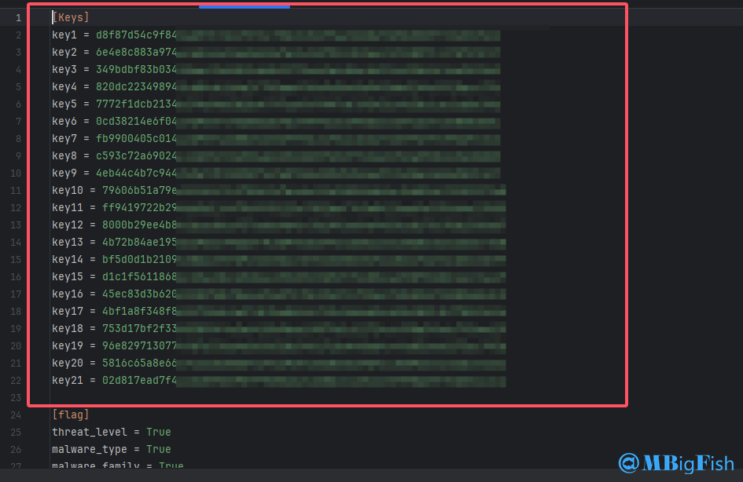

# 【开发】病毒样本(md5)信息批量查询工具

**（Get\_Md5\_Information）**

---

## 一、项目简介

* **这款工具是当时实习时候写的一款工具，在实习过程中本来一直都是直接运行python的，功能也比较简单，后来快要离职时候才写成图形化界面的，并且补充完善了一些功能，其实还有启明星辰和vt的代码，但当时比较赶，没时间往这个程序中添加，后面有机会再说吧，到现在其实离职有段时间了，本来这个程序和代码也是懒得往GitHub上面发，并且这个的受众人员也很少，大多数人还是用不到的，但是因为这两天在弄实习报告，必须要这些东西，本来想直接把压缩包放在word里，但是毕竟还挺大，才打算写个GitHub，后面直接把GitHub链接放报告里就行了。**
* **这款工具通过调用微步在线API，批量获取病毒样本MD5的相关信息。用户可以自定义查询字段，包括威胁等级、威胁分类、病毒家族、文件名称、文件类型、标签、威胁评分值和检出率等。程序提供了图形化用户界面（GUI），支持从TXT或Excel文件中导入MD5列表，并能够将查询结果导出为Excel文件。**
* **下载地址：**[https://github.com/mBigFish/Get\_Md5\_Information](https://github.com/mBigFish/Get_Md5_Information)

---

## 二、关于API

#### （一）API地址获取

* **注册微步在线账户，之后API的key值可以在下面这个网站获取**

```
https://x.threatbook.com/v5/serviceCenter?tab=myKey
```


#### （二）关于接口信息

* **程序所调用API是这个接口，具体信息可以在下面这个网站查看**

```
https://x.threatbook.com/v5/apiDocs
```


## 三、主要功能

* **字段选择**：用户可以自由选择需要获取的字段。
* **数据导入**：支持从TXT或Excel文件中导入MD5列表。
* **信息查询**：批量调用微步在线API，获取病毒样本信息。
* **结果导出**：将查询结果导出为Excel文件，方便查看和分析。
* **配置保存**：工具会保存用户的配置，以便下次打开时自动加载上次的操作设置。

---

## 四、运行及展示

### （一）初始化

* **在第一次打开程序时候，会检测生成一份配置文件**


* **此时就会打开程序gui界面**


* **在导入文件之前需要先去生成的配置文件里输入api的key，没有的话可以参考关于api里面注册一个**



* **可以像我这样放多个key，api越多，速度越快（因为微步对每个api都有请求限制），并且每个api可以获取1000条数据。**

### （二）运行界面


### （三）导出结果


### （四）导出展示


**注意事项**

* **确保API密钥有效并且配置正确。**
* **查询频率过高可能会导致API访问限制。**
* **结果的准确性依赖于微步在线API的返回数据。**
* **可以直接在release里下载windows版的图形化界面程序直接使用，无需任何环境**

## 四、代码结构

* **`run.py`**：主程序文件。
* **`config.py`**：配置操作代码，负责读取和写入配置文件。
* **`worker.py`**：程序工作代码，包含与API交互和数据处理的功能。
* **`main_window.py`**：程序界面代码，定义主窗口和界面布局。
* **`gui.py`**：程序界面操作函数代码，处理用户交互和界面更新。
* **`Initialize.py`**：程序初始化代码，负责配置文件的创建和初始化。
* **`untitled.ui`**：界面UI文件，使用Qt Designer创建的界面设计文件。
* **`config.txt`**：配置文件，包含API密钥和字段选择设置。

## 五、代码介绍

**可以直接下载打包好的软件直接运行，不需要看这里，****可以看第三块内容**

1. **安装依赖**：
   * **确保系统中已安装Python。**
   * **安装必要的Python库：**

```
# 直接运行pip install -r requirements.txt
certifi==2024.8.30
charset-normalizer==3.3.2
et-xmlfile==1.1.0
idna==3.8
numpy==2.0.2
openpyxl==3.1.5
pandas==2.2.2
PySide6==6.7.2
PySide6_Addons==6.7.2
PySide6_Essentials==6.7.2
python-dateutil==2.9.0.post0
pytz==2024.2
requests==2.32.3
shiboken6==6.7.2
six==1.16.0
tzdata==2024.1
urllib3==2.2.3
```

1. **配置文件**：
   * **运行** `InitializeConfig`类以生成配置文件 `config.ini`。该文件包含API密钥和字段选择设置。
2. **运行工具**：
   * **使用以下命令运行工具：**
     ```
     python run.py
     ```
   * **按照GUI界面进行操作，导入MD5列表，选择需要的字段，然后执行查询并导出结果。**

---

## 六、贡献与开源

* **欢迎对项目进行贡献或提出改进建议。请参阅**[GitHub项目页面](https://github.com/your-repo)以获取更多信息。
