# 串流教程

## 一、安装sunshine（发射端）

### （一）官方版

#### 1.下载安装

```
https://github.com/LizardByte/Sunshine
```

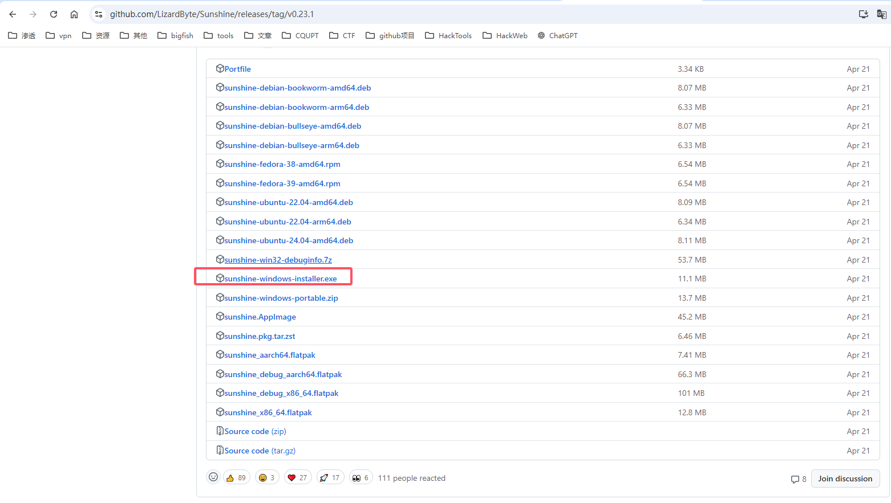

#### 2.选择语言

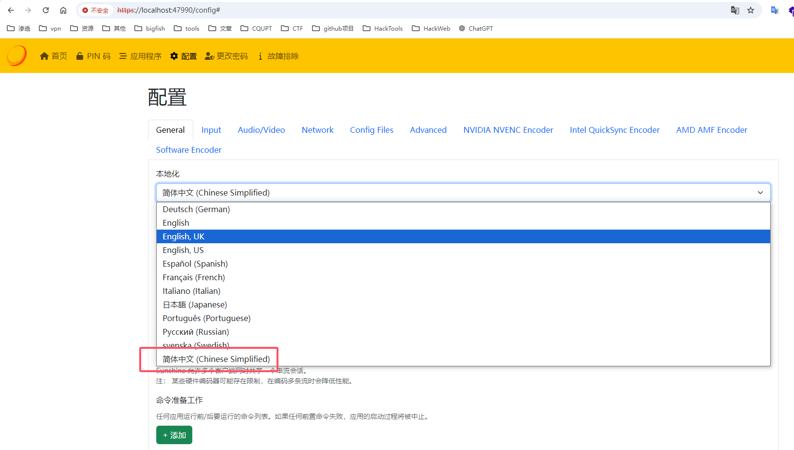

#### 3.网络配置

```
UPnP		启用
IP地址组 	  Ipv4 + IPv6
公网加密模式  禁用

最后 保存 + 应用
```

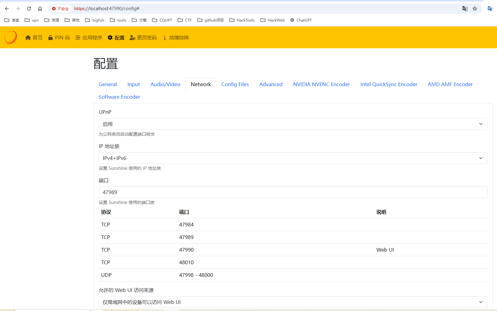

### （二）魔改版

#### 1.下载安装

```·
https://github.com/qiin2333/Sunshine
```

- 如果安装过选择否保存之前数据

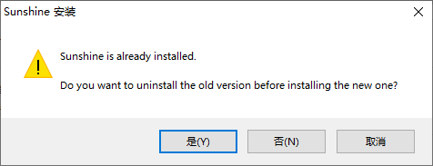


#### 2.设置语言

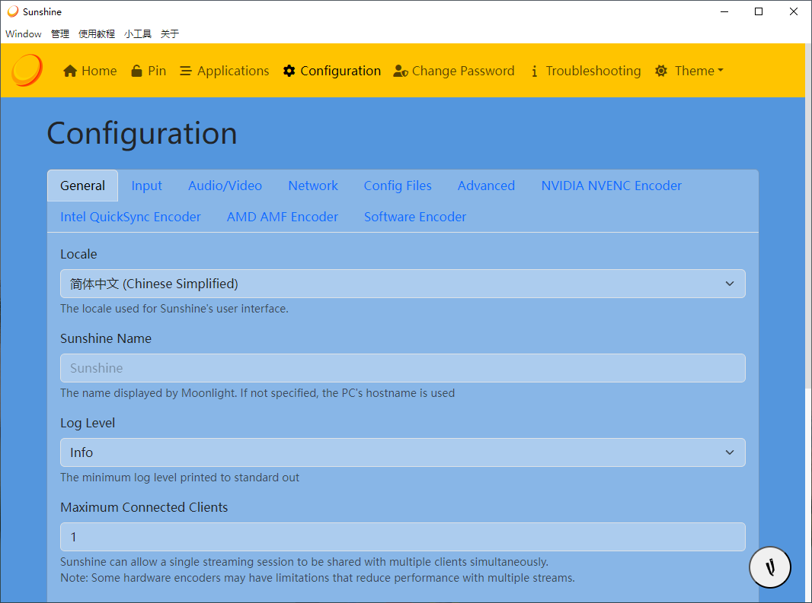

#### 3.配置设置

##### （1）网络配置

```
UPnP		启用
IP地址组 	  Ipv4 + IPv6
局域网加密模式 禁用
公网加密模式  禁用

最后 保存 + 应用
```

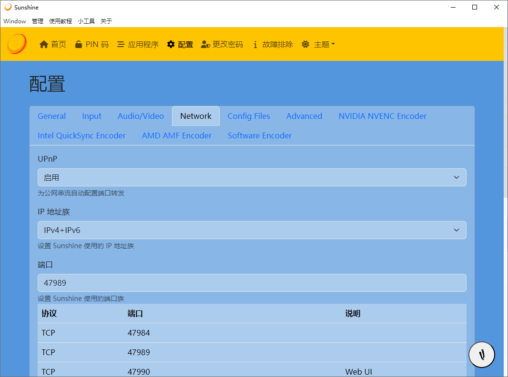

##### （2）虚拟显示器选择显卡

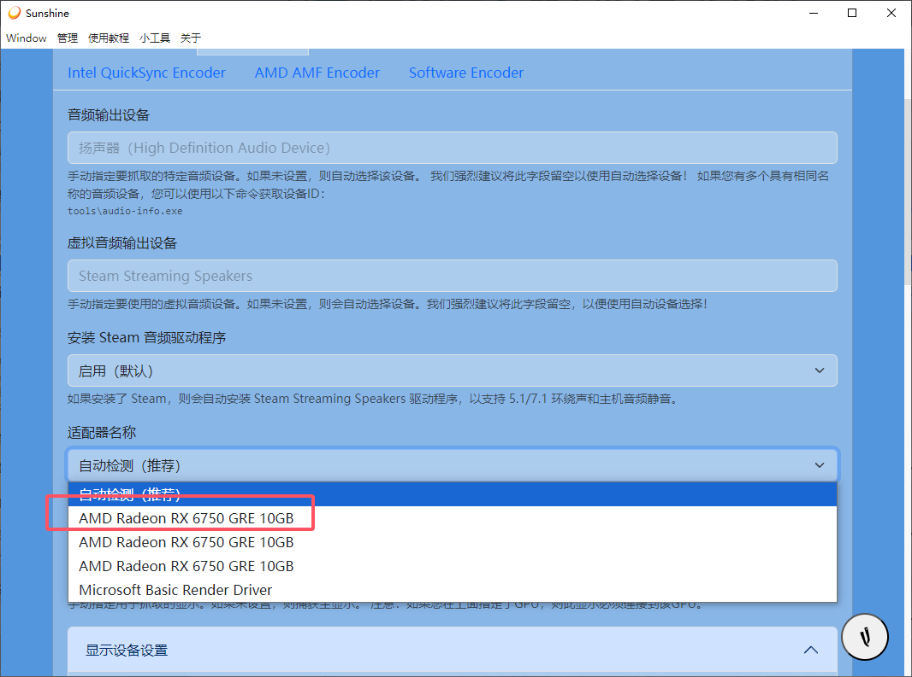

##### （3）串流息屏

- **如果想做副屏，跳过此步骤**


##### （4）副屏串流

- **如果不是想做副屏，跳过此步骤**

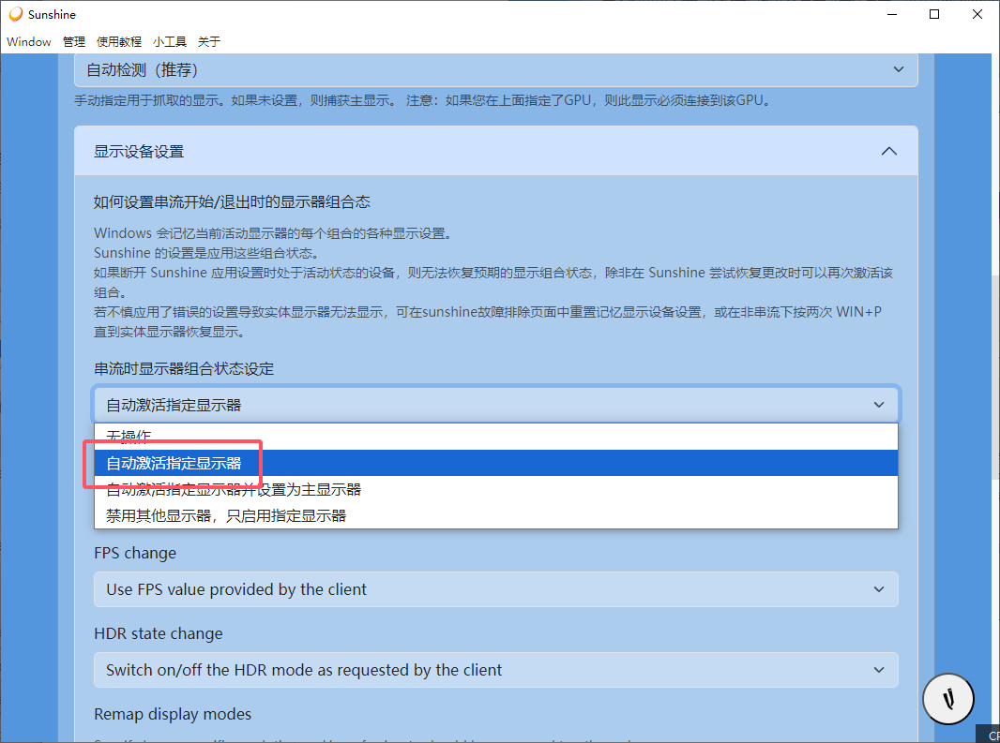

##### （5）分辨率调整

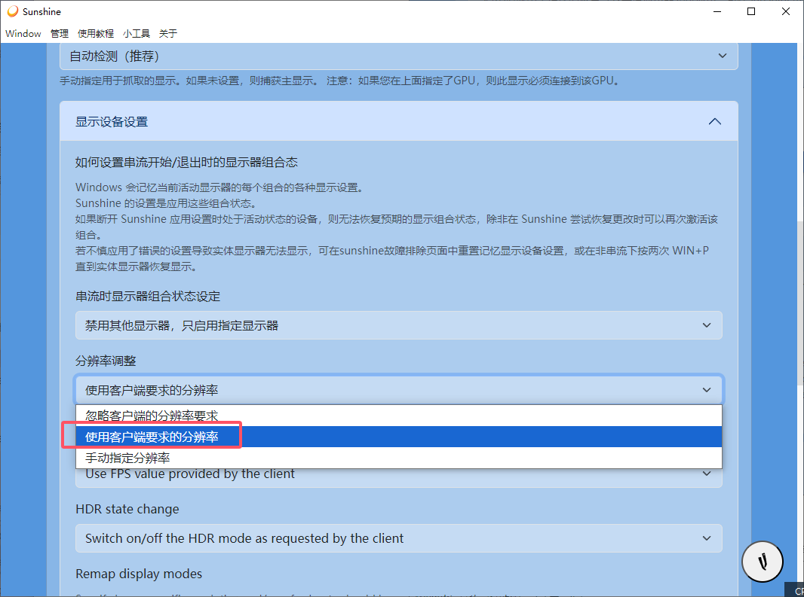

#### （6）添加自定义分辨率

- **必须确保分辨率里面有你设备的分辨率才能正常运行**

## 二、安装moonlight（接收端）

#### （一）下载安装

```
https://github.com/moonlight-stream/moonlight-qt/releases
```

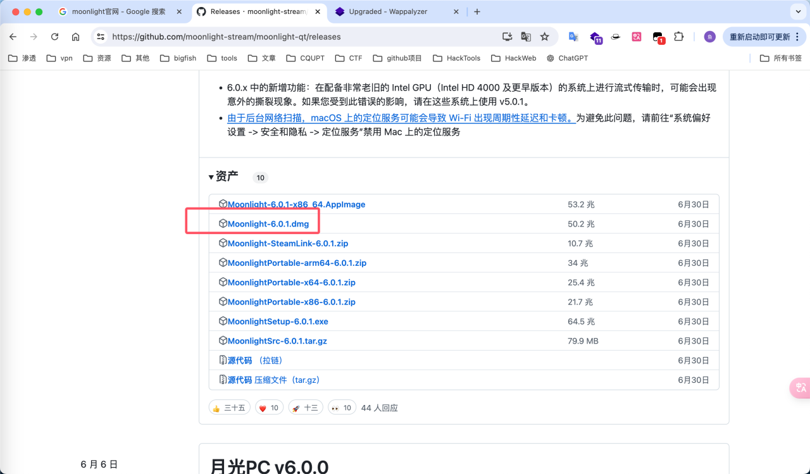

#### （二）获取发射端IP（局域网下）

- 因为我的电脑是用的WiFi，如果是网线就看以太网

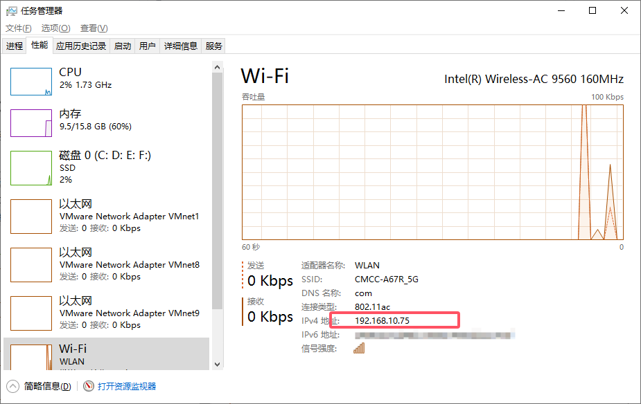

#### （三）添加发射端

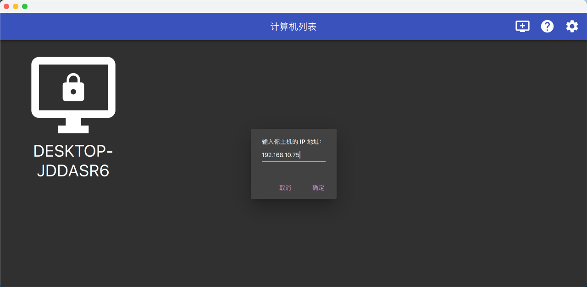

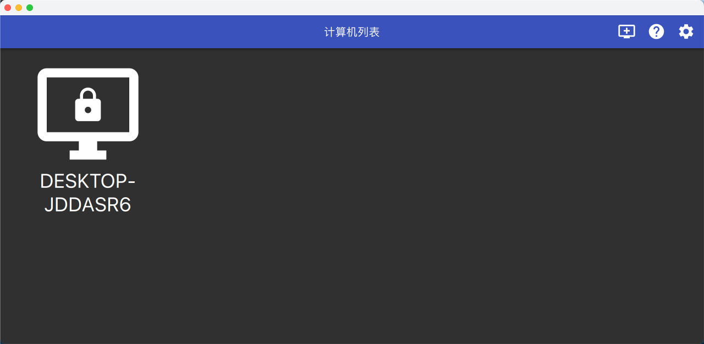

#### （四）连接

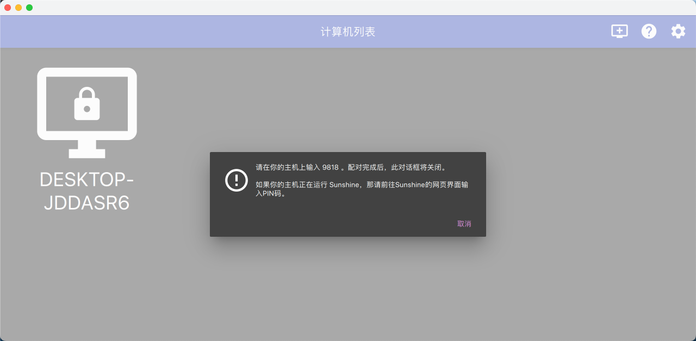

#### （五）输入PIN码

- 发射端后台 -> PIN码 -> 输入接收端给的四位数字即可

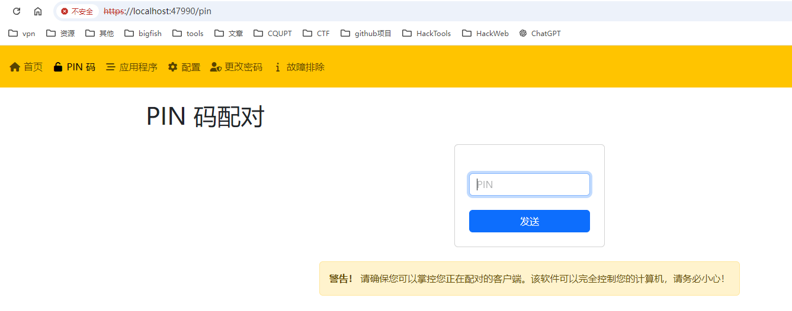


#### （六）成功连接

- 发射端

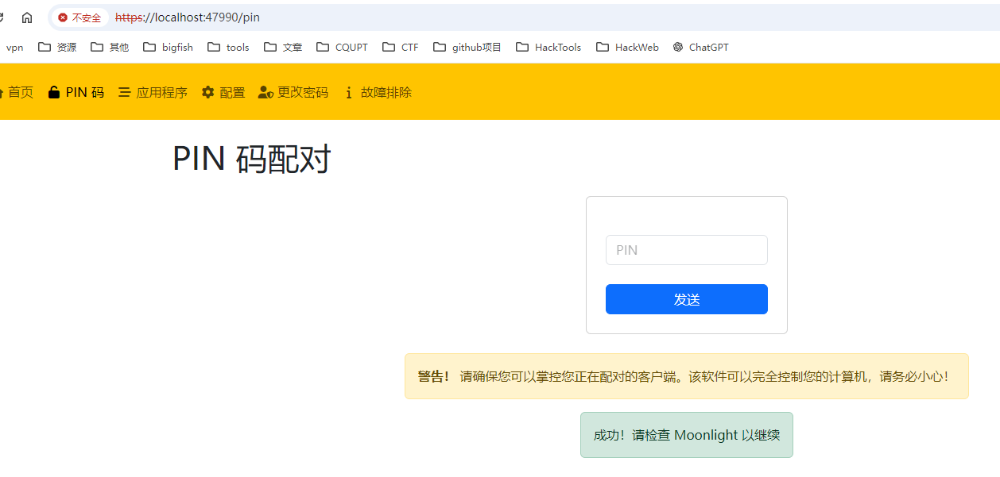

- 接收端

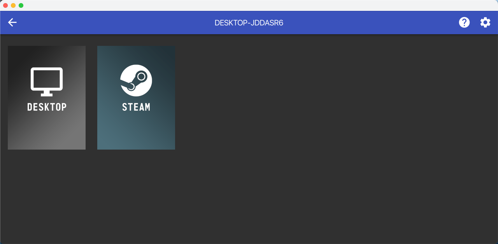

#### （七）启用

- 点击desktop即可连接桌面

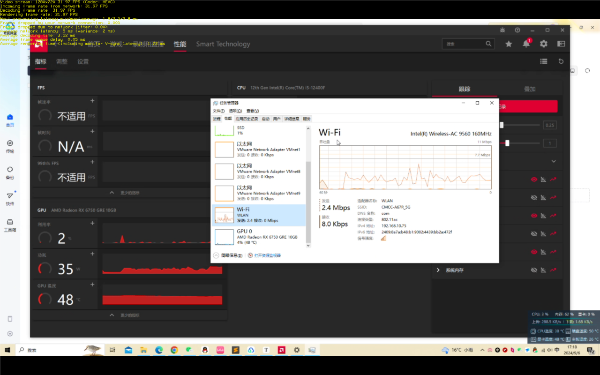

## 三、配合DDNS-GO

- 可以配合ddns-go来实现远程串流，前提是需要有ipv6地址，其他什么都不用，具体可以这博客里搜一下ddns-go

## 四、参考

- https://qiuyifei.com/
- https://www.bilibili.com/video/BV13i421r7Ff/
- https://www.bilibili.com/read/cv35839389/?jump_opus=1

## 五、相关文档

```
b站教程文档，可以去看视频学习https://www.bilibili.com/video/BV13i421r7Ff/

「串流入门到毕业 总链接」
链接：https://pan.quark.cn/s/66b08fbc8d4a

「第一阶段：官方版（从零开始安装sunshine和moonlight）」
链接：https://pan.quark.cn/s/d4caa163a5d3

「第二阶段：虚拟显示器（笔记本+台式机）」
链接：https://pan.quark.cn/s/cdf9d688e735

「第三阶段：魔改版本（基地版+安卓魔改+IOS魔改）」
链接：https://pan.quark.cn/s/675aa6a3e3c0

「第四阶段：皎月连」
链接：https://pan.quark.cn/s/9ef92662f781

「第五阶段：DDNS-go」
链接：https://pan.quark.cn/s/b41c211674b5

以下是部分项目的官网

sunshine基地版官网 https://github.com/qiin2333/Sunshine/releases/tag/alpha  
sunshine官网：https://app.lizardbyte.dev/Sunshine/?lng=en#Download  
moonlight官网：https://moonlight-stream.org/
Moonlight 安卓威力加强版官网：   https://github.com/qiin2333/moonlight-android/releases/tag/shortcut
moonlight IOS 砖家版官网：  https://github.com/TrueZhuangJia/moonlight-ios-NativeMultiTouchPassthrough
皎月连官网 ：  https://natpierce.cn/
DDNS-go项目地址：  https://github.com/jeessy2/ddns-go
```

