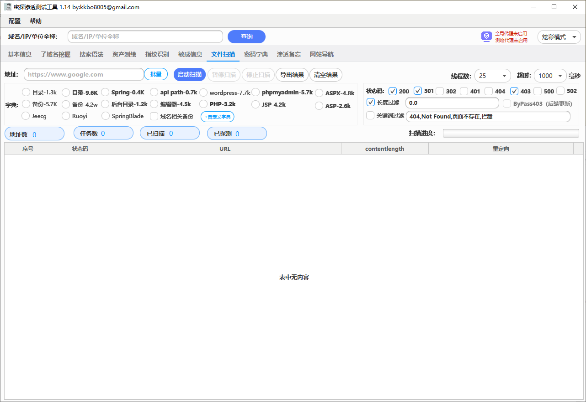

# 密探 -- 渗透测试工具

## 一、功能特性

**密探-主要包含**

* **资产信息收集，**
* **IP端口查询**
* **备案信息查询**
* **子域名爆破（支持多级递归）**
* **搜索引擎语法自动生成（FOFA,Hunter,Quake,ZoomEye,google,github**
* **资产测绘（FOFA，hunter，Quake，ZoomEye 的查询及结果导出）**
* **指纹识别**
* **敏感信息（暴露接口并可以自动探测未授权）**
* **文件扫描（包含目录，备份文件，spring信息泄漏，自定义字典等）**
* **渗透技能路线备忘录**
* **常用网络安全网站导航等功能**

## 二、支持系统

**支持Windows、Mac、Linux**

## 三、运行方法

1. **在jdk8环境下（在jdk8以上的高版本请参考常见问题1的处理方案）运行以下语句运行:**

```
java -jar mitan-jar-with-dependencies.jar
```

2. **Mac/Linux启动脚本**

```
# Mac/Linux 环境下，可以通过sh文件启动，需要在控制台窗口先给予**start.sh**权限。
chmod +x start.sh

# 赋予权限后，每次在控制台窗口执行如下命令打开工具
./start.sh
```

3. **Windows启动脚本**

```
双击"start.bat" 
```

## 四、工具截图




## 五、下载地址

**GitHub：**[https://github.com/kkbo8005/mitan](https://github.com/kkbo8005/mitan)
