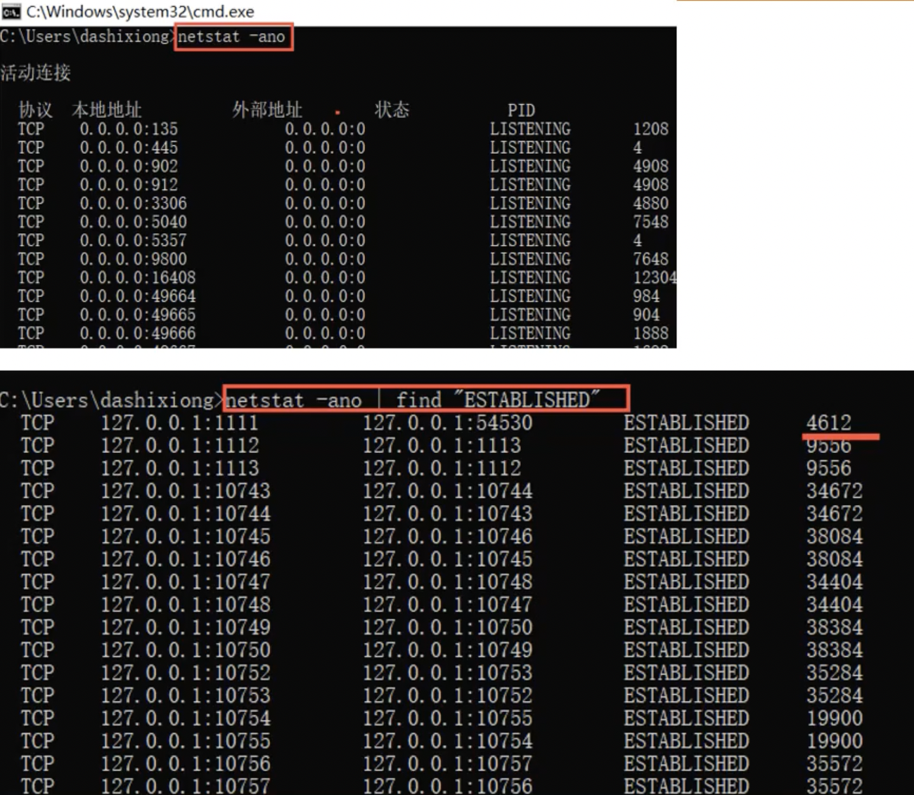
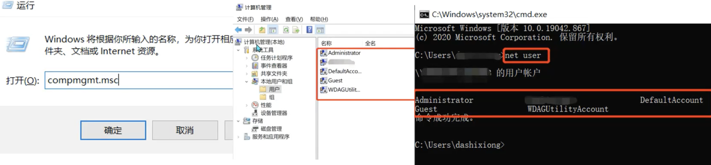
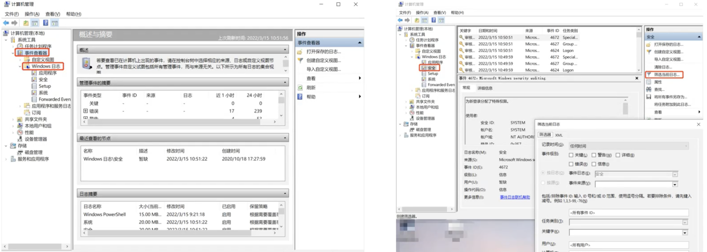
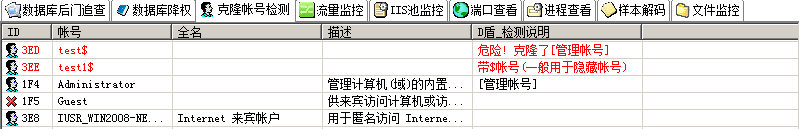
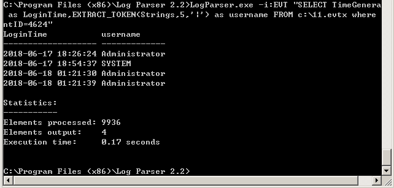

## 第一节课：护网概述

### 一、演练流程

1. #### 统筹阶段

   - 方案策划

   - 项目进场实施
   - 安全意识培训

2. #### 自查阶段

   - 资产梳理
   - 安全检测与加固
   - 防御体系建设
   - 防护策略优化

3. #### 演练阶段

   - 应急流程培训
   - 第一轮演练
   - 第二轮演练

4. #### 实战阶段

   - 实战防守

5. #### 总结阶段

   - 演习恢复
   - 演习总结
   - 整改建议

### 二、攻防演练防护过程

#### （一）准备阶段

- 防守方案编制
- 防守工作启动会
- 人员结构组织
- 目标系统梳理
- 网络架构检查
- 安全防护设备、厂商梳理了解
- APT检测、流量分析、态势感知等安全检测设备梳理了解

#### （二）自查阶段

- 自查阶段
- 互联网资产扫描探测
- 漏洞扫描
- 渗透测试
- 安全风险检查(集权类系统、网络划分应用系统、网络攻击风险等检查）
- 安全基线/配置核查
- 安全设备策略有效性检查
- 日志审计情况检查
- 重大活动或之前进行的安全评估结果复查
- 安全监测、防护设备补充完善
- 安全整改加固

#### （三）常见安全设备：

- 边界隔离：网闸、下一代防火墙/UTM
- 旁路检测： IDS/CS，网络审计、数据库审计、APT、全流量分析系统；
- 数据传输加密：VPN、加密机；
- WEB 服务器重点防护：服务器区前端部署 WAF，部署网页防篡改系统；
- 终端管控：EDR；
- 平台监控：安全管理平台
- 其他设备：漏洞扫描、基线核查、威胁情报系统、蜜罐、攻防演练平台；

#### （四）演练阶段

- 授权与备案
- 预演习攻击
- 预演习防护
- 问题分析总结
- 安全整改与加固

#### （五）实战阶段

- 安全事件实时监测
- 安全事件分析
- 应急响应和决策处置

#### （六）总结阶段

- 在演习过程中还存在的脆弱点，开展整改工作，进一步提高目标系统的安全防护能力。

### 三、防守事件分类和防御

#### （一）木马后门事件


**处置方法**：

1. 先针对出现木马后门设备进行断网隔离处理

2. 同时将该设备日志进行备份留存分析入侵途径
3. 随后对操作系统进行重新部署或病毒软件进行全盘查杀


#### （二）异常登陆事件


**处置方法：**

1. 先将相关账号下线并留存账号相关日志

2. 随后针对问题账号采取修改口令或删除账号等方式进行处理

#### （三）钓鱼邮件事件


**处置方法：**

1. 对邮件内链接仔细核查溯源
2. 删除相关邮件
3. 对收到钓鱼邮件的主机进行病毒查杀

#### （四）漏洞攻击事件


**处置方法：**

1. 无补丁情况，采取“白名单”策略，对正常服务的路径进行加白，
2. 在主机配置强制访问控制策略，对进程、驱动等资源进行强制管理;
3. 有补丁情况，加强信息系统漏洞巡检和补丁修复，采取相应技术手段，检查漏洞修

复情况，并督促整改。

#### （五）暴力破解


**处置方法**：

1. 针对产生暴力破解事件的相关攻击 IP 进行有效封锁

2. 并关注出现被暴力破解事件系统运行状态。

#### （六）数据窃取事件


 **处置方法：**

1. 组织技术研判组对失窃数据内容及范围进行研判，根据研判结果向相关业务主管部

​	门进行通报，

2. 相关业务主管部门在收到通报后，应在第一时间根据技术研判组研判建议采取相关

​	处置措施，防止事件升级。

#### （七）拒绝服务事件


**处置方法**：

1. 借助互联网出口运营商防护资源实现拒绝服务流量近源清洗

2. 关注出现拒绝服务攻击事件系统的运行状态。

### 四、事件分级

#### 	一级：演习目标被控制

#### 	二级：重要系统或设备被控制

#### 	三级：内网一般设备被控制

#### 	四级：DMZ区一般设备被控制

#### 	五级：DMZ区设备遭到攻击或内网终端遭到攻击

- 注：事件级别的威胁程度降序排列。

### 五、防守事件流转

按照扁平化指挥原则，通过建立护网行动即时通讯群组，统一进行调度：

- 总部在群组中及时发布预警信息指令；
- 子分公司及时通过群组向总部进行事件汇报。
- 详细情况材料按照处置流程通过 OA 系统、事件上报平台上报。

### 六、事件处置方式

#### 	（一）技术研判组报告事件情况

#### 	（二）应急处置组开展应急处置工作

#### 	（三）事件上报组进行通报

### 七、护网常用攻击手段

- 弱口令：有简单的突破方式为什么要选择复杂的。
- 0Day：本次护网过程中爆发多种 0day 漏洞，简单粗暴。
- 钓鱼邮件：一旦成功，可能会获取比较重要内部敏感信息。
- 优先攻击集中管控类设备，如：堡垒机、终端管理、域控
- 分布式扫描：分散防守方注意力，获取有效信息。

### 八、护网攻击方式


### 九、护网防护方式


### 十、经验总结

1. 攻击方不会守规矩：名义上攻击时间段为工作日的 9:00-17:00；实际上攻击方不会遵守时间规则，晚上和周末均会发起攻击。
2. 攻击方式多样：主要以远程网络入侵为主、还会存在社工等方式。
3. 谨慎上报目标系统：目标系统被攻破意味着该单位此次护网失败。
4. 充分备战最为关键：深入研究得分规则和总结往年攻防经验，在演习前做好充分的防护准备和应急预案等。
5. 全面检测、分析、展示机制不可缺失：被动安全防护机制不能实现全面感知、智能协同的主动防御目的，难以满足 HW 过程中的多点、多样化攻击。
6. 建立威胁情报系统：建立适合自身需要的威胁情报系统，及时更新威胁情报库。
7. 证据妥善保管：保留好相关攻击数据、截图及样本证据，为溯源提供材料。

### 十一、各阶段注意事项

#### （一）准备阶段

- 资产梳理，对资产进行漏洞扫描，补丁修复。根据业务通过流量监控设备建立黑白
  名单，有利于发现 0day。
- 明确防守边界，对边界防火墙进行访问控制策略收紧，关闭不必要的（高危）端口。

#### （二）攻击阶段：

- 保证 7*24 小时安全监控，多为夜间攻击。
- 加强弱口令防护，发现弱口令及时上报修改。
- 防范钓鱼邮件。
- 及时应急响应处置，将危险范围降为最小，并及时溯源上报。
- 威胁情报：因为攻击方使用的都是运营商提供的新的 IP 和域名，可以进行随时更换，建立自己的威胁情报系统，通过兄弟单位、协作单位进行威胁情报收集，及时更新威胁情报库。

#### （三）溯源阶段：

- 保留好相关攻击数据、截图及样本证据，为溯源提供材料。

## 第二节课：网络基础知识


### 一、常用协议分析

#### （一）HTTP

- **定义：**超文本传输协议，用于分布式、协作式和超媒体信息系统的应用层协议，是万维网的数据通信的基础。
- **主要功能**：包含命令和传输信息，用于 Web 访问、其他的 Internet、内联网应用系统之间的通信。
- **工作原理**：HTTP 协议采用了请求/响应模型（即客户端向服务器发送一个请求报文）。
- **请求报文包含**：请求的方法、URL、协议版本、请求头部和请求数据。
- **响应的内容包括**：协议的版本、成功或者错误代码、服务器信息、响应头部和响应数据。
- **HTTP 协议特点**：无连接、无状态

#### （二）DHCP

- **定义**：由服务器控制一段 IP 地址范围，客户机登录服务器时就可以自动获得服务器分配的 IP 地址和子网掩码。
- **主要作用**：集中的管理、分配 IP 地址，使网络环境中的主机动态的获得 IP 地址、Gateway地址、DNS 服务器地址等信息，并能够提升地址的使用率。
- **工作原理**：集中管理和自动分配 IP 网络地址的通信协议。
- **DHCP 协议特点**：允许地址重用、临时性、即插即用、支持移动用户加入网络。

#### （三）NAT

- **定义**：NAT（网络地址转换）协议是将 IP 数据报头中的 IP 地址转换为另一个 IP 地址的过程。主要用于实现私有网络访问公共网络的功能。
- **主要作用**：解决 IP 地址不足的问题，有效地避免来自网络外部的攻击，隐藏并保护网络内部的计算机。
- **工作原理**：
  - 私有网络发送对 Internet 访问请求，并在组织出口位置部署网关
  - 报文离开私网时，源 IP 替换公网地址
  - 请求到达后，出口网关将目的地址替换为私网地址并返回请求
- **NAT 协议特点**：节省合法注册地址、重叠地址提供解决方案、网络变化时避免重新编址。

#### （四）DNS

- **定义**：DNS 全名域名解析协议，将域名和 IP 地址相互映射的一个分布式数据库，能够使人更方便地访问互联网。
- **主要功能**：将域名解析为 IP。
- **工作原理**：当 DNS 客户机需要查询程序中使用的名称时，它会查询本地 DNS 服务器来解析该名称。
- **DNS 协议特点**：
  -  DNS 是进行域名解析的服务器。
  -  DNS 将域名和 IP 地址相互映射的一个分布式数据库。

#### （五）TCP

- **定义**：TCP(传输控制协议)是一种面向连接的、可靠的、基于字节流的传输层通信协议。
- **主要功能**：确保数据的可靠传输。
- **工作原理**：建立连接（三次握手）、数据传输、关闭连接。
- **TCP 协议特点**：基于流的方式、面向连接、可靠通信、连接面向通信的两端点、降低系统重传开销。

**三次握手**

##### 

#### （六）UDP

- **定义**：用户数据报协议（UDP 协议）是无连接的传输协议。UDP 为应用程序提供一种无需建立连接就可以发送封装的 IP 数据包的方法。
- **主要功能**：UDP 协议能够实现广播报文的中继转发。
- **UDP 协议特点**：无连接性、无阻塞控制、不可靠、面向报文。

**TCP和UDP区别：**

| 功能项             | TCP                                                | UDP            |
| ------------------ | -------------------------------------------------- | -------------- |
| 连接服务的类型     | 面向连接                                           | 无连接         |
| 维护连接状态       | 维持端到端的连接状态                               | 不维护连接状态 |
| 对应用层数据的封装 | 对应用层数据进行分段和封装，用端口号标识应用层程序 | 与 TCP 相同    |
| 数据传输           | 通过序列号和应答机制确保可靠传输                   | 不确保可靠传输 |
| 流量控制           | 使用滑动窗口机制控制流量                           | 无流量控制机制 |

#### （七）ARP

- 定义：地址解析协议（ARP）是根据 IP 地址获取物理地址的一个 TCP/IP 协议。
- 主要功能：可根据网络层 IP 数据包包头中的 IP 地址信息解析出目标硬件地址（MAC 地
  址）信息。
- ARP 协议原理：
  -  主机的 ARP 缓冲区存在 ARP 列表。主机（网络接口）新加入网络时会发送免费 ARP报文把自己 IP 地址与 Mac 地址的映射关系广播给其他主机。
  -  网络上的主机接收到免费 ARP 报文时，会更新自己的 ARP 缓冲区。将新的映射关系更新到自己的 ARP 表中。
  -  主机发送报文时，检查 ARP 列表中是否有对应 IP 地址的目的主机的 MAC 地址，如果有则发送数据，如果没有就向本网段的所有主机发送 ARP 数据包，源主机收到 ARP 响应包后。就将目的主机的 IP 和 MAC 地址写入 ARP 列表
- ARP 协议特点
  - 局域网络上的主机可以自主发送 ARP 应答消息，其他主机收到应答报文时不会检测该报文的真实性就会将其记入本机 ARP 缓存。
  - ARP 命令可用于查询本机 ARP 缓存中 IP 地址和 MAC 地址的对应关系、添加或删除静态对应关系等。

#### 二、数据加密

#### 	（一）概念简介

​	将一个信息或称明文经过加密钥匙及加密函数转换，变成无意义的密文，而接收方则将此密文经过解密函数、解密钥匙还原成明文。

#### 	（二）加密类型

##### 		1、链路加密

​	有消息在被传输之前进行加密，在每一个节点对接收到的消息进行解密。使用下一个链路的密钥对消息进行加密，再进行传输。在到达目的地之前，一条消息可能要经过许多通信链路的传输。

##### 		2、节点加密

​	节点加密要求报头和路由信息以明文形式传输，以便中间节点能得到如何处理消息的信息。

##### 		3、端-端加密

​	端到端加密允许数据在从源点到终点的传输过程中始终以密文形式存在。

#### （三）加密技术分类

##### 	1、分组密码


##### 	2、公钥加密


##### 	3、散列函数


#### 四、OSI七层模型


##### （一）物理层


##### （二）数据链路层


##### （三）网络层


##### （四）传输层


##### （五）会话层


##### （六）表示层


##### （七）应用层


### 五、IP地址

#### （一）构成：网络标识 + 主机标识

#### （二）分类

##### 1、根据协议版本分类


##### 2、根据IP段分类

​	除 A、B、C、D 四类 IP 地址之外，还存在 E 类地址。


#### （三）公网ip和私网ip


### 六、MAC地址

#### （一）定义

- MAC 地址(局域网地址/以太网地址/物理地址)用来确认网络设备位置的位址。
- MAC 地址用于在网络中唯一标示一个网卡，一台设备若有一或多个网卡，则每个网卡都需要并会有一个唯一的 MAC 地址。
- MAC 地址采用十六进制数表示，长度是 6 个字节（48 位），分为前 24 位和后 24位。

#### （二）IP 地址与 MAC 地址的区别：

##### 	IP 地址：

- 长度：32 位（二进制）
- 分配数据：基于网络拓扑
- 寻址协议：基于网络层

##### 	MAC 地址：

- 长度：48 位（十六进制）
- 分配数据：基于制造商
- 寻址协议：基于数据链路层

#### （三）iP 地址与 MAC 地址的区别

1. IP 地址专注于网络层，网络层设备（如路由器）根据 IP 地址，将数据包从一个网络传递转发到另外一个网络上。
2. MAC 地址专注于数据链路层，数据链路层设备（如交换机）根据 MAC 地址，将一个数据帧从一个节点传送到相同链路的另一个节点上。

## 第三节课：winows问题排查


### 一、文件排查

#### （一）文件分析

通常情况下，各种木马病毒等恶意程序，都会在计算机开机启动的过程中自启动，在windows系统中可以通过以下三种方式查看开机启动项

- 利用操作系统中的启动菜单
- 利用系统配置msconfig查看
- 利用注册表regedit查看

#### （二）临时文件


#### （三）时间属性分析

1、在Windows系统下，文件属性的时间属性具有

- 创建时间
- 修改时间
- 访问时间

​	如果修改时间要早于创建时间，那么这个文件存在很大可疑（中国菜刀等工具可以修改）

2、黑客拿下服务器后，极有可能会使用浏览器进行网站访问。我们可以查看浏览器记录，进一步分析

- 查看浏览器下载记录，看是否被使用下载恶意代码及文件
- 查看浏览器浏览记录，看是否有浏览恶意网站等


#### （四）最佳打开文件分析

Windows系统会记录系统中最佳打开使用的文件等快捷方式，通过以下方法可以查看最佳打开的文件：

- [win + E] --- [C:\\Documents and Settings\\Administratos\\Recent]
- [win + E] --- [C:\\Users\\Administrator\\Recent]
- [win + R] --- [%UserProfile%Recent]

### 二、进程排查

#### （一）进程基础知识

##### 1、介绍

​	本地计算机与外部网络通信是建立在TCP或UDP协议上通过端口 （0-65535）进行通信，通常计算机被中木马后，一定会与外部网络通信，此时**可通过网络连接状态，找到对应的进程ID**，关闭进程ID（关闭进程ID即意味着关闭连接状态）

| listening   | 含义                                                      |
| ----------- | --------------------------------------------------------- |
| listening   | 表示监听 表示这个端口正在开发 可以提供服务                |
| closing     | 表示关闭 表示端口人为或者防火墙使其关闭（也许服务被卸载） |
| time wai    | 并表示正在等待连接 就是你正在向该端口发送请求连接状态     |
| established | 表示是对方与你已经连接 正在通信交换数据                   |

##### 2、查看所有的端口占用情况

- netstat -ano

参数说明：

- -a	显示所有网络连接、路由表和网络接口信息
- -n        以数字形式显示地址和端口号
- -0        显示与每个连接相关的所属进程 ID
- -r         显示路由表
- -S        显示按协议统计信息、默认地、显示IP


##### 3、查询进程

```bat
vmic process #(带有cmdline)
vmic process list brief
vmic process where name="pid值" get excutablepath
```

##### 4、删除进程

```bat
vmic process where processid="pid值" delete
```

##### 5、查询服务

```bat
vmic SERVICE #(涵盖服务关联所有信息)
vmic SERVICE where caption(name)="pid值" call stopservice
vmic SERVICE where caption(name)="pid值" call delete
```

##### 6、启动项枚举

- vmic startup list full

##### 7、计划任务枚举

- schtasks /query /fo table /v （执行前先执行chcp 437）

#### （二）记录一次进程排查：

##### 方法一：

1. 查看所有的端口占用情况命令netstat -ano
2. 查看端口中状态为established的所有进程，netstat -ano | find "ESTABLISHED"
3. 发现”可疑进程”定位PID值 4612



4. 查看指定pid的占用情况：netstat  -ano|findstr  "pid值"


5. 查看pid对应的进程命令：tasklist| findstr  "pid值"


5. 杀死该可疑进程：taskkill /f /t /im SangForPromoteService.exe

##### 方法二：

1. 先根据netstat定位出pid
2. 在通过tasklist命令进行进程定位
3. 根据 vmic process 获取进程的全路径任务管理器定位到进程路径


### 三、系统信息排查

1、查看环境变量的设置【我的电脑】---【属性】---【高级系统设置】---【高级】---【环境变量】

- windows计划任务【程序】---【附件】---【系统根据】---【任务计划程序】


2、windows账号信息，如隐藏账号等【开始】---【运行】---【compmgmt.msc】---【本地用户和组】---【用户】（用户以$结尾为隐藏用户）

- 命令行方式：net user，可直接收集用户信息，若需查看某个用户的详细信息，可使用命令---net user username



3、查看当前系统用户的会话使用 query user 查看当前系统的会话，比如查看是否有人使用远程终端登录服务器。

- logoff 踢出该用户


4、查看systeminfo信息，系统版本以及补丁信息

- Github源码：https://github.com/neargle/win-powerup-exp-index


### 四、工具排查

- 因为正常护网当中，不可以在客户机器上随意安装软件，所以这部分为了解


1、Procexp是常用的进程查看工具：

- 打开procexp，进程标识颜色不同是用于区分进程状态和进程类型，进程开始启动时为绿色，结束时为红色
- 可对某个进程进行操作，右键单击即可


### 五、日志排查

windows日子包括：登陆日志、安全日志、中间件日志

#### 1、登陆日志

#### 2、安全日志

- 主要分析安全日志，可以借助自带的筛选功能



- 可以把日志导出为文本格式，然后使用notepad++ 打开，使用正则模式去匹配远程登录过的IP地址，在界定事件日期范围的基础使用正则表达式匹配


#### 3、中间件日志

- （Web 日志access_log）nginx、apache, is, tomcat,jboss.weblogic, websphere


## 第四节课：web常见安全漏洞解析

## 第五节课：蓝队防守技术

### 一、岗位职责

#### （一）设备监控岗位

​	初步监控攻击事件，做简单分析并上报。

#### （二）分析研判岗

​	对攻击方式、路径、范围、结果等做分析研判，找到攻击者信息。

#### （三）应急响应岗

​	攻击事件影响分析，复线及溯源等。

#### （四）处置封禁岗	

​	事件的处置，包括IP的封禁。

### 二、事件上报一般性原则

1．上报事件查 IP 归属地

2.  IP 上报不重复

3．重点关注事件响应动作为 PASS 的

4．攻击频率高要上报

5．漏洞利用类要重点上报

6．低危事件大量扫描必上报（批量）

7．国外 IP 要上报处置

8．确定恶意攻击必上报

9．一个 IP 对多个资产进行攻击要上报

10．高危事件重点关注（敏感文件访问、文件上传，或者 webshell

连接等）

11．监控事件遵循原则：先看相应动作，再看详细报文分析，再看IP

### 三、安全设备


#### （一）安全监测类

IDS：某某入侵检测与管理系统

IPS：天清入侵防御系统

- 主要特点有：
  - 深层防御、精确阻断，
  - 可及时准确发现入侵攻击行为，
  - 实时精确阻断，
  - 主动而高效

APT:

邮件管理：天清邮件安全管理系统


#### （二）安全防护类

网页防篡改：天清 web 应用安全网关网页防篡改

防火墙：天清汉马 USG 防火墙

抗 DDOS：天清 ADM

WAF：天清 web 应用安全网关

基于算法引擎和特征引擎双引擎检测方法，针对 web 服务器进行 http/https 流量监测

- 防护场景：

  - ＞恶意扫描防护；＞漏洞利用防护；暴力破解防护；SQL 注入防护；XSS 注入防护；＞敏感

  - 信息泄露防护；Web 网站应急保障；

#### （三）安全分析类

入侵分析：入侵分析中心 DAC

流量分析：泰和流量分析系统 NBA

#### （四）安全管理/展示类

策略管理：flowereye 安全域流监控系统

日志审计：泰和日志审计系统

数据库审计：天玥数据库审计系统

安全运营平台：启明星辰安全运营平台

态势感知平台：泰和安全管理平台 TSDC


##### WAF

​	**特点**：

1. 基于算法引擎和特征引擎双引擎检测方法
2. 针对web服务器进行 HTTP/HTTPS 流量检测和防御

​	**防护场景**：

1. 恶意扫描防护；
2. 漏洞利用防护；
3. 暴力破解防护；
4. SQL注入防护；
5. XSS注入防护；
6. 敏感信息泄露防护；
7. Web网站应急保障；


##### IPS


****


##### IDS


## 第六节课：研判分析与处置技术

### 一、安全设备

### 二、web日志分析

#### （一）安全设备

#### （一）常见web服务器

**nginx日志**

- 默认储存位置：Windows: /Nginx/logs/； Linux: /var/log/apache2
- 日志文件：一般分为access_log 和 error_log两种

**IIS日志**

- 默认储存位置：Windows: C:/WINDOWS/system32/LogFiles

**apache日志**

- 默认储存位置：windows:/ apache/logs; Linux: /var/log/apache
- 日志文件：一般分为access_log 和 error_log两种

 **tomcat日志**

- 日志文件：一般分为catalina.out、localhost、manager

### 三、主机日志

### （一）Windows日志

### （二）Linux日志


## 第七节课：流量分析

### 安全设备

#### （一）常见的安全设备

| 网络流量检测设备     | 其他         |
| -------------------- | ------------ |
| WAF                  | 日志审计     |
| IPS                  | 主机防护软件 |
| IDS                  | 堡垒机       |
| 态势感知             | 数据库审计   |
| 下一代防火墙（T 墙） | 准入控制     |

#### （二）安全设备的部署

​	对于仅仅做流量监测、报警等安全设备并联在网络架构中

​	对于攻击进行防护、拦截等安全设备常常串联在网络架构中

​	注意：并联的安全设备通过引流的方式也能达到拦截攻击流量的效果


#### （三）常见安全设备优先级


#### （四）常见研判经验

告警分析类型：

1. 业务误报

原因：由于开发代码不规范或防护设备拦截策略问题引起的误报。

特点：大量请求，处罚漏洞类型类似，触发事件有一定规律

2. 扫描器请求

原因：僵尸网络批量全网扫描引发的攻击流量告警，或扫描器引发的无意义的漏洞

特点：大量请求、攻击频率高、攻击请求与实际环境有违背、攻击特征比较明显。

3. 告警真实攻击

原因：由真实攻击者引发的攻击告警

特点：攻击频率较低，攻击请求与实际环境相结合，攻击请求偏深度利用。

### 分类

常见恶意流量分析（webshell）

常见代理流量分析（regeorg）

常见协议流量分析（ftp http dns）

### 二、常见恶意流量分析（webshell）

#### （一）蚁剑

有些 UA 存在 antSword

存在@ini_set("display_errors","0"）或者危险函数

#### （二）冰蝎

Acceptlaoolication/json text/javascript /;q=0.01

content-length 有规律 每次+1

user-agent

appect 很⻓

信息是 aes 加密，base64 编码	

#### （三）哥斯拉

请求包⻓度为 52541 响应包为 0 

强特征：

- cookie 值最后有一个分号。

- 命令执⾏过程载体有 pass 

- ⼀个 tcp 包中有三个 http

#### （四）菜刀

请求包 UA 头为百度，⽕狐

请求体中存在 eavl,base64 等特征字符

请求体中传递的 payload 为 base64 编码


## 第八节课：应急响应

### 一、流程

**信息收集 -> 判断类型 -> 深入分析 -> 清理处置 -> 产出报告**

- **收集信息：**收集客户信息和中毒主机信息，包括样本。
- **判断类型：**判断是否是安全事件，何种安全事件，勒索、挖矿、断网、DoS等等。
- **深入分析**：账号安全、端口进程、启动项 计划任务 服务、系统信息、日志。
- **清理处置：**直接杀掉进程，删除文件，打补丁，抑或是修复文件。
- **产出报告：**整理并输出完整的安全事件报告。

### 二、常见应急事件分类

| 事件类型 | 事件分类                      |
| -------- | ----------------------------- |
| Web入侵  | 网页挂马、主页篡改、Webshell  |
| 系统入侵 | 病毒木马、勒索软件、远控后门  |
| 网络攻击 | DDOS 攻击、DNS 劫持、ARP 欺骗 |

信息收集表

|   客户名称   |        什么区域的什么客户        |
| :----------: | :------------------------------: |
|  感染主机数  |         感染了多数台主机         |
|   补丁情况   |  打了哪些补丁，是否存在补丁漏打  |
|   中毒现象   | 勒索/挖矿/DoS/僵尸网络/后门/木马 |
|   帐号密码   |         确认是否有弱密码         |
| 对外开发端口 |        对外开发了哪些端口        |
|  开启的服务  |          开启了哪些服务          |
| 操作系统版本 |         操作系统版本信息         |
|   客户需求   |         确认客户具体需求         |

### 三、深度分析

#### （一）windows入侵排查

##### 1、系统账号安全

（1）查看服务器是否有弱口令，远程管理端口是否对公网开放。

- 检查方法：据实际情况咨询相关服务器管理员。

（2）查看服务器是否存在可疑账号、新增账号。

- 检查方法：打开 cmd 窗口，输入 `lusrmgr.msc` 命令，查看是否有新增/可疑的账号，如有管理员群组的（Administrators）里的新增账户，如有，请立即禁用或删除掉。

（3）查看服务器是否存在隐藏账号、克隆账号。

- 检查方法：

  a、打开注册表 ，查看管理员对应键值。

  b、使用D盾_web查杀工具，集成了对克隆账号检测的功能。



（4）结合日志，查看管理员登录时间、用户名是否存在异常。

- 检查方法：

  a、Win+R 打开运行，输入”eventvwr.msc”，回车运行，打开“事件查看器”。

  b、导出 Windows 日志 – 安全，利用微软官方工具 [Log Parser](https://www.microsoft.com/en-us/download/details.aspx?id=24659) 进行分析。



##### 2、异常端口、进程

（1）检查端口连接情况，是否有远程连接、可疑连接。

- 检查方法：

  a、使用`netstat -ano` 命令查看目前的网络连接，定位可疑的 ESTABLISHED

  b、根据 netstat 命令定位出的 PID 编号，再通过 tasklist 命令进行进程定位 `tasklist | findstr "PID"`


（2）进程

- 检查方法：

  a、开始 – 运行 – 输入 `msinfo32` 命令，依次点击 “软件环境 – 正在运行任务” 就可以查看到进程的详细信息，比如进程路径、进程ID、文件创建日期以及启动时间等。

  b、打开D盾_web查杀工具，进程查看，关注没有签名信息的进程。

  c、通过微软官方提供的 Process Explorer 等工具进行排查 。

  d、查看可疑的进程及其子进程。可以通过观察以下内容：

  ```
    没有签名验证信息的进程  没有描述信息的进程  进程的属主  进程的路径是否合法  CPU 或内存资源占用长时间过高的进程
  ```

（3）小技巧：

 a、查看端口对应的 PID：`netstat -ano | findstr "port"`

 b、查看进程对应的 PID：任务管理器 – 查看 – 选择列 – PID 或者 `tasklist | findstr "PID"`

 c、查看进程对应的程序位置：

 任务管理器 – 选择对应进程 – 右键打开文件位置

 运行输入 `wmic`，cmd 界面输入 `process`

 d、`tasklist /svc` 进程 – PID – 服务

 e、查看Windows服务所对应的端口：

 %systemroot%/system32/drivers/etc/services（一般 %systemroot% 就是 C:\Windows 路径）

##### 3、启动项、计划任务、服务

（1）检查服务器是否有异常的启动项。

- 检查方法：

  a、登录服务器，单击【开始】>【所有程序】>【启动】，默认情况下此目录在是一个空目录，确认是否有非业务程序在该目录下。
  b、单击开始菜单 >【运行】，输入 `msconfig`，查看是否存在命名异常的启动项目，是则取消勾选命名异常的启动项目，并到命令中显示的路径删除文件。
  c、单击【开始】>【运行】，输入 regedit，打开注册表，查看开机启动项是否正常，特别注意如下三个注册表项：

  ```
  HKEY_CURRENT_USER\Software\Microsoft\Windows\CurrentVersion\runHKEY_LOCAL_MACHINE\Software\Microsoft\Windows\CurrentVersion\RunHKEY_LOCAL_MACHINE\Software\Microsoft\Windows\CurrentVersion\Runonce
  ```

  检查右侧是否有启动异常的项目，如有请删除，并建议安装杀毒软件进行病毒查杀，清除残留病毒或木马。

  d、利用安全软件查看启动项、开机时间管理等。

  e、组策略，运行 `gpedit.msc`


（2）检查计划任务

- 检查方法：

  a、单击【开始】>【设置】>【控制面板】>【任务计划】，查看计划任务属性，便可以发现木马文件的路径。

  b、单击【开始】>【运行】；输入 `cmd`，然后输入 `at`，检查计算机与网络上的其它计算机之间的会话或计划任务，如有，则确认是否为正常连接。

（3）服务自启动

- 检查方法：单击【开始】>【运行】，输入 `services.msc`，注意服务状态和启动类型，检查是否有异常服务。

##### 4、系统相关信息

（1）查看系统版本以及补丁信息

- 检查方法：单击【开始】>【运行】，输入 `systeminfo`，查看系统信息。

（2）查找可疑目录及文件

- 检查方法：

  a、 查看用户目录，新建账号会在这个目录生成一个用户目录，查看是否有新建用户目录。

  ```
  Window 2003版本 C:\Documents and SettingsWindow 2008R2及以后版本 C:\Users\
  ```

  b、单击【开始】>【运行】，输入 `%UserProfile%\Recent`，分析最近打开分析可疑文件。

  c、在服务器各个目录，可根据文件夹内文件列表时间进行排序，查找可疑文件。

  d、回收站、浏览器下载目录、浏览器历史记录

  e、修改时间在创建时间之前的为可疑文件

（3）发现并得到 WebShell、远控木马的创建时间，如何找出同一时间范围内创建的文件？

​	a、利用 [Registry Workshop](http://www.torchsoft.com/en/rw_information.html) 注册表编辑器的搜索功能，可以找到最后写入时间区间的文件。
​	b、利用计算机自带文件搜索功能，指定修改时间进行搜索。

##### 5、日志分析

（1）系统日志

- 分析方法：

  a、前提：开启审核策略，若日后系统出现故障、安全事故则可以查看系统的日志文件，排除故障，追查入侵者的信息等。

  b、Win+R 打开运行，输入 “eventvwr.msc”，回车运行，打开”事件查看器”。

  C、导出应用程序日志、安全日志、系统日志，利用 [Log Parser](https://www.microsoft.com/en-us/download/details.aspx?id=24659) 进行分析。

（2）Web 访问日志

- 分析方法：

  a、找到中间件的web日志，打包到本地方便进行分析。

  b、推荐工具：Windows 下，推荐用 EmEditor 进行日志分析，支持大文本，搜索效率还不错。Linux 下，使用 Shell 命令组合查询分析。

#####  6、自动化工具查杀

- 病毒查杀
  - 检查方法：下载安全软件，更新最新病毒库，进行全盘扫描。
- webshell查杀
  - 检查方法：选择具体站点路径进行webshell查杀，建议使用两款 WebShell 查杀工具同时查杀，可相互补充规则库的不足。

##### 注：常见残留痕迹：

```
*用户目录（rd /s /g)

X:\Documents and Settings (X\Users) 

*桌面目录（习惯性操作）

X:\DOCUME-1VAccount 京面（Desktop) 

*互联网临时文件（访问网址缓存）

X:\DOCUME-1VAccountVOCALS-1\Temporary Internet Files 

*使用文件记录（文档记录）

X:\DOCUME-1VAccount\Recent

·临时文件（自解压释放）

X:\DOCUME-1VAccountVLOCALS-1\Temp

敏感目录的文件分析（类/tmp 目录，命令目录/usr/bin/usr/sbin)

新增文件分析

要查找 24 小时内被修改的 php 文件：find/-mtime0-name"*.php（最后一次修改发生在距

离当前时间 n24/时至（n+124 小时）

特殊权限的文件查找 777 的权限的文件

find/-name*.php-perm 777

隐藏的文件（以 "开头的具有隐藏属性的文件）
```

#### （二）Linux入侵排查

##### 1、系统账号安全

- 基本使用：

```bash
# 1、用户信息文件 /etc/passwd
root:x:0:0:root:/root:/bin/bash
account:password:UID:GID:GECOS:directory:shell
用户名：密码：用户ID：组ID：用户说明：家目录：登陆之后的 shell
注意：无密码只允许本机登陆，远程不允许登陆
# 2、影子文件 /etc/shadow
root:$6$oGs1PqhL2p3ZetrE$X7o7bzoouHQVSEmSgsYN5UD4.kMHx6qgbTqwNVC5oOAouXvcjQSt.Ft7ql1WpkopY0UV9ajBwUt1DpYxTCVvI/:16809:0:99999:7:::
# 用户名：加密密码：密码最后一次修改日期：两次密码的修改时间间隔：密码有效期：密码修改到期到的警告天数：密码过期之后的宽限天数：账号失效时间：保留
```

```bash
who     查看当前登录用户（tty 本地登陆  pts 远程登录）
w       查看系统信息，想知道某一时刻用户的行为
uptime  查看登陆多久、多少用户，负载状态
```

- 入侵排查：

```bash
#1、查询特权用户特权用户(uid 为0)
[root@localhost ~]# awk -F: '$3==0{print $1}' /etc/passwd
#2、查询可以远程登录的帐号信息
[root@localhost ~]# awk '/\$1|\$6/{print $1}' /etc/shadow
#3、除root帐号外，其他帐号是否存在sudo权限。如非管理需要，普通帐号应删除sudo权限
[root@localhost ~]# more /etc/sudoers | grep -v "^#\|^$" | grep "ALL=(ALL)"
#4、禁用或删除多余及可疑的帐号
    usermod -L user    禁用帐号，帐号无法登录，/etc/shadow 第二栏为 ! 开头
    userdel user       删除 user 用户
    userdel -r user    将删除 user 用户，并且将 /home 目录下的 user 目录一并删除
```

##### 2、端口进程

- 端口：使用 netstat 网络连接命令，分析可疑端口、IP、PID

```
netstat -antlp | more查看下 pid 所对应的进程文件路径，运行 ls -l /proc/$PID/exe 或 file /proc/$PID/exe（$PID 为对应的 pid 号）
```

- 进程：使用 ps 命令，分析进程

```
ps aux | grep pid 
```

##### 3.1、启动项

**基本使用：**

- 系统运行级别示意图：

| 运行级别 |                           含义                            |
| :------: | :-------------------------------------------------------: |
|    0     |                           关机                            |
|    1     | 单用户模式，可以想象为windows的安全模式，主要用于系统修复 |
|    2     |              不完全的命令行模式，不含NFS服务              |
|    3     |            完全的命令行模式，就是标准字符界面             |
|    4     |                         系统保留                          |
|    5     |                         图形模式                          |
|    6     |                          重启动                           |

- 查看运行级别命令 `runlevel`

- 系统默认允许级别

```
vi  /etc/inittabid=3：initdefault  #系统开机后直接进入哪个运行级别
```

- 开机启动配置文件

```
/etc/rc.local/etc/rc.d/rc[0~6].d
```

- 例子：当我们需要开机启动自己的脚本时，只需要将可执行脚本丢在 /etc/init.d 目录下，然后在 /etc/rc.d/rc*.d 文件中建立软链接即可。

- 注：此中的 * 代表 0,1,2,3,4,5,6 这七个等级

```
root@localhost ~]# ln -s /etc/init.d/sshd /etc/rc.d/rc3.d/S100ssh
```

- 此处sshd是具体服务的脚本文件，S100ssh是其软链接，S开头代表加载时自启动；如果是K开头的脚本文件，代表运行级别加载时需要关闭的。

**入侵排查：**

- 启动项文件：

```
more /etc/rc.local/etc/rc.d/rc[0~6].dls -l /etc/rc.d/rc3.d/
```

##### 3.2、定时任务

**基本使用**

1、利用 crontab 创建计划任务

- 基本命令

```
crontab -l   列出某个用户cron服务的详细内容Tips：默认编写的crontab文件会保存在 (/var/spool/cron/用户名 例如: /var/spool/cron/rootcrontab -r   删除每个用户cront任务(谨慎：删除所有的计划任务)crontab -e   使用编辑器编辑当前的crontab文件 如：*/1 * * * * echo "hello world" >> /tmp/test.txt 每分钟写入文件
```

2、利用 anacron 命令实现异步定时任务调度

- 使用案例

```
每天运行 /home/backup.sh 脚本：vi /etc/anacrontab @daily    10    example.daily   /bin/bash /home/backup.sh当机器在 backup.sh 期望被运行时是关机的，anacron会在机器开机十分钟之后运行它，而不用再等待 7天。
```

**入侵排查**

- 重点关注以下目录中是否存在恶意脚本

```
/var/spool/cron/* /etc/crontab/etc/cron.d/*/etc/cron.daily/* /etc/cron.hourly/* /etc/cron.monthly/*/etc/cron.weekly//etc/anacrontab/var/spool/anacron/*
```

- 小技巧：

```
more /etc/cron.daily/*  查看目录下所有文件
```

##### 3.3、服务

**服务自启动**

- 第一种修改方法：

```
chkconfig [--level 运行级别] [独立服务名] [on|off]chkconfig –level  2345 httpd on  开启自启动chkconfig httpd on （默认level是2345）
```

- 第二种修改方法：

```
修改 /etc/re.d/rc.local 文件  加入 /etc/init.d/httpd start
```

- 第三种修改方法：
  - 使用 ntsysv 命令管理自启动，可以管理独立服务和 xinetd 服务。

**入侵排查**

（1）查询已安装的服务：

- RPM 包安装的服务

```
chkconfig  --list  查看服务自启动状态，可以看到所有的RPM包安装的服务ps aux | grep crond 查看当前服务系统在3与5级别下的启动项 中文环境chkconfig --list | grep "3:启用\|5:启用"英文环境chkconfig --list | grep "3:on\|5:on"
```

- 源码包安装的服务

```
查看服务安装位置 ，一般是在/user/local/service httpd start搜索/etc/rc.d/init.d/  查看是否存在
```

##### 4、异常文件

1. 查看敏感目录，如/tmp目录下的文件，同时注意隐藏文件夹，以“..”为名的文件夹具有隐藏属性

2. 得到发现WEBSHELL、远控木马的创建时间，如何找出同一时间范围内创建的文件？

   ​	可以使用find命令来查找，如 find /opt -iname “*” -atime 1 -type f 找出 /opt 下一天前访问过的文件

3. 针对可疑文件可以使用 stat 进行创建修改时间。

##### 5、日志分析

​	日志默认存放位置：/var/log/

​	查看日志配置情况：more /etc/rsyslog.conf

|     日志文件     |                             说明                             |
| :--------------: | :----------------------------------------------------------: |
|  /var/log/cron   |                 记录了系统定时任务相关的日志                 |
|  /var/log/cups   |                      记录打印信息的日志                      |
|  /var/log/dmesg  | 记录了系统在开机时内核自检的信息，也可以使用dmesg命令直接查看内核自检信息 |
| /var/log/mailog  |                         记录邮件信息                         |
| /var/log/message | 记录系统重要信息的日志。这个日志文件中会记录Linux系统的绝大多数重要信息，如果系统出现问题时，首先要检查的就应该是这个日志文件 |
|  /var/log/btmp   | 记录错误登录日志，这个文件是二进制文件，不能直接vi查看，而要使用lastb命令查看 |
| /var/log/lastlog | 记录系统中所有用户最后一次登录时间的日志，这个文件是二进制文件，不能直接vi，而要使用lastlog命令查看 |
|  /var/log/wtmp   | 永久记录所有用户的登录、注销信息，同时记录系统的启动、重启、关机事件。同样这个文件也是一个二进制文件，不能直接vi，而需要使用last命令来查看 |
|  /var/log/utmp   | 记录当前已经登录的用户信息，这个文件会随着用户的登录和注销不断变化，只记录当前登录用户的信息。同样这个文件不能直接vi，而要使用w,who,users等命令来查询 |
| /var/log/secure  | 记录验证和授权方面的信息，只要涉及账号和密码的程序都会记录，比如SSH登录，su切换用户，sudo授权，甚至添加用户和修改用户密码都会记录在这个日志文件中 |

​	日志分析技巧：

```bash
# 1、
# 定位有多少IP在爆破主机的root帐号：    
grep "Failed password for root" /var/log/secure | awk '{print $11}' | sort | uniq -c | sort -nr | more
# 定位有哪些IP在爆破：
grep "Failed password" /var/log/secure|grep -E -o "(25[0-5]|2[0-4][0-9]|[01]?[0-9][0-9]?)\.(25[0-5]|2[0-4][0-9]|[01]?[0-9][0-9]?)\.(25[0-5]|2[0-4][0-9]|[01]?[0-9][0-9]?)\.(25[0-5]|2[0-4][0-9]|[01]?[0-9][0-9]?)"|uniq -c
# 爆破用户名字典是什么？
grep "Failed password" /var/log/secure|perl -e 'while($_=<>){ /for(.*?) from/; print "$1\n";}'|uniq -c|sort -nr
 
# 2、
# 登录成功的IP有哪些：     
grep "Accepted " /var/log/secure | awk '{print $11}' | sort | uniq -c | sort -nr | more
# 登录成功的日期、用户名、IP：
grep "Accepted " /var/log/secure | awk '{print $1,$2,$3,$9,$11}' 

# 3、增加一个用户kali日志：
Jul 10 00:12:15 localhost useradd[2382]: new group: name=kali, GID=1001
Jul 10 00:12:15 localhost useradd[2382]: new user: name=kali, UID=1001, GID=1001, home=/home/kali
, shell=/bin/bash
Jul 10 00:12:58 localhost passwd: pam_unix(passwd:chauthtok): password changed for kali
#grep "useradd" /var/log/secure 

# 4、删除用户kali日志：
Jul 10 00:14:17 localhost userdel[2393]: delete user 'kali'
Jul 10 00:14:17 localhost userdel[2393]: removed group 'kali' owned by 'kali'
Jul 10 00:14:17 localhost userdel[2393]: removed shadow group 'kali' owned by 'kali'
# grep "userdel" /var/log/secure

# 5、
# su切换用户：
Jul 10 00:38:13 localhost su: pam_unix(su-l:session): session opened for user good by root(uid=0)
# sudo授权执行:
sudo -l
Jul 10 00:43:09 localhost sudo:    good : TTY=pts/4 ; PWD=/home/good ; USER=root ; COMMAND=/sbin/shutdown -r now
```

#### 四、工具

##### （一）Windows

###### 病毒分析

- PCHunter：[http://www.xuetr.com](http://www.xuetr.com/)

- 火绒剑：[https://www.huorong.cn](https://www.huorong.cn/)

- Process Explorer：https://docs.microsoft.com/zh-cn/sysinternals/downloads/process-explorer
- processhacker：https://processhacker.sourceforge.io/downloads.php
- autoruns：https://docs.microsoft.com/en-us/sysinternals/downloads/autoruns
- OTL：https://www.bleepingcomputer.com/download/otl/
- SysInspector：http://download.eset.com.cn/download/detail/?product=sysinspector

###### 病毒查杀

- 卡巴斯基：http://devbuilds.kaspersky-labs.com/devbuilds/KVRT/latest/full/KVRT.exe （推荐理由：绿色版、最新病毒库）
- 大蜘蛛：http://free.drweb.ru/download+cureit+free（推荐理由：扫描快、一次下载只能用1周，更新病毒库）
- 火绒安全软件：[https://www.huorong.cn](https://www.huorong.cn/)
- 360杀毒：http://sd.360.cn/download_center.html

###### 病毒动态

- CVERC-国家计算机病毒应急处理中心：[http://www.cverc.org.cn](http://www.cverc.org.cn/)
- 微步在线威胁情报社区：[https://x.threatbook.cn](https://x.threatbook.cn/)
- 火绒安全论坛：http://bbs.huorong.cn/forum-59-1.html
- 爱毒霸社区：[http://bbs.duba.net](http://bbs.duba.net/)
- 腾讯电脑管家：http://bbs.guanjia.qq.com/forum-2-1.html

###### 在线病毒扫描网站

- Virustotal：[https://www.virustotal.com](https://www.virustotal.com/)
- Virscan：[http://www.virscan.org](http://www.virscan.org/)
- 腾讯哈勃分析系统：[https://habo.qq.com](https://habo.qq.com/)
- Jotti 恶意软件扫描系统：[https://virusscan.jotti.org](https://virusscan.jotti.org/)

###### webshell查杀

- D盾_Web查杀：http://www.d99net.net/index.asp
- 河马 WebShell 查杀：[http://www.shellpub.com](http://www.shellpub.com/)

##### （二）Linux

###### Rootkit查杀

- chkrootkit

  网址：[http://www.chkrootkit.org](http://www.chkrootkit.org/)

  ```bash
  使用方法：
  wget ftp://ftp.pangeia.com.br/pub/seg/pac/chkrootkit.tar.gz
  tar zxvf chkrootkit.tar.gz
  cd chkrootkit-0.52
  make sense
  #编译完成没有报错的话执行检查
  ./chkrootkit
  ```

- rkhunter

  网址：[http://rkhunter.sourceforge.net](http://rkhunter.sourceforge.net/)

  ```bash
  使用方法：
  Wget https://nchc.dl.sourceforge.net/project/rkhunter/rkhunter/1.4.4/rkhunter-1.4.4.tar.gz
  tar -zxvf rkhunter-1.4.4.tar.gz
  cd rkhunter-1.4.4
  ./installer.sh --install
  rkhunter -c
  ```

###### 病毒查杀

- Clamav

  网址：http://www.clamav.net/download.html

  安装方式一：

  ```bash
  1、安装 zlib：
  wget http://nchc.dl.sourceforge.net/project/libpng/zlib/1.2.7/zlib-1.2.7.tar.gz 
  tar -zxvf  zlib-1.2.7.tar.gz
  cd zlib-1.2.7
  #安装一下gcc编译环境： yum install gcc
  CFLAGS="-O3 -fPIC" ./configure --prefix= /usr/local/zlib/
  make && make install
  2、添加用户组 clamav 和组成员 clamav：
  groupadd clamav
  useradd -g clamav -s /bin/false -c "Clam AntiVirus" clamav
  3、安装 Clamav
  tar –zxvf clamav-0.97.6.tar.gz
  cd clamav-0.97.6
  ./configure --prefix=/opt/clamav --disable-clamav -with-zlib=/usr/local/zlib
  make
  make install
  4、配置 Clamav
  mkdir /opt/clamav/logs
  mkdir /opt/clamav/updata
  touch /opt/clamav/logs/freshclam.log
  touch /opt/clamav/logs/clamd.log
  cd /opt/clamav/logs
  chown clamav:clamav clamd.log
  chown clamav:clamav freshclam.log
  5、ClamAV 使用：
   /opt/clamav/bin/freshclam 升级病毒库
  ./clamscan –h 查看相应的帮助信息
  ./clamscan -r /home  扫描所有用户的主目录就使用
  ./clamscan -r --bell -i /bin  扫描bin目录并且显示有问题的文件的扫描结果
  ```

  安装方式二：

  ```bash
  #安装
  yum install -y clamav
  #更新病毒库
  freshclam
  #扫描方法
  clamscan -r /etc --max-dir-recursion=5 -l /root/etcclamav.log
  clamscan -r /bin --max-dir-recursion=5 -l /root/binclamav.log
  clamscan -r /usr --max-dir-recursion=5 -l /root/usrclamav.log
  #扫描并杀毒
  clamscan -r  --remove  /usr/bin/bsd-port
  clamscan -r  --remove  /usr/bin/
  clamscan -r --remove  /usr/local/zabbix/sbin
  #查看日志发现
  cat /root/usrclamav.log |grep FOUND
  ```

###### webshell查杀

- Linux 版：

```
河马 WebShell 查杀：http://www.shellpub.com
```

###### RPM check 检查

- 系统完整性可以通过rpm自带的-Va来校验检查所有的rpm软件包，查看哪些命令是否被替换了：

```bash
./rpm -Va > rpm.log
```

- 如果一切均校验正常将不会产生任何输出，如果有不一致的地方，就会显示出来，输出格式是8位长字符串，每个字符都用以表示文件与RPM数据库中一种属性的比较结果 ，如果是. (点) 则表示测试通过。

```
验证内容中的8个信息的具体内容如下：
        S         文件大小是否改变
        M         文件的类型或文件的权限（rwx）是否被改变
        5         文件MD5校验是否改变（可以看成文件内容是否改变）
        D         设备中，从代码是否改变
        L         文件路径是否改变
        U         文件的属主（所有者）是否改变
        G         文件的属组是否改变
        T         文件的修改时间是否改变
```

- 如果命令被替换了，如果还原回来：

```bash
文件提取还原案例：
rpm  -qf /bin/ls  查询 ls 命令属于哪个软件包
mv  /bin/ls /tmp  先把 ls 转移到 tmp 目录下，造成 ls 命令丢失的假象
rpm2cpio /mnt/cdrom/Packages/coreutils-8.4-19.el6.i686.rpm | cpio -idv ./bin/ls 提取 rpm 包中 ls 命令到当前目录的 /bin/ls 下
cp /root/bin/ls  /bin/ 把 ls 命令复制到 /bin/ 目录 修复文件丢失
```

###### Linux安全检查脚本

- Github 项目地址：
- https://github.com/grayddq/GScan
- https://github.com/ppabc/security_check
- https://github.com/T0xst/linux
